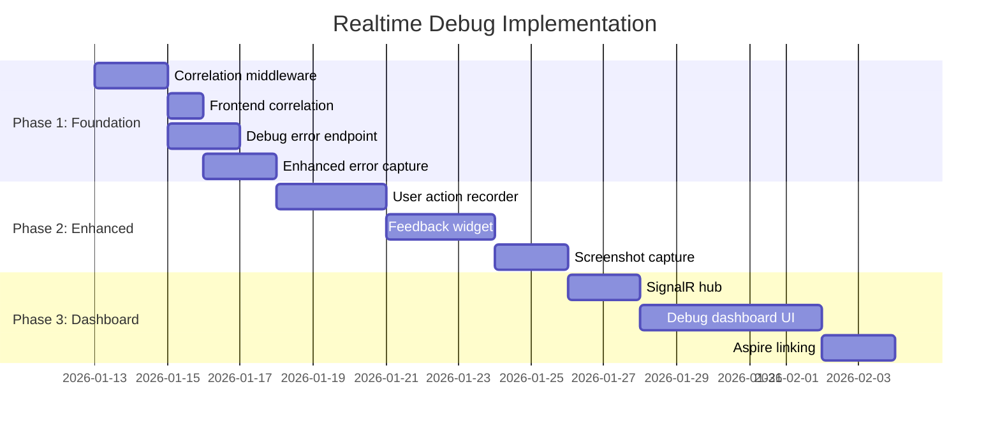

# ADR-053: Realtime Debug Architecture

**Status**: Proposed  
**Date**: 10. Januar 2026  
**Decision Makers**: @Architect, @TechLead, @Security

---

## Context

The B2X platform needs a unified debugging capability that correlates:
- Backend distributed traces (OpenTelemetry/Aspire)
- Frontend user actions and errors
- Browser performance metrics
- User-submitted feedback

Current state analysis revealed:
- ✅ OpenTelemetry infrastructure exists (`B2X.Tracing.Extensions`)
- ✅ Aspire Dashboard configured for telemetry visualization
- ✅ Frontend error logging service exists (`errorLoggingService.ts`)
- ❌ No correlation ID propagation frontend → backend
- ❌ No backend endpoint for frontend errors
- ❌ No realtime event streaming (WebSocket/SignalR)
- ❌ No debug dashboard UI

---

## Decision

We will implement a **Correlation-First Debug Architecture** that:

1. **Extends existing OpenTelemetry** infrastructure (not replaces)
2. **Uses SignalR** for realtime event streaming
3. **Integrates with Aspire Dashboard** via TraceId linking
4. **Stores debug data in PostgreSQL** (existing database)

### Architecture Overview

```
┌─────────────────────────────────────────────────────────────────┐
│                     Frontend (Vue 3)                            │
│  ┌──────────────┐  ┌──────────────┐  ┌──────────────────────┐  │
│  │ Enhanced     │  │ Action       │  │ Feedback Widget      │  │
│  │ Error        │  │ Recorder     │  │ (html2canvas)        │  │
│  │ Service      │  │ (mutations)  │  │                      │  │
│  └──────┬───────┘  └──────┬───────┘  └──────────┬───────────┘  │
│         │                 │                      │              │
│         └─────────────────┼──────────────────────┘              │
│                           ▼                                      │
│              ┌────────────────────────┐                         │
│              │ Debug Context Provider │                         │
│              │ + Correlation ID       │                         │
│              │ + resilientApiClient   │                         │
│              └───────────┬────────────┘                         │
└──────────────────────────┼──────────────────────────────────────┘
                           │ HTTP + X-Correlation-Id
                           ▼
┌──────────────────────────────────────────────────────────────────┐
│                     Backend (.NET 10)                            │
│                                                                  │
│  ┌────────────────────────────────────────────────────────────┐ │
│  │              Correlation Middleware                         │ │
│  │  • Extract/Generate X-Correlation-Id                       │ │
│  │  • Enrich Activity with correlation                        │ │
│  │  • Add to LogContext                                       │ │
│  └────────────────────────────────────────────────────────────┘ │
│                           │                                      │
│  ┌────────────────────────▼───────────────────────────────────┐ │
│  │              Debug Controller                               │ │
│  │  POST /api/debug/errors     - Receive frontend errors      │ │
│  │  POST /api/debug/feedback   - Receive user feedback        │ │
│  │  GET  /api/debug/sessions   - List debug sessions          │ │
│  │  GET  /api/debug/traces/:id - Get trace details            │ │
│  └────────────────────────────────────────────────────────────┘ │
│                           │                                      │
│  ┌────────────────────────▼───────────────────────────────────┐ │
│  │              SignalR Debug Hub                              │ │
│  │  • Stream errors in realtime                               │ │
│  │  • Push performance alerts                                 │ │
│  │  • Session activity updates                                │ │
│  └────────────────────────────────────────────────────────────┘ │
│                           │                                      │
│  ┌────────────────────────▼───────────────────────────────────┐ │
│  │         OpenTelemetry Custom Exporter                       │ │
│  │  • Tap into existing telemetry stream                      │ │
│  │  • Filter debug-relevant spans                             │ │
│  │  • Feed SignalR hub                                        │ │
│  └────────────────────────────────────────────────────────────┘ │
│                           │                                      │
│                           ▼                                      │
│  ┌────────────────────────────────────────────────────────────┐ │
│  │              PostgreSQL (Debug Schema)                      │ │
│  │  debug.sessions    - Active sessions with metadata         │ │
│  │  debug.errors      - Captured errors with context          │ │
│  │  debug.feedback    - User feedback with screenshots        │ │
│  │  debug.actions     - User action sequences                 │ │
│  └────────────────────────────────────────────────────────────┘ │
│                           │                                      │
│                           ▼                                      │
│              ┌────────────────────────┐                         │
│              │    Aspire Dashboard    │◄── TraceId linking      │
│              │    (existing)          │                         │
│              └────────────────────────┘                         │
└──────────────────────────────────────────────────────────────────┘
```

---

## Alternatives Considered

### Option A: Custom Telemetry Backend (Rejected)
- Build separate telemetry collection and storage
- **Pros**: Full control, no dependency on Aspire
- **Cons**: Duplicates existing infrastructure, high maintenance
- **Decision**: Rejected - leverage existing OpenTelemetry investment

### Option B: Third-Party Service (Sentry, LogRocket) (Rejected)
- Use commercial observability platform
- **Pros**: Feature-rich, no development required
- **Cons**: Cost, data leaves tenant environment, vendor lock-in
- **Decision**: Rejected - conflicts with data sovereignty requirements

### Option C: Extend Aspire Dashboard (Considered)
- Build custom Aspire dashboard plugins
- **Pros**: Unified observability experience
- **Cons**: Limited customization, Aspire SDK complexity
- **Decision**: Partial adoption - link to Aspire, don't embed

### Option D: Correlation-First Architecture ✅ (Selected)
- Extend existing OpenTelemetry with custom debug layer
- **Pros**: Builds on existing investment, full control, tenant-isolated
- **Cons**: Development effort required
- **Decision**: Selected - best balance of integration and customization

---

## Technical Decisions

### TD-001: Correlation ID Strategy
```
Format: {tenantId}-{sessionId}-{requestId}
Example: acme-a1b2c3d4-550e8400-e29b-41d4-a716-446655440000

Header: X-Correlation-Id
W3C Compatible: Also support traceparent header for full OpenTelemetry compatibility
```

### TD-002: SignalR Hub Design
```csharp
public interface IDebugHub
{
    Task OnErrorCaptured(DebugError error);
    Task OnSessionStarted(DebugSession session);
    Task OnPerformanceAlert(PerformanceAlert alert);
    Task OnFeedbackSubmitted(DebugFeedback feedback);
}
```

### TD-003: Database Schema
```sql
-- Debug schema (tenant-isolated via RLS)
CREATE SCHEMA debug;

CREATE TABLE debug.sessions (
    id UUID PRIMARY KEY,
    tenant_id UUID NOT NULL,
    user_id UUID,
    correlation_id VARCHAR(100) NOT NULL,
    user_agent TEXT,
    viewport JSONB,
    started_at TIMESTAMPTZ DEFAULT NOW(),
    last_activity_at TIMESTAMPTZ DEFAULT NOW(),
    metadata JSONB
);

CREATE TABLE debug.errors (
    id UUID PRIMARY KEY,
    session_id UUID REFERENCES debug.sessions(id),
    correlation_id VARCHAR(100) NOT NULL,
    severity VARCHAR(20) NOT NULL,
    message TEXT NOT NULL,
    stack_trace TEXT,
    component_stack TEXT,
    user_actions JSONB,  -- Last N actions before error
    trace_id VARCHAR(32),  -- Link to Aspire
    created_at TIMESTAMPTZ DEFAULT NOW()
);

CREATE TABLE debug.feedback (
    id UUID PRIMARY KEY,
    session_id UUID REFERENCES debug.sessions(id),
    correlation_id VARCHAR(100) NOT NULL,
    description TEXT NOT NULL,
    screenshot_url TEXT,
    user_actions JSONB,
    created_at TIMESTAMPTZ DEFAULT NOW()
);

-- Index for fast correlation lookups
CREATE INDEX idx_errors_correlation ON debug.errors(correlation_id);
CREATE INDEX idx_errors_trace ON debug.errors(trace_id);
```

### TD-004: Frontend Integration Points

| File | Change Required |
|------|-----------------|
| `resilientApiClient.ts` | Add `X-Correlation-Id` header injection |
| `errorLoggingService.ts` | Send errors to `/api/debug/errors` |
| New: `debugContext.ts` | Session management, action recording |
| New: `FeedbackWidget.vue` | User feedback UI |
| New: `DebugDashboard.vue` | Admin debug console |

### TD-005: Backend Integration Points

| Component | Change Required |
|-----------|-----------------|
| New: `CorrelationMiddleware.cs` | Extract/generate correlation ID |
| New: `DebugController.cs` | API endpoints |
| New: `DebugHub.cs` | SignalR hub |
| New: `DebugTelemetryExporter.cs` | Custom OTel exporter |
| Existing: `B2X.Tracing.Extensions` | Register debug exporter |

---

## Privacy & Security Considerations

### Data Handling
| Data Type | Sensitivity | Handling |
|-----------|-------------|----------|
| User actions | Medium | Mask form inputs, exclude passwords |
| Screenshots | High | Opt-in only, blur PII regions |
| Error stacks | Low | Full capture allowed |
| Correlation IDs | Low | No PII, safe to log |

### Access Control
- Debug dashboard: `Admin` or `Developer` role only
- Debug API endpoints: Authenticated + authorized
- SignalR hub: Tenant-isolated connections
- Data retention: 7 days default (configurable per tenant)

### Compliance
- GDPR: User consent for session recording
- Data minimization: Only capture necessary context
- Right to erasure: Cascade delete on user deletion

---

## Performance Impact

| Component | Overhead | Mitigation |
|-----------|----------|------------|
| Correlation middleware | <1ms | Lightweight header extraction |
| Error capture | <5ms | Async processing |
| Action recording | <2ms per action | Debounce, sample |
| SignalR connection | Persistent | One connection per dashboard session |
| Database writes | Async | Batch inserts, background worker |

---

## Implementation Sequence



---

## Consequences

### Positive
- ✅ Unified debugging experience across frontend and backend
- ✅ Reduces mean time to diagnosis from hours to minutes
- ✅ Builds on existing OpenTelemetry investment
- ✅ Tenant-isolated, no data leaves environment
- ✅ Enables proactive issue detection

### Negative
- ⚠️ Additional infrastructure (SignalR, database tables)
- ⚠️ Ongoing maintenance of debug components
- ⚠️ Storage costs for debug data

### Neutral
- ↔️ Requires developer training on new tools
- ↔️ May surface previously unknown issues (good for quality)

---

## Review & Approval

| Role | Reviewer | Decision | Date |
|------|----------|----------|------|
| Architect | @Architect | ⏳ Pending | - |
| Tech Lead | @TechLead | ⏳ Pending | - |
| Security | @Security | ⏳ Pending | - |
| DevOps | @DevOps | ⏳ Pending | - |

---

## References

- [BS-REALTIME-DEBUG] Brainstorm Document
- [REQ-008] Requirements Specification
- [KB-064] Chrome DevTools MCP Server
- [KB-061] Monitoring MCP Usage Guide
- [ADR-003] Aspire Orchestration
- [ADR-001] Wolverine over MediatR
