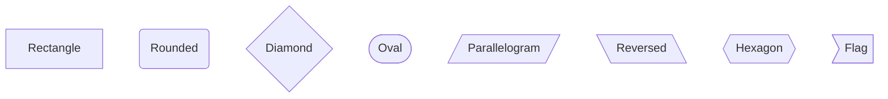

# Mermaid Diagrams in VS Code & GitHub

**Version:** 1.0 | **Last Updated:** 30. Dezember 2025

Mermaid is a JavaScript-based diagramming and charting tool that uses a simple, intuitive syntax to create diagrams. It's natively supported in GitHub and VS Code markdown.

---

## 📋 Table of Contents

1. [Support & Platforms](#support--platforms)
2. [Diagram Types](#diagram-types)
3. [Basic Syntax](#basic-syntax)
4. [Common Diagrams](#common-diagrams)
5. [Best Practices](#best-practices)
6. [Troubleshooting](#troubleshooting)

---

## Support & Platforms

### VS Code
- **Built-in Support**: Markdown Preview includes Mermaid rendering
- **Enable**: File → Preferences → Settings → Search "markdown.mermaid" → Ensure `true`
- **Preview**: Click the Eye icon in markdown editor or press `Ctrl+Shift+V`
- **Version**: Uses latest Mermaid from CDN

### GitHub
- **Built-in Support**: All markdown files and GitHub Flavored Markdown (GFM)
- **Where**: README.md, wiki pages, pull requests, issues, discussions
- **Version**: Updates automatically with GitHub platform

### Other Platforms
- **GitLab**: Supported natively
- **Notion**: Supported via integrations
- **Confluence**: Supported via plugins
- **Docusaurus**: Native support

---

## Diagram Types

| Type | Use Case | Best For |
|------|----------|----------|
| **Flowchart** | Decision trees, workflows, processes | Feature flows, API flows |
| **Sequence** | Interactions over time | Multi-service calls, handshakes |
| **Class** | Object relationships | Data models, entity diagrams |
| **State** | State transitions | Lifecycle, FSM |
| **ER (Entity-Relationship)** | Database schemas | Data structures |
| **Gantt** | Timeline/schedules | Sprint planning, project schedules |
| **Git Graph** | Branch/commit history | Git workflow visualization |
| **Pie/Bar** | Data visualization | Metrics, distribution |
| **Mind Map** | Hierarchical ideas | Planning, brainstorming |
| **Timeline** | Historical events | Release history, milestones |

---

## Basic Syntax

### Structure


### Node Types


### Connections
```mermaid
graph TD
    A --> B           # Arrow
    A --- B           # Line
    A -->|Label| B    # Labeled arrow
    A -.->|Dotted| B  # Dotted arrow
    A ==>|Thick| B    # Thick arrow
```

### Styling


---

## Common Diagrams

### 1. Flowchart (Wolverine HTTP Handler Lifecycle)


### 2. Sequence Diagram (Multi-Service Communication)


### 3. State Diagram (Order Lifecycle)


### 4. Class Diagram (Entity Relationships)


### 5. ER Diagram (Database Schema)


### 6. Gantt Chart (Sprint Planning)


---

## Best Practices

### 1. Keep Diagrams Simple

✅ Clear and readable


❌ Too complex - break into multiple diagrams

### 2. Use Descriptive Labels

✅ Clear action


❌ Abbreviations confuse readers

### 3. Color Code by Priority/Category


### 4. Use Subgraphs for Organization


### 5. Document Complex Flows with Annotations


---

## Troubleshooting

### Issue: Diagram not rendering in VS Code
**Solution**:
1. Ensure markdown.mermaid.enabled = true in settings
2. Reload VS Code (Ctrl+R or Cmd+R)
3. Check browser console for errors (if using markdown preview)

### Issue: Diagram renders differently on GitHub
**Cause**: GitHub uses different CSS/rendering  
**Solution**: 
- Test locally first
- GitHub has better support for flowcharts/sequences than advanced diagrams
- Use simpler syntax for cross-platform compatibility

### Issue: Syntax Error: "No valid definition found"
**Cause**: Invalid syntax
**Solution**:
1. Check diagram type declaration (graph, sequenceDiagram, etc.)
2. Validate node connections (A --> B must have both A and B defined)
3. Use online editor: https://mermaid.live

### Issue: Node text overlapping
**Cause**: Long text in small diagram
**Solution**:
- Use line breaks: `["Line 1<br/>Line 2"]`
- Shorten labels
- Make diagram wider

### Issue: Arrows not appearing as expected
**Common mistakes**:
```mermaid
% ❌ Wrong - missing node definition
A --> B
% B not defined

% ✅ Correct
A[Node A] --> B[Node B]
```

---

## Syntax Reference

### Flowchart Directions
```
graph TD    % Top to Down
graph LR    % Left to Right
graph DU    % Down to Up
graph RL    % Right to Left
```

### Connection Types
```
-->         % Arrow
---         % Line
-.->        % Dotted arrow
==>         % Thick arrow
--text-->   % Labeled
```

### Node Shapes
```
[text]      % Rectangle
(text)      % Rounded
{text}      % Diamond
([text])    % Oval/Stadium
[/text/]    % Parallelogram
[\text\]    % Reversed parallelogram
{{text}}    % Hexagon
>text]      % Flag
[(text)]    % Subroutine
```

---

## Resources

- **Official Docs**: https://mermaid.js.org/
- **Live Editor**: https://mermaid.live/
- **GitHub Support**: https://github.blog/2022-02-14-include-diagrams-in-your-markdown-files-with-mermaid/
- **VS Code Docs**: https://code.visualstudio.com/docs/languages/markdown#_mermaid

---

## Examples in This Project

### Architecture Diagrams
- [Backend Handler Lifecycle](../../../.github/instructions/backend.instructions.md)
- [Frontend Component Lifecycle](../../../.github/instructions/frontend.instructions.md)
- [Security P0 Components](../../../.github/instructions/security.instructions.md)
- [Infrastructure Topology](../../../.github/instructions/devops.instructions.md)

### Usage Guidelines
- Use for architecture/design decisions
- Prefer Mermaid over ASCII art
- Include in: Architecture Decision Records, API documentation, process flows
- Keep in: `.github/instructions/` for reference, agent files for quick commands

---

## When to Use Each Diagram Type

| Goal | Diagram | Example |
|------|---------|---------|
| Show workflow | Flowchart | Feature development process |
| Show communication | Sequence | API calls between services |
| Show states | State | Order lifecycle |
| Show data model | ER Diagram | Database schema |
| Show object structure | Class | Entity relationships |
| Show timeline | Gantt | Sprint schedule |
| Show hierarchy | Mind Map | Project breakdown |

---

## Tips for Integration

1. **In Code Reviews**: Use Mermaid to explain complex changes
2. **In Architecture Docs**: Every significant architecture should have a diagram
3. **In PR Descriptions**: Add diagram to show what's changing
4. **In Agent Instructions**: Use diagrams to explain concepts
5. **In Runbooks**: Flowcharts for incident response procedures

