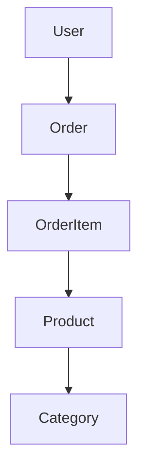

# Technical Requirements Specification (TRS) Template

## Dokumenteninformationen
- **Dokument-Titel:** [Feature Name] Technical Requirements Specification
- **Version:** 1.0
- **Datum:** [YYYY-MM-DD]
- **Autor:** [Architect/TechLead Name]
- **Basierend auf BRD:** [BRD Version, Datum]
- **Status:** [Draft | Review | Approved | Implemented]

## System Overview
### Architecture Context
[High-Level System Architecture, Integration Points, Data Flow]

### Technology Stack
- **Backend:** .NET 10, Wolverine CQRS, EF Core
- **Frontend:** Vue.js 3, TypeScript, Pinia, Tailwind CSS
- **Database:** PostgreSQL, Redis (Cache)
- **Infrastructure:** Azure/AWS, Kubernetes, Docker
- **Monitoring:** OpenTelemetry, Application Insights

## Functional Requirements Mapping

### [BRD Feature 1] → [Technical Implementation]

#### API Endpoints
```
POST /api/v1/[resource]
- Request: [JSON Schema]
- Response: [JSON Schema]
- Status Codes: 200, 400, 401, 500
```

#### Database Schema
```sql
CREATE TABLE [table_name] (
    id UUID PRIMARY KEY,
    [field] [type] NOT NULL,
    created_at TIMESTAMP DEFAULT NOW(),
    updated_at TIMESTAMP DEFAULT NOW()
);
```

#### Business Logic Components
- **Aggregate:** [Domain Aggregate Class]
- **Commands:** [Wolverine Command Handlers]
- **Events:** [Domain Events]
- **Queries:** [Read Models]

### [BRD Feature 2] → [Technical Implementation]
[Wie oben strukturiert für jedes Feature]

## Non-Functional Requirements Implementation

### Performance Requirements
- **API Response Times:** < 200ms (p95) für einfache Queries
- **Database Queries:** < 50ms durchschnittlich
- **Concurrent Users:** [X] simultane Sessions
- **Throughput:** [X] requests/second

### Scalability Design
- **Horizontal Scaling:** Kubernetes Deployments mit Auto-scaling
- **Database Sharding:** [Strategy für hohe Datenvolumen]
- **Caching Strategy:** Redis für Session und häufige Queries
- **CDN Integration:** Azure CDN für statische Assets

### Security Implementation
- **Authentication:** JWT Tokens mit Refresh Mechanism
- **Authorization:** Role-Based Access Control (RBAC)
- **Data Encryption:** AES-256-GCM für sensitive Daten
- **API Security:** Rate Limiting, Input Validation, CORS

### Reliability & Resilience
- **Circuit Breakers:** Polly Policies für externe Service Calls
- **Retry Logic:** Exponential Backoff für temporäre Fehler
- **Health Checks:** /health Endpoints für alle Services
- **Logging:** Structured Logging mit Serilog

## Data Architecture

### Entity Relationships


### Data Flow Diagrams
[Sequence Diagrams für kritische User Journeys]

### Database Design
- **Primary Keys:** UUID v4 für globale Eindeutigkeit
- **Indexes:** Composite Indexes für häufige Query Patterns
- **Constraints:** Foreign Key Constraints, Check Constraints
- **Partitioning:** Time-based Partitioning für große Tables

## API Design

### RESTful Endpoints
| Method | Endpoint | Description | Response |
|--------|----------|-------------|----------|
| GET | /api/v1/products | Produktliste abrufen | 200: Product[] |
| POST | /api/v1/products | Neues Produkt erstellen | 201: Product |
| PUT | /api/v1/products/{id} | Produkt aktualisieren | 200: Product |
| DELETE | /api/v1/products/{id} | Produkt löschen | 204 |

### Message Contracts (Wolverine)
```csharp
// Command
public record CreateProductCommand(
    string Name,
    string Description,
    decimal Price,
    Guid CategoryId
);

// Event
public record ProductCreatedEvent(
    Guid ProductId,
    string Name,
    DateTime CreatedAt
);

// Query
public record GetProductsQuery(
    int Page = 1,
    int PageSize = 20,
    string? SearchTerm = null
);
```

## Component Design

### Backend Services
#### [Service Name] Microservice
- **Responsibilities:** [Domain Boundaries]
- **Dependencies:** [Other Services, External APIs]
- **Database:** [Dedicated Schema/Context]
- **APIs:** [Exposed Endpoints]

#### Wolverine Message Handlers
```csharp
public static class ProductCommandHandler
{
    [WolverineCommand]
    public static async Task Handle(
        CreateProductCommand command,
        IDocumentSession session,
        ILogger logger)
    {
        var product = new Product
        {
            Id = Guid.NewGuid(),
            Name = command.Name,
            // ... weitere Properties
        };

        session.Store(product);
        await session.SaveChangesAsync();

        // Event publishing
        await session.PublishAsync(new ProductCreatedEvent(product.Id, product.Name));
    }
}
```

### Frontend Components
#### Component Architecture
```
src/components/products/
├── ProductList.vue
├── ProductCard.vue
├── ProductForm.vue
└── ProductFilters.vue
```

#### State Management (Pinia)
```typescript
// stores/productStore.ts
export const useProductStore = defineStore('products', {
  state: () => ({
    products: [] as Product[],
    loading: false,
    error: null as string | null
  }),

  actions: {
    async fetchProducts() {
      this.loading = true;
      try {
        const response = await api.get('/api/v1/products');
        this.products = response.data;
      } catch (error) {
        this.error = error.message;
      } finally {
        this.loading = false;
      }
    }
  }
});
```

## Integration Points

### External Systems
- **Payment Provider:** Stripe/PayPal Integration
- **Shipping Service:** DHL/FedEx API
- **Email Service:** SendGrid/Mailgun
- **Analytics:** Google Analytics, Mixpanel

### Internal Services
- **Identity Service:** User Authentication & Authorization
- **Catalog Service:** Product & Category Management
- **Order Service:** Order Processing & Fulfillment
- **Search Service:** Elasticsearch Integration

## Testing Strategy

### Unit Testing
- **Framework:** xUnit, NUnit
- **Coverage:** > 80% Code Coverage
- **Mocking:** Moq für Dependencies
- **Test Categories:** Domain Logic, API Controllers, Message Handlers

### Integration Testing
- **Database Tests:** EF Core In-Memory Database
- **API Tests:** WebApplicationFactory
- **Message Tests:** Wolverine Testing Support
- **Contract Tests:** Pact für Service Integrationen

### End-to-End Testing
- **Framework:** Playwright für UI Tests
- **Scenarios:** Critical User Journeys
- **Environments:** Staging Environment
- **Automation:** CI/CD Pipeline Integration

## Deployment & Operations

### Infrastructure Requirements
- **Kubernetes:** Helm Charts für Service Deployment
- **Database:** PostgreSQL Cluster mit Read Replicas
- **Cache:** Redis Cluster für Session & Data Cache
- **Storage:** Azure Blob Storage für Dateien

### Monitoring & Observability
- **Metrics:** Application Insights, Prometheus
- **Logging:** Centralized Logging mit ELK Stack
- **Tracing:** OpenTelemetry für Distributed Tracing
- **Alerts:** PagerDuty Integration für Critical Issues

### Backup & Recovery
- **Database Backups:** Daily Full, Hourly Incremental
- **RTO/RPO:** 4h / 1h für kritische Services
- **Disaster Recovery:** Multi-Region Failover
- **Testing:** Quarterly DR Drills

## Risk Assessment & Mitigation

### Technical Risks
| Risiko | Wahrscheinlichkeit | Impact | Mitigation |
|--------|-------------------|--------|------------|
| Performance Bottlenecks | Mittel | Hoch | Load Testing, Query Optimization |
| External API Failures | Hoch | Mittel | Circuit Breakers, Fallbacks |
| Data Consistency Issues | Niedrig | Hoch | Eventual Consistency Patterns |

### Operational Risks
| Risiko | Wahrscheinlichkeit | Impact | Mitigation |
|--------|-------------------|--------|------------|
| Deployment Failures | Mittel | Hoch | Blue-Green Deployments, Rollbacks |
| Security Vulnerabilities | Niedrig | Hoch | Regular Security Audits, Dependency Scanning |
| Scalability Limits | Niedrig | Mittel | Capacity Planning, Auto-scaling |

## Implementation Timeline
- **Phase 1:** [Sprint X-Y] - Core API Implementation
- **Phase 2:** [Sprint Y-Z] - Frontend Development
- **Phase 3:** [Sprint Z-W] - Integration & Testing
- **Phase 4:** [Sprint W-X] - Deployment & Go-Live

## Approval & Sign-off
- **Architect:** ____________________ Datum: ________
- **TechLead:** ____________________ Datum: ________
- **DevOps Lead:** ____________________ Datum: ________
- **QA Lead:** ____________________ Datum: ________

---

*Dieses TRS folgt der B2Connect Requirements Analysis Methodology und ist abgestimmt mit der BRD.*