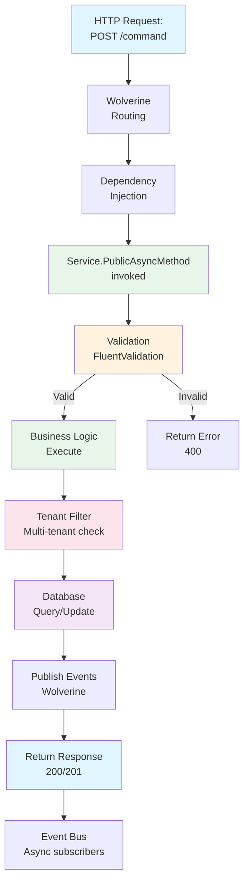

# Backend Developer - AI Agent Instructions

**Focus**: Wolverine services, onion architecture, database design  
**Agent**: @backend-developer (or specialized: @backend-admin, @backend-store)  
**Escalation**: Complex problems → @tech-lead | System structure → @software-architect  
**For full reference**: [copilot-instructions.md](./copilot-instructions.md)

---

## 🎯 Architecture (Backend-Specific)

### Wolverine Handler Lifecycle



### Every Service Uses This Structure
```
Service/
├── Core/                   # Domain entities, interfaces, NO framework deps
├── Application/            # DTOs, Wolverine handlers, validators
├── Infrastructure/         # EF Core, repositories, external services
└── Program.cs              # DI configuration
```

### Wolverine Handler Pattern (REQUIRED)

```mermaid
graph LR
    A["Command POCO"] --> B["Service.PublicAsyncMethod"]
    B --> C["Validator"]
    C --> D["HTTP Response"]
    
    E["❌ MediatR Pattern"] -.->|NEVER USE| X["IRequest&lt;&gt;<br/>IRequestHandler&lt;&gt;<br/>@HttpPost"]
    
    style A fill:#e8f5e9
    style B fill:#e8f5e9
    style C fill:#e8f5e9
    style D fill:#e1f5ff
    style E fill:#ffebee
    style X fill:#ffcdd2
```



```csharp
// ✅ CORRECT
public class CreateProductService {
    public async Task<ProductDto> CreateAsync(CreateProductCommand cmd, CancellationToken ct) { }
}

// ❌ NEVER use IRequest<>, IRequestHandler<>, [ApiController], [HttpPost]
```

---

## ⚡ Critical Rules

1. **Build-First Rule (CRITICAL)**: Generate files → Build IMMEDIATELY (`dotnet build B2Connect.slnx`) → Fix errors → Test
   - **Why**: Issue #30 accumulated 38+ test failures by deferring build validation
   - **Prevents**: Cascading failures across multiple files
   - Pattern: Code → Build → Test → Commit (never defer build)

2. **Test Immediately After Code Changes**: Run tests after handler, validator, and query changes
   - Execute `dotnet test backend/Domain/[Service]/tests -v minimal` after each logical change
   - Issue #30 achieved 0 regressions via continuous verification (204/204 passing)

3. **Tenant isolation**: EVERY query must filter by `TenantId`

4. **FluentValidation**: EVERY command needs a `public class XyzValidator : AbstractValidator<Xyz>`

5. **Audit logging**: EVERY data modification must be logged (EF Core interceptor)

6. **Encryption**: PII fields (email, phone, address) use AES-256

---

## 🚀 Quick Commands

```bash
dotnet build B2Connect.slnx                    # Build
dotnet test backend/Domain/[Service]/tests     # Test specific service
cd AppHost && dotnet run         # Start all services
dotnet ef migrations add [Name] --project backend/Domain/[Service]/src  # Migration
```

---

## 📋 Before Implementing a Handler

### Code Structure
- [ ] Is this a plain POCO command (no IRequest)?
- [ ] Is handler a public async method in a Service class?
- [ ] Does it follow the Wolverine pattern (NOT MediatR)?

### Security & Data Protection
- [ ] Does it filter queries by TenantId?
- [ ] Are PII fields encrypted (IEncryptionService)?
- [ ] Is there audit logging for data changes?
- [ ] Does it validate input with FluentValidation?

### Async & Performance
- [ ] Does every async call pass CancellationToken?
- [ ] Are there no blocking calls (no .Result, .Wait())?
- [ ] Is the query optimized (.Select() for projection)?
- [ ] Are external service calls timeout-protected?

### Testing & Validation
- [ ] Is there a validator class?
- [ ] Are positive and negative tests written?
- [ ] Does it test tenant isolation (cross-tenant access blocked)?
- [ ] Is encryption/decryption round-trip tested?
- [ ] Build successful after code: `dotnet build B2Connect.slnx`?
- [ ] Tests passing: `dotnet test backend/Domain/[Service]/tests -v minimal`?

### Code Review Readiness
- [ ] No hardcoded secrets (use IConfiguration)
- [ ] No stack traces in error messages
- [ ] No PII in logs or error responses

### User-Facing Feature Documentation
- [ ] User-facing features have EN/DE documentation?
- [ ] Docs created simultaneously (not EN→DE translation)?
- [ ] Both language files in same commit?
- [ ] Grammar reviewed (Grammarly/LanguageTool)?

**Rationale**: Sprint 1 Phase A (Issue #30) revealed gaps in multi-stage validation. This comprehensive checklist prevents regressions.

---

## 🛑 Common Mistakes

| Mistake | Prevention |
|---------|-----------|
| Using MediatR | Copy from `backend/Domain/Identity/src/Handlers/CheckRegistrationTypeService.cs` |
| Forgetting tenant filter | Add `.Where(x => x.TenantId == tenantId)` to EVERY query |
| Using `null` defaults | Make defaults explicit and meaningful |
| Hardcoding secrets | Use `IConfiguration["Key"]` or `appsettings.json` |
| No encryption for PII | Use `IEncryptionService.Encrypt()` for email, phone, address, DOB |

---

## 🚀 Escalation Path

**Problem?** → Ask your agent
- **Complex implementation**: Ask @tech-lead for code patterns
- **Service design question**: Ask @tech-lead, they may escalate to @software-architect
- **Architectural decision**: Ask @software-architect directly (e.g., should search be separate service?)
- **DevOps/Operations**: Ask @cli-developer if it should be a CLI command
- **Performance issue**: Ask @tech-lead, may escalate to @software-architect

---

## 📚 Reference Files

- Architecture: [docs/architecture/DDD_BOUNDED_CONTEXTS.md](../docs/architecture/DDD_BOUNDED_CONTEXTS.md)
- Example handler: [backend/Domain/Identity/src/Handlers/CheckRegistrationTypeService.cs](../backend/Domain/Identity/src/Handlers/CheckRegistrationTypeService.cs)
- Security patterns: [copilot-instructions.md §Security](./copilot-instructions.md)
- Testing: [docs/guides/TESTING_GUIDE.md](../docs/guides/TESTING_GUIDE.md)

---

## 🔐 Security Checklist (Mandatory for Features)

Before PR: Does your code include?
- [ ] FluentValidation validators
- [ ] TenantId filtering on all queries
- [ ] Audit logging via EF Core interceptor
- [ ] PII encryption (Email, Phone, FirstName, LastName, Address, DOB)
- [ ] `CancellationToken` passed through async calls
- [ ] No hardcoded secrets (use `IConfiguration`)
- [ ] Tests with 80%+ coverage
