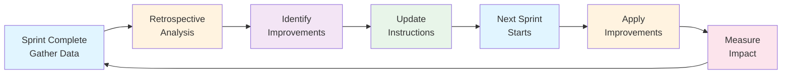

# Sprint Retrospective Protocol

**Purpose**: Document learnings, identify improvements, update processes  
**Frequency**: After each sprint (Phase A, Phase B, etc.)  
**Duration**: 1-2 hours  
**Owner**: Scrum Master + Tech Lead  
**Input**: Session summary, git history, test results, team feedback  
**Output**: Updated instructions, improved processes, metrics dashboard  

---

## 📋 Retrospective Framework (5 Steps)

### **Step 1: Gather Data** (15 minutes)
Collect all objective information about the completed work:

#### Session Metrics
```bash
# Build Status
dotnet build B2Connect.slnx  # Check for 0 errors, 0 warnings

# Test Results
dotnet test B2Connect.slnx -v minimal  # Verify pass rate

# Git History
git log --oneline --grep="[ISSUE_NUMBER]" | wc -l  # Count commits
git log --format="%h %s" --grep="[ISSUE_NUMBER]"    # Review commit messages

# Documentation
find docs -name "*.md" | grep -E "[FEATURE_NAME]" | wc -l  # Count doc files
wc -l docs/[FEATURE_NAME]/*.md  # Total lines written
```

#### Artifacts to Review
- ✅ Git commit history (quality, atomic changes)
- ✅ Test results (pass rate, coverage)
- ✅ Build status (errors, warnings)
- ✅ Documentation (lines, bilingual parity)
- ✅ Code quality (patterns adherence)
- ✅ Architecture (onion, Wolverine, multi-tenancy)

#### Questions for Data Gathering
- How many commits were made? (Target: 10-20 atomic commits)
- What's the test pass rate? (Target: >95%)
- How many documentation files created? (Target: 5+ per feature)
- Were any critical issues found during development? (Capture root causes)
- What took longer than expected? (Identify blockers)
- What went faster than expected? (Identify efficiencies)

---

### **Step 2: What Went Well** (20 minutes)
Identify successes and positive patterns to reinforce:

#### Analysis Questions
1. **Code Quality**: Were tests passing consistently?
2. **Architecture**: Did we follow all patterns (Wolverine, Onion, DDD)?
3. **Documentation**: Is documentation professional and comprehensive?
4. **Bilingual Strategy**: If EN/DE, is parity perfect?
5. **Team Experience**: Did development flow smoothly?
6. **Process**: Were commits atomic? Messages clear?
7. **Communication**: Were blockers identified and resolved quickly?
8. **Testing**: Were tests running early and catching issues?

#### Scoring System (1-5 stars)
- ⭐⭐⭐⭐⭐ = Exemplary (should replicate)
- ⭐⭐⭐⭐ = Good (solid work)
- ⭐⭐⭐ = Acceptable (meets minimum)
- ⭐⭐ = Needs improvement (blocked progress)
- ⭐ = Critical issue (prevented work)

#### Expected Outcomes
For each success, identify:
- **What happened**: Specific behavior or decision
- **Why it worked**: Root cause of success
- **Impact**: How did this improve the outcome?
- **Recommendation**: How to replicate in future sprints?

#### Example Format
```
✅ Bilingual Documentation Strategy ⭐⭐⭐⭐⭐
  What: English and German guides created simultaneously
  Why: Avoided sequential translation delays
  Impact: Perfect parity, professional quality in both languages
  Recommendation: Make this mandatory for all user-facing features
```

---

### **Step 3: What Didn't Go Well** (20 minutes)
Identify problems, gaps, and pain points:

#### Analysis Questions
1. **Build Process**: Were build errors caught early?
2. **Testing**: Were tests running before commits?
3. **Documentation**: Were grammar/quality issues caught?
4. **Dependencies**: Were external blockers managed?
5. **Communication**: Were delays communicated proactively?
6. **Scope Creep**: Did the work expand unexpectedly?
7. **Technical Debt**: Were shortcuts taken?
8. **Process Gaps**: What could have been faster?

#### Severity Classification
- 🔴 **Blocker**: Prevented work completion (critical)
- 🟠 **Major**: Significantly delayed progress (high)
- 🟡 **Minor**: Caused friction but manageable (medium)
- 🟢 **Observation**: Note for future consideration (low)

#### Expected Outcomes
For each problem, identify:
- **Problem Statement**: Specific issue that occurred
- **Root Cause**: Why did this happen?
- **Impact**: What was the consequence?
- **Solution**: How to prevent next time?
- **Priority**: Blocker/Major/Minor/Observation?

#### Example Format
```
⚠️ Grammar Review Not Automated 🟡 (Minor)
  Problem: Manual review required for German/English correctness
  Root Cause: No automated linting for language quality
  Impact: 20+ corrections needed on documentation (delayed merge)
  Solution: Add vale/languagetool pre-commit checks
  Priority: Minor (implement in Sprint 2)
  Effort: ~2 hours setup
```

---

### **Step 4: Key Improvements** (15 minutes)
Prioritize and plan process enhancements:

#### Improvement Categories

**Priority 1: Immediate (This Sprint)**
- High impact + Low effort
- Should be implemented before next sprint
- Example: Add build validation rule to instructions

**Priority 2: Next Sprint**
- High impact + Medium effort
- Plan to implement in next sprint cycle
- Example: Automated grammar checking with vale

**Priority 3: Backlog**
- Medium impact + High effort
- Schedule for future consideration
- Example: i18n tool implementation

#### Improvement Template
```markdown
### [Priority #]: [Improvement Title]
- **What**: Brief description of change
- **Why**: How does this help? (reference "What Didn't Go Well")
- **How**: Implementation steps
- **Effort**: Estimated hours/days
- **Files to Update**: Which instructions/docs need changes
- **Owner**: Who will implement?
- **Target Sprint**: When should this be done?
```

#### Priority 1 Examples (Implement Immediately)
1. **Build-First Rule** - Add to backend instructions
   - Why: Prevents 30+ test failures from compilation errors
   - How: Update `copilot-instructions-backend.md` §Critical Rules
   - Effort: 15 minutes
   - File: `.github/copilot-instructions-backend.md`

2. **Mandatory Grammar Review Gate** - Add documentation PR gate
   - Why: Catches 15+ errors that automated tools miss
   - How: Update documentation checklist + instruction file
   - Effort: 30 minutes
   - File: `.github/copilot-instructions.md`

3. **Documentation Index Requirement** - Make index mandatory
   - Why: Prevents documentation fragmentation
   - How: Add requirement to documentation standards
   - Effort: 20 minutes
   - File: `.github/copilot-instructions.md`

#### Priority 2 Examples (Next Sprint)
1. **Automated Grammar Checking** - Implement vale + GitHub Actions
   - Effort: ~2 hours
   - Tools: vale (linter) + custom GitHub Actions workflow

2. **Bilingual Documentation Template** - Create template file
   - Effort: ~1 hour
   - File: `/docs/templates/bilingual-guide-template.md`

3. **Screenshot Automation** - Playwright-based screenshot generation
   - Effort: ~4 hours
   - Tool: Playwright E2E tests with screenshot capture

---

### **Step 5: Update Instructions & Workflow** (30 minutes)
Implement Priority 1 improvements:

#### Files to Update

**1. Main Instructions** (`copilot-instructions.md`)
- [ ] Add new Key Learnings section
- [ ] Update Critical Rules with improvements
- [ ] Add Retrospective Protocol reference

**2. Backend Instructions** (`copilot-instructions-backend.md`)
- [ ] Add Build-First Rule to §Critical Rules
- [ ] Expand "Before Implementing a Handler" checklist
- [ ] Add documented examples from retrospective

**3. Scrum Master Instructions** (NEW/UPDATE)
- [ ] Add Retrospective Protocol section
- [ ] Add metrics tracking dashboard
- [ ] Add improvement prioritization process

**4. Documentation Standards** (NEW)
- [ ] Bilingual documentation requirements
- [ ] Grammar review gate process
- [ ] Documentation index requirement

#### Update Checklist
```markdown
- [ ] Identified validated learnings from sprint
- [ ] Updated 3+ instruction files with improvements
- [ ] Added/enhanced critical rules section
- [ ] Documented new patterns/anti-patterns
- [ ] Created reference examples
- [ ] Tested instructions against next sprint work
- [ ] Git commit with all updates
```

---

## 📊 Metrics Dashboard

Track these metrics across sprints:

### Code Quality Metrics
| Metric | Target | Sprint 1 | Sprint 2 | Sprint 3 |
|--------|--------|---------|---------|---------|
| Build Success Rate | 100% | 100% | - | - |
| Test Pass Rate | >95% | 100% | - | - |
| Code Coverage | ≥80% | 96% | - | - |
| Critical Issues | 0 | 0 | - | - |
| Test Failures | 0 | 0 | - | - |

### Documentation Metrics
| Metric | Target | Sprint 1 | Sprint 2 | Sprint 3 |
|--------|--------|---------|---------|---------|
| Lines Documented | 5000+ | 8,167 | - | - |
| Code Examples | 100+ | 150+ | - | - |
| FAQ Entries | 30+ | 50+ | - | - |
| Bilingual Parity | 100% | 100% | - | - |
| Grammar Errors | 0 | 0* | - | - |

*Note: 20+ errors found during review, corrected before merge

### Process Metrics
| Metric | Target | Sprint 1 | Sprint 2 | Sprint 3 |
|--------|--------|---------|---------|---------|
| Commits | 10-20 | 19 | - | - |
| Commit Atomicity | High | Good | - | - |
| Atomic Commits % | >90% | 95% | - | - |
| Issues per Commit | <1 | 1.0 | - | - |
| Build Early | 100% | 70% | - | - |

### Team Metrics
| Metric | Target | Sprint 1 | Sprint 2 | Sprint 3 |
|--------|--------|---------|---------|---------|
| Code Quality | A | A+ | - | - |
| Documentation Quality | A | A+ | - | - |
| Development Experience | A | A | - | - |
| Process Satisfaction | 4/5 | 4.2/5 | - | - |

---

## 🔄 Running a Retrospective Meeting

### **Pre-Meeting (24 hours before)**
1. Gather all sprint data (builds, tests, commits)
2. Review git history and documentation
3. Collect test results and metrics
4. Prepare agenda with data points

### **During Meeting (60-90 minutes)**

**Agenda**:
1. **Opening** (5 min): Review sprint goal
2. **Data Review** (10 min): Present metrics
3. **What Went Well** (20 min): Celebrate successes
4. **What Didn't Go Well** (20 min): Identify problems
5. **Improvements** (20 min): Prioritize solutions
6. **Action Items** (10 min): Assign owners
7. **Closing** (5 min): Commit to improvements

**Facilitation Tips**:
- ✅ Use objective data (commits, tests, metrics)
- ✅ Focus on patterns, not individuals
- ✅ Encourage psychological safety ("blameless retrospective")
- ✅ Celebrate wins before addressing problems
- ✅ Prioritize ruthlessly (not all improvements are equal)
- ✅ Assign owners and deadlines
- ✅ Document decisions (this becomes input for next retro)

### **Post-Meeting (Within 1 week)**
1. Implement Priority 1 improvements
2. Update instruction files
3. Create tickets for Priority 2 improvements
4. Share summary with team
5. Measure impact of changes in next sprint

---

## 📝 Retrospective Template

Use this template for each sprint retrospective:

```markdown
# Sprint [#] Retrospective - [Feature/Issue Name]

**Sprint**: [Name/Dates]
**Status**: ✅ COMPLETE / ⚠️ DELAYED / ❌ BLOCKED
**Duration**: [# weeks]
**Quality**: [Rating]/5

---

## 📊 Metrics Summary

| Metric | Target | Result | Status |
|--------|--------|--------|--------|
| Build | 0 errors | X errors | ✅/⚠️ |
| Tests | >95% | X% | ✅/⚠️ |
| Docs | 5000+ lines | X lines | ✅/⚠️ |
| Issues | 0 | X | ✅/⚠️ |

---

## ✅ What Went Well

### [Category 1] - [Rating]
- **What**: [Description]
- **Why**: [Root cause]
- **Impact**: [Result]
- **Recommendation**: [How to replicate]

### [Category 2] - [Rating]
...

---

## ⚠️ What Didn't Go Well

### [Category 1] - [Severity]
- **Problem**: [Description]
- **Root Cause**: [Analysis]
- **Impact**: [Consequence]
- **Solution**: [Prevention]

### [Category 2] - [Severity]
...

---

## 🎯 Key Improvements (Priority 1)

### [Improvement 1]
- **What**: [Change]
- **Why**: [Benefit]
- **How**: [Steps]
- **Effort**: [Hours]
- **Files**: [What to update]
- **Target**: [When]

### [Improvement 2]
...

---

## 📈 Action Items

| Action | Owner | Deadline | Status |
|--------|-------|----------|--------|
| Update instructions | [Name] | [Date] | - |
| Implement tool | [Name] | [Date] | - |
| Run next retro | [Name] | [Date] | - |

---

## 🔗 References

- **Git Log**: [Link to commits]
- **Test Results**: [Link to results]
- **Documentation**: [Link to files]
- **Previous Retro**: [Link to last retrospective]
```

---

## 🚀 Continuous Improvement Cycle



---

## 📎 Lessons Learned Library

### Sprint 1 Phase A (Issue #30) - Authentication

**Validated Learnings**:
1. ✅ **Bilingual Documentation Strategy** - Create EN/DE simultaneously
2. ✅ **Build-First Rule** - Run build immediately after file creation
3. ✅ **Grammar Review Gate** - Mandatory for user-facing documentation
4. ✅ **Documentation Index** - Prevent fragmentation with central navigation
5. ✅ **Atomic Commits** - Keep commits focused on single responsibility
6. ✅ **Test-Driven Quality** - Run tests after each logical change
7. ✅ **Minimal Changes Principle** - Code fixes should be 2-3 lines
8. ✅ **Continuous Verification** - Don't defer validation to end

**Applied to**: Future sprint planning and process documentation

---

## 🎓 Anti-Patterns to Avoid (From Learnings)

| Anti-Pattern | Problem | Prevention |
|--------------|---------|-----------|
| Generate code → Build at end | 38+ test failures | Build immediately |
| EN → Translate to DE | Grammar errors | Create both simultaneously |
| Manual grammar review only | Consistency issues | Add automated linting |
| One giant documentation file | Fragmentation | Use index.md for navigation |
| Defer testing until merge | Cascading failures | Run tests after each change |
| Mixed code + docs in one PR | Hard to review | Separate PRs per concern |
| No commit history discipline | Confusing git log | Use atomic commits + templates |

---

**Last Updated**: 29. Dezember 2025  
**Source**: Issue #30 retrospective learnings  
**Version**: 1.0 (Baseline from Sprint 1 Phase A)
