# Backend Developer - AI Agent Instructions

**Focus**: Wolverine services, onion architecture, database design  
**For full reference**: [copilot-instructions.md](./copilot-instructions.md)

---

## 🎯 Architecture (Backend-Specific)

### Wolverine Handler Lifecycle


### Every Service Uses This Structure
```
Service/
├── Core/                   # Domain entities, interfaces, NO framework deps
├── Application/            # DTOs, Wolverine handlers, validators
├── Infrastructure/         # EF Core, repositories, external services
└── Program.cs              # DI configuration
```

### Wolverine Handler Pattern (REQUIRED)

```mermaid
graph LR
    A["Command POCO"] --> B["Service.PublicAsyncMethod"]
    B --> C["Validator"]
    C --> D["HTTP Response"]
    
    E["❌ MediatR Pattern"] -.->|NEVER USE| X["IRequest&lt;&gt;<br/>IRequestHandler&lt;&gt;<br/>@HttpPost"]
    
    style A fill:#e8f5e9
    style B fill:#e8f5e9
    style C fill:#e8f5e9
    style D fill:#e1f5ff
    style E fill:#ffebee
    style X fill:#ffcdd2
```



```csharp
// ✅ CORRECT
public class CreateProductService {
    public async Task<ProductDto> CreateAsync(CreateProductCommand cmd, CancellationToken ct) { }
}

// ❌ NEVER use IRequest<>, IRequestHandler<>, [ApiController], [HttpPost]
```

---

## ⚡ Critical Rules

1. **Build first**: `dotnet build B2Connect.slnx` BEFORE writing tests
2. **Tenant isolation**: EVERY query must filter by `TenantId`
3. **FluentValidation**: EVERY command needs a `public class XyzValidator : AbstractValidator<Xyz>`
4. **Audit logging**: EVERY data modification must be logged (EF Core interceptor)
5. **Encryption**: PII fields (email, phone, address) use AES-256

---

## 🚀 Quick Commands

```bash
dotnet build B2Connect.slnx                    # Build
dotnet test backend/Domain/[Service]/tests     # Test specific service
cd backend/Orchestration && dotnet run         # Start all services
dotnet ef migrations add [Name] --project backend/Domain/[Service]/src  # Migration
```

---

## 📋 Before Implementing a Handler

- [ ] Is this a plain POCO command (no IRequest)?
- [ ] Is handler a public async method in a Service class?
- [ ] Does it filter queries by TenantId?
- [ ] Is there a validator class?
- [ ] Is there audit logging for data changes?
- [ ] Does every async call pass CancellationToken?
- [ ] Are PII fields encrypted (IEncryptionService)?

---

## 🛑 Common Mistakes

| Mistake | Prevention |
|---------|-----------|
| Using MediatR | Copy from `backend/Domain/Identity/src/Handlers/CheckRegistrationTypeService.cs` |
| Forgetting tenant filter | Add `.Where(x => x.TenantId == tenantId)` to EVERY query |
| Using `null` defaults | Make defaults explicit and meaningful |
| Hardcoding secrets | Use `IConfiguration["Key"]` or `appsettings.json` |
| No encryption for PII | Use `IEncryptionService.Encrypt()` for email, phone, address, DOB |

---

## 📚 Reference Files

- Architecture: [docs/architecture/DDD_BOUNDED_CONTEXTS.md](../docs/architecture/DDD_BOUNDED_CONTEXTS.md)
- Example handler: [backend/Domain/Identity/src/Handlers/CheckRegistrationTypeService.cs](../backend/Domain/Identity/src/Handlers/CheckRegistrationTypeService.cs)
- Security patterns: [copilot-instructions.md §Security](./copilot-instructions.md)
- Testing: [docs/guides/TESTING_GUIDE.md](../docs/guides/TESTING_GUIDE.md)

---

## 🔐 Security Checklist (Mandatory for Features)

Before PR: Does your code include?
- [ ] FluentValidation validators
- [ ] TenantId filtering on all queries
- [ ] Audit logging via EF Core interceptor
- [ ] PII encryption (Email, Phone, FirstName, LastName, Address, DOB)
- [ ] `CancellationToken` passed through async calls
- [ ] No hardcoded secrets (use `IConfiguration`)
- [ ] Tests with 80%+ coverage
