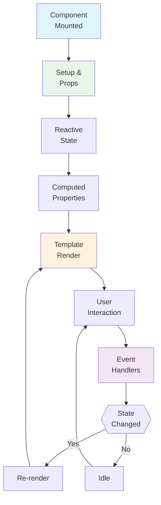
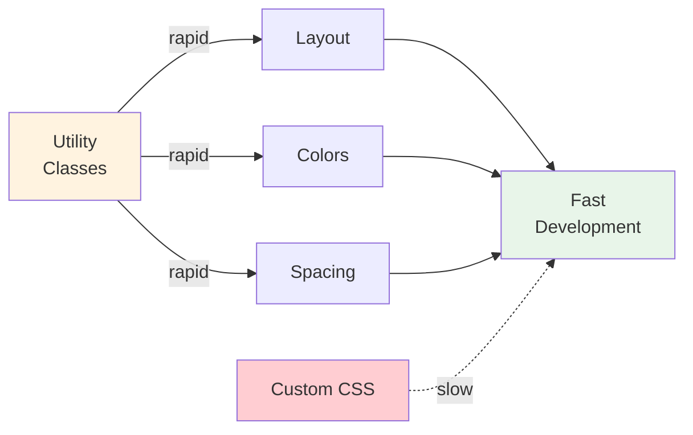

# Frontend Developer - AI Agent Instructions

**Focus**: Vue.js 3, accessibility (WCAG 2.1 AA), Tailwind CSS  
**For full reference**: [copilot-instructions.md](./copilot-instructions.md)

---

## 🎯 Architecture (Frontend-Specific)

### Vue 3 Component Lifecycle



### Vue 3 Component Pattern
```vue
<script setup lang="ts">
import { ref, computed } from 'vue'
import { useStore } from '@/stores'

const props = defineProps<{ product: Product }>()
const emit = defineEmits<{ (e: 'select', p: Product): void }>()
const store = useStore()
</script>

<template>
  <div class="flex gap-4">
    <!-- Multi-word component names, scoped styles, semantic HTML -->
  </div>
</template>

<style scoped>
/* CSS modules or scoped styles only */
</style>
```

### Tailwind CSS (NOT custom CSS)



```html
<!-- ✅ Utility-first approach -->
<button class="px-4 py-2 rounded-lg bg-blue-500 hover:bg-blue-600 dark:bg-blue-600">

<!-- ❌ NEVER custom CSS for layout -->
<style> .my-button { padding: 16px; background: blue; } </style>
```

---

## ⚡ Critical Rules

1. **Accessibility FIRST** (WCAG 2.1 AA - Legal deadline 28. Juni 2025!)
   - Keyboard navigation (TAB, ENTER, Escape)
   - Screen reader support (ARIA labels, semantic HTML)
   - Color contrast 4.5:1 minimum
   - All images need alt text

2. **Type Safety**: Use TypeScript everywhere, NO `any` types

3. **Composition API only**: NO Options API in new code

4. **Pinia for state**: NO global variables or context chaos

5. **Responsive design**: Mobile-first (unprefixed = all screens, `md:` = 768px+)

---

## 🚀 Quick Commands

```bash
cd Frontend/Store && npm run dev           # Start dev (Port 5173)
cd Frontend/Admin && npm run dev           # Admin frontend (Port 5174)
npm run test                               # Unit tests (Vitest)
npm run test:e2e                           # E2E tests (Playwright)
npm run lint                               # ESLint + format
npx @axe-core/cli http://localhost:5173   # Accessibility audit
npx lighthouse http://localhost:5173 --only-categories=accessibility  # Performance
```

---

## 📋 Before Implementing a Component

- [ ] Is component name multi-word (ProductCard, not Card)?
- [ ] Props have TypeScript types AND default values?
- [ ] `:key` on every `v-for`?
- [ ] No `v-if` with `v-for` on same element?
- [ ] Accessibility: ARIA labels, semantic HTML, alt text?
- [ ] Tailwind utilities used (no inline styles)?
- [ ] Dark mode variants added (`dark:` prefix)?
- [ ] Mobile-first responsive (unprefixed for mobile)?

---

## 🛑 Common Mistakes

| Mistake | Prevention |
|---------|-----------|
| Single-word component names | Use `ProductCard.vue`, not `Card.vue` |
| Missing `:key` on v-for | Add unique `:key="item.id"` |
| Inline styles instead of Tailwind | Use `class="flex gap-4"` not `style="display:flex"` |
| No color contrast testing | Run axe DevTools, target 4.5:1+ |
| Hardcoding API URLs | Use `.env.development` variables |
| No keyboard navigation | Test with TAB key only (no mouse) |

---

## ♿ Accessibility Essentials (Legal Requirement!)

**WCAG 2.1 Level AA by 28. Juni 2025:**
- [ ] Keyboard TAB navigation works
- [ ] Focus indicators visible
- [ ] All form fields have `<label>`
- [ ] Images have meaningful alt text
- [ ] Color contrast >= 4.5:1
- [ ] Modal closes on Escape
- [ ] Error messages in `role="alert"`

**Test with:**
- axe DevTools (Chrome extension)
- NVDA (Windows) or VoiceOver (macOS) screen reader
- Keyboard only (no mouse)

---

## 📚 Reference Files

- Component patterns: [Frontend/Store/src/components/](../Frontend/Store/src/components/)
- Tailwind guide: [copilot-instructions.md §Tailwind CSS](./copilot-instructions.md)
- Accessibility tests: [docs/P0.8_BARRIEREFREIHEIT_BITV_TESTS.md](../docs/compliance/P0.8_BARRIEREFREIHEIT_BITV_TESTS.md)
- Vue 3 docs: [https://vuejs.org/](https://vuejs.org/)

---

## 📋 Accessibility Audit Checklist

Before every PR:
- [ ] Lighthouse Accessibility >= 90
- [ ] axe DevTools: 0 critical issues
- [ ] Keyboard navigation tested (TAB only)
- [ ] Screen reader tested (NVDA/VoiceOver)
- [ ] Color contrast checked (4.5:1+ for normal text)
- [ ] Dark mode verified
- [ ] Mobile responsive (320px - 1920px)
