# AI Agent Instructions - Role-Specific Guides

**B2Connect AI Coding Agent** - Select your role for targeted guidance

---

## 🎯 Quick Navigation

### Role Selection Flow

```mermaid
graph TD
    A["B2Connect AI Agent<br/>Choose Your Role"] --> B{"What's Your Role?"}
    
    B -->|Backend| C["💻 Backend Developer<br/>10 min read"]
    B -->|Frontend| D["🎨 Frontend Developer<br/>10 min read"]
    B -->|DevOps| E["⚙️ DevOps Engineer<br/>10 min read"]
    B -->|QA| F["🧪 QA Engineer<br/>10 min read"]
    B -->|Security| G["🔐 Security Engineer<br/>10 min read"]
    B -->|Not Sure| H["📋 Quick-Start Guide<br/>5 min read"]
    
    C --> I["Wolverine<br/>Onion Architecture<br/>Database Design"]
    D --> J["Vue.js 3<br/>Accessibility<br/>Tailwind CSS"]
    E --> K["Aspire<br/>Infrastructure<br/>Port Management"]
    F --> L["xUnit Tests<br/>52 Compliance Tests<br/>E2E Testing"]
    G --> M["Encryption<br/>Audit Logging<br/>Compliance P0.1-P0.5"]
    H --> N["Architecture Overview<br/>Critical Commands<br/>Common Mistakes"]
    
    I --> O["✅ Ready to Code"]
    J --> O
    K --> O
    L --> O
    M --> O
    N --> O
    
    style A fill:#e1f5ff
    style B fill:#fff3e0
    style C fill:#e8f5e9
    style D fill:#e8f5e9
    style E fill:#e8f5e9
    style F fill:#e8f5e9
    style G fill:#e8f5e9
    style H fill:#fff3e0
    style O fill:#c8e6c9
```



| Role | File | Focus | Read Time |
|------|------|-------|-----------|
| **Backend Developer** | [copilot-instructions-backend.md](./copilot-instructions-backend.md) | Wolverine services, onion architecture, database | 10 min |
| **Frontend Developer** | [copilot-instructions-frontend.md](./copilot-instructions-frontend.md) | Vue.js 3, accessibility, Tailwind CSS | 10 min |
| **DevOps Engineer** | [copilot-instructions-devops.md](./copilot-instructions-devops.md) | Aspire, infrastructure, port management | 10 min |
| **QA Engineer** | [copilot-instructions-qa.md](./copilot-instructions-qa.md) | 52 compliance tests, E2E testing | 10 min |
| **Security Engineer** | [copilot-instructions-security.md](./copilot-instructions-security.md) | Encryption, audit logging, compliance (P0.1-P0.5) | 10 min |

---

## 📋 Quick-Start Guides

- **All Roles**: Start with [copilot-instructions-quickstart.md](./copilot-instructions-quickstart.md) (5 minutes)
  - Essential architecture overview
  - Critical commands
  - Common mistakes

- **For Deep Dives**: See [copilot-instructions.md](./copilot-instructions.md) (comprehensive reference)
  - 3,500+ lines of detailed patterns
  - .NET 10 / C# 14 best practices
  - Security checklist
  - Compliance requirements

---

## 🚀 Immediate Next Steps

### Step 1: Choose Your Role
Select the file above that matches your role.

### Step 2: Read Quick-Start
All roles should start with [copilot-instructions-quickstart.md](./copilot-instructions-quickstart.md) (5 min).

### Step 3: Read Role-Specific Guide
Read your role's file above (10 min).

### Step 4: Reference as Needed
Use [copilot-instructions.md](./copilot-instructions.md) for deeper patterns and examples.

---

## 📁 File Organization

```
.github/
├── copilot-instructions.md              ← Main reference (3,500+ lines)
├── copilot-instructions-quickstart.md   ← All roles start here (5 min)
├── copilot-instructions-index.md        ← This file
├── copilot-instructions-backend.md      ← Backend developers
├── copilot-instructions-frontend.md     ← Frontend developers
├── copilot-instructions-devops.md       ← DevOps engineers
├── copilot-instructions-qa.md           ← QA engineers
└── copilot-instructions-security.md     ← Security engineers
```

---

## 🔗 Architecture Overview (All Roles)

### Microservices (Wolverine-Based)


### Patterns (All Roles)
- **Architecture**: DDD (Domain-Driven Design) + Onion pattern
- **HTTP Handlers**: Wolverine (NOT MediatR)
- **Communication**: Event-driven (Wolverine messaging)
- **Multi-Tenancy**: X-Tenant-ID header + TenantId filtering
- **Security**: Encryption (AES-256), Audit logging, Key vault

---

## ⚡ Critical Rules (All Roles)

1. **Build first**: `dotnet build B2Connect.slnx` before writing code
2. **Wolverine only**: NO MediatR, NO `[ApiController]`, NO `IRequest<>`
3. **Tenant isolation**: EVERY query filters by `TenantId`
4. **Encryption**: PII fields use `IEncryptionService`
5. **Audit logging**: EVERY data change logged
6. **Accessibility**: WCAG 2.1 AA (legal deadline: 28. Juni 2025!)

---

## 🎯 Key Documents by Role

**Backend**: 
- [docs/architecture/DDD_BOUNDED_CONTEXTS.md](../docs/architecture/DDD_BOUNDED_CONTEXTS.md)
- [docs/guides/TESTING_GUIDE.md](../docs/guides/TESTING_GUIDE.md)

**Frontend**:
- [docs/P0.8_BARRIEREFREIHEIT_BITV_TESTS.md](../docs/compliance/P0.8_BARRIEREFREIHEIT_BITV_TESTS.md)
- [docs/LOCALIZATION_IMPLEMENTATION_COMPLETE.md](../docs/LOCALIZATION_IMPLEMENTATION_COMPLETE.md)

**DevOps**:
- [docs/architecture/ASPIRE_GUIDE.md](../docs/architecture/ASPIRE_GUIDE.md)
- [docs/PORT_BLOCKING_SOLUTION.md](../docs/PORT_BLOCKING_SOLUTION.md)

**QA**:
- [docs/P0.6_ECOMMERCE_LEGAL_TESTS.md](../docs/compliance/P0.6_ECOMMERCE_LEGAL_TESTS.md)
- [docs/COMPLIANCE_TESTING_EXAMPLES.md](../docs/compliance/COMPLIANCE_TESTING_EXAMPLES.md)

**Security**:
- [docs/EU_SAAS_COMPLIANCE_IMPLEMENTATION_ROADMAP.md](../docs/EU_SAAS_COMPLIANCE_IMPLEMENTATION_ROADMAP.md)
- [docs/AUDIT_LOGGING_IMPLEMENTATION.md](../docs/AUDIT_LOGGING_IMPLEMENTATION.md)

---

## 💡 Pro Tips

- **Lost?** Check the role-specific file first
- **Need examples?** See working code references in each guide
- **Building?** Always run `dotnet build` immediately
- **Testing?** Coverage >= 80% required before PR
- **Security?** No hardcoded secrets, encrypt all PII
- **Accessibility?** Test with keyboard only (no mouse)

---

**Last Updated**: 28. Dezember 2025  
**Questions?** Check your role's guide → Quick-start → Main reference
