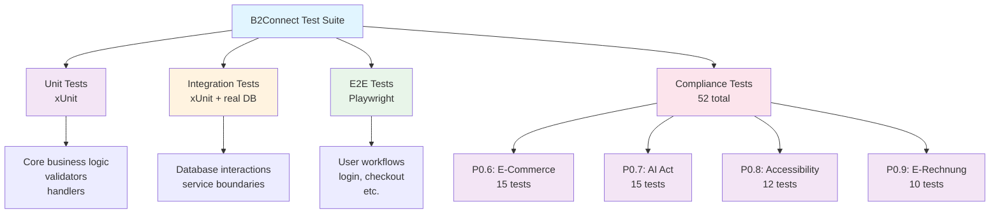
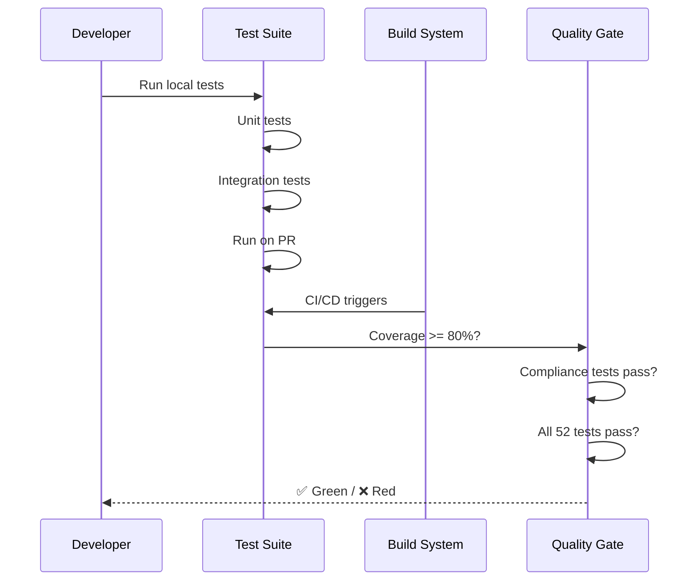

# QA Engineer - AI Agent Instructions

**Focus**: 52 compliance tests, xUnit, E2E testing, automation  
**For full reference**: [copilot-instructions.md](./copilot-instructions.md)

---

## 🎯 Testing Architecture

### Test Types



### Test Execution Flow



---

### Test File Location Pattern
```
backend/Domain/[Service]/tests/
├── [Service]Tests.csproj
├── Handlers/
│   ├── CreateProductHandlerTests.cs
│   └── ValidateProductHandlerTests.cs
├── Validators/
│   └── CreateProductValidatorTests.cs
└── Integration/
    └── ProductRepositoryTests.cs
```

---

## ⚡ Critical Rules

1. **All 52 compliance tests MUST PASS** before Phase 1 deployment
   - P0.6: E-Commerce (VAT, returns, invoices)
   - P0.7: AI Act (fraud detection logging)
   - P0.8: Accessibility (keyboard, screen readers)
   - P0.9: E-Rechnung (ZUGFeRD format)

2. **Test coverage >= 80%** for business logic

3. **xUnit only** (no NUnit, MSTest in B2Connect)

4. **AAA pattern**: Arrange → Act → Assert

5. **Mock external dependencies** (HTTP, database, email)

---

## 🚀 Quick Commands

```bash
# Run all tests
dotnet test B2Connect.slnx -v minimal

# Run specific service tests
dotnet test backend/Domain/Identity/tests -v minimal

# Run compliance tests only
dotnet test --filter "Category=Compliance"

# Run with coverage
dotnet test --collect:"XPlat Code Coverage"

# E2E tests (frontend)
cd Frontend/Admin && npm run test:e2e
cd Frontend/Store && npm run test:e2e

# Accessibility testing
npx @axe-core/cli http://localhost:5173
npx lighthouse http://localhost:5173 --only-categories=accessibility
```

---

## 📋 Test Template (Copy-Paste)

```csharp
public class CreateProductHandlerTests : IAsyncLifetime {
    private CreateProductService _service;
    private Mock<IProductRepository> _mockRepo;
    private Guid _tenantId = Guid.NewGuid();
    
    public async Task InitializeAsync() {
        _mockRepo = new Mock<IProductRepository>();
        _service = new CreateProductService(_mockRepo.Object);
    }
    
    public Task DisposeAsync() => Task.CompletedTask;
    
    [Fact]
    public async Task CreateAsync_ValidCommand_CreatesProduct() {
        // Arrange
        var cmd = new CreateProductCommand("SKU", "Name", 99.99m);
        
        // Act
        var result = await _service.CreateAsync(_tenantId, cmd, CancellationToken.None);
        
        // Assert
        Assert.NotNull(result);
        Assert.True(result.Success);
        _mockRepo.Verify(r => r.AddAsync(It.IsAny<Product>(), It.IsAny<CancellationToken>()));
    }
    
    [Fact]
    public async Task CreateAsync_InvalidCommand_ReturnsFailed() {
        // Invalid data test...
    }
}
```

---

## 🛑 Common Mistakes

| Mistake | Prevention |
|---------|-----------|
| Forgetting to mock dependencies | Always mock external services (HTTP, DB) |
| Duplicate test names | Use descriptive names: `Scenario_Condition_Expected` |
| Not testing error cases | Add negative tests: invalid input, missing data |
| Ignoring locale issues | German tests need decimal handling (`.` vs `,`) |
| Missing tenant isolation tests | Verify cross-tenant access is blocked |

---

## ♿ Accessibility Testing (P0.8 - CRITICAL!)

### Automated Testing
```bash
# Run axe accessibility checks
npx @axe-core/cli http://localhost:5173
# Should report: 0 critical/serious violations

# Lighthouse accessibility audit
npx lighthouse http://localhost:5173 --only-categories=accessibility
# Target score: >= 90
```

### Manual Testing (Required!)
- [ ] TAB through page (keyboard only, no mouse)
- [ ] All form fields navigable and labeled
- [ ] Focus indicators visible
- [ ] Color contrast >= 4.5:1 (use contrast checker)
- [ ] Test with NVDA (Windows) or VoiceOver (macOS)
- [ ] Modal closes on Escape key
- [ ] Alt text on all images

---

## 📚 Reference Files

- Compliance tests: [docs/P0.6_ECOMMERCE_LEGAL_TESTS.md](../docs/compliance/P0.6_ECOMMERCE_LEGAL_TESTS.md)
- AI Act tests: [docs/P0.7_AI_ACT_TESTS.md](../docs/compliance/P0.7_AI_ACT_TESTS.md)
- BITV/Accessibility: [docs/P0.8_BARRIEREFREIHEIT_BITV_TESTS.md](../docs/compliance/P0.8_BARRIEREFREIHEIT_BITV_TESTS.md)
- E-Rechnung tests: [docs/P0.9_ERECHNUNG_TESTS.md](../docs/compliance/P0.9_ERECHNUNG_TESTS.md)
- Testing guide: [docs/guides/TESTING_GUIDE.md](../docs/guides/TESTING_GUIDE.md)

---

## 📋 Compliance Test Execution Checklist

Before Phase 1 Gate:
- [ ] All 15 P0.6 E-Commerce tests PASS
- [ ] All 15 P0.7 AI Act tests PASS
- [ ] All 12 P0.8 Accessibility tests PASS
- [ ] All 10 P0.9 E-Rechnung tests PASS
- [ ] Code coverage >= 80%
- [ ] No regressions in existing tests
- [ ] Test report generated (pass/fail summary)

---

## 🎯 Test Execution Matrix

| Component | Tests | Type | Automation | Status |
|-----------|-------|------|-----------|--------|
| P0.6 | 15 | xUnit | Automated | ⏳ |
| P0.7 | 15 | xUnit | Automated | ⏳ |
| P0.8 | 12 | Playwright + axe | Automated | ⏳ |
| P0.9 | 10 | xUnit | Automated | ⏳ |
| **TOTAL** | **52** | Mixed | Yes | **Gate** |
