# Security Engineer - AI Agent Instructions

**Focus**: Encryption, audit logging, incident response, compliance  
**For full reference**: [copilot-instructions.md](./copilot-instructions.md)

---

## 🎯 Security Architecture

### P0 Compliance Components (Critical!)

```mermaid
graph TD
    A["🔒 P0 Security<br/>Framework"]
    
    A --> P1["P0.1: Audit Logging<br/>Immutable, encrypted<br/>All CRUD operations"]
    A --> P2["P0.2: Encryption<br/>AES-256-GCM<br/>Email, Phone, PII"]
    A --> P3["P0.3: Incident Response<br/>< 24h notification<br/>Breach detection"]
    A --> P4["P0.4: Network<br/>VPC, Security Groups<br/>Least privilege"]
    A --> P5["P0.5: Key Management<br/>Azure KeyVault<br/>Annual rotation"]
    
    P1 --> L1["TenantId, UserId<br/>Before/After values<br/>Tamper detection"]
    P2 --> L2["Random IV<br/>Key in vault<br/>No plaintext"]
    P3 --> L3["Brute force alerts<br/>Exfiltration detection<br/>NIS2 compliance"]
    P4 --> L4["Services isolated<br/>No direct DB access<br/>mTLS between services"]
    P5 --> L5["Key rotation<br/>Access audit<br/>Secure storage"]
    
    style A fill:#fff3e0
    style P1 fill:#f3e5f5
    style P2 fill:#f3e5f5
    style P3 fill:#f3e5f5
    style P4 fill:#f3e5f5
    style P5 fill:#f3e5f5
```



### Threat Model & Defense

```mermaid
graph LR
    subgraph Threats["🚨 Threat Vectors"]
        T1["Unauthorized<br/>Data Access"]
        T2["SQL Injection<br/>or XSS"]
        T3["Key<br/>Compromise"]
        T4["Cross-Tenant<br/>Leaks"]
    end
    
    subgraph Defenses["🛡️ Mitigations"]
        D1["Encryption +<br/>TenantId Filter"]
        D2["Parameterized<br/>Queries"]
        D3["KeyVault +<br/>RBAC"]
        D4["Audit Logging +<br/>Immutable"]
    end
    
    T1 --> D1
    T2 --> D2
    T3 --> D3
    T4 --> D4
    
    style T1 fill:#ffcdd2
    style T2 fill:#ffcdd2
    style T3 fill:#ffcdd2
    style T4 fill:#ffcdd2
    style D1 fill:#e8f5e9
    style D2 fill:#e8f5e9
    style D3 fill:#e8f5e9
    style D4 fill:#e8f5e9
```



---

## ⚡ Critical Rules

1. **All PII encrypted** with AES-256-GCM + random IV
   - Email, Phone, FirstName, LastName, Address, DOB, SSN

2. **Every data modification logged** with:
   - User ID (who made change)
   - Timestamp (when)
   - Before/after values (what changed)
   - Tenant ID (multi-tenant safety)

3. **Tenant isolation enforced** at query level
   - EVERY query filters by `TenantId`
   - DbContext has global query filter

4. **No hardcoded secrets**
   - All secrets in Azure KeyVault (prod) or `appsettings.json` (dev)
   - Never in code/config files

5. **Key rotation policy** (annual minimum)
   - Automated renewal
   - Audit trail of rotations

---

## 🚀 Quick Commands

```bash
# Run security tests
dotnet test --filter "Category=Security"

# Check for hardcoded secrets
grep -r "password\|secret\|key" backend/ --include="*.cs" --include="*.json"

# Verify encryption
dotnet test --filter "Encryption"

# Run compliance tests
dotnet test --filter "Category=Compliance"

# Check audit logs
curl http://localhost:7002/admin/audit-logs  # Requires auth
```

---

## 📋 Security Checklist (Mandatory for Every Feature)

### P0.1: Audit Logging
- [ ] EF Core SaveChangesInterceptor captures CRUD
- [ ] AuditLogEntry stores: TenantId, UserId, action, before/after
- [ ] Logs are immutable (no update/delete allowed)
- [ ] Hash verification for tamper detection
- [ ] Serilog exports to SIEM

### P0.2: Encryption
- [ ] `IEncryptionService` used for all PII
- [ ] AES-256-GCM with random IV per encryption
- [ ] Keys in Azure KeyVault (NOT hardcoded)
- [ ] Key rotation automated (annual)
- [ ] Tests verify round-trip (encrypt → decrypt = original)

### P0.3: Incident Response
- [ ] Brute force detection (>5 failed logins/10min)
- [ ] Data exfiltration detection (>3x normal volume)
- [ ] NIS2 notification < 24h to authorities
- [ ] Alert channels configured (Slack, email, PagerDuty)

### P0.4: Network
- [ ] VPC with 3 subnets (public, services, databases)
- [ ] Security Groups (principle of least privilege)
- [ ] mTLS between services
- [ ] No direct internet access to databases

### P0.5: Key Management
- [ ] Azure KeyVault provisioned
- [ ] Access policies per service
- [ ] Key rotation automation
- [ ] Audit logging of key access

---

## 🛑 Common Mistakes

| Mistake | Prevention |
|---------|-----------|
| Plaintext PII in database | Use `IEncryptionService.Encrypt()` |
| Hardcoded secrets in code | Use `IConfiguration["Key"]` |
| Forgot tenant filter in query | Add `.Where(x => x.TenantId == tenantId)` |
| No audit logging | Use EF Core SaveChangesInterceptor |
| Nullable passwords/tokens | Use proper hashing (Argon2, not MD5) |

---

## 🔐 Data Classification

### Level 1 (PII - ENCRYPT)
- Email addresses
- Phone numbers
- First/Last names
- Postal addresses
- Dates of birth
- SSN/Tax IDs

### Level 2 (Sensitive Business - Audit)
- Order amounts
- Customer payment methods (reference only, never store)
- Internal cost data
- Supplier information

### Level 3 (Public)
- Product SKUs
- Product names
- Public pricing

---

## 📚 Reference Files

- Encryption patterns: [docs/AUDIT_LOGGING_IMPLEMENTATION.md](../docs/AUDIT_LOGGING_IMPLEMENTATION.md)
- Security checklist: [copilot-instructions.md §Security](./copilot-instructions.md)
- EU compliance: [docs/EU_SAAS_COMPLIANCE_IMPLEMENTATION_ROADMAP.md](../docs/EU_SAAS_COMPLIANCE_IMPLEMENTATION_ROADMAP.md)
- AI Act: [docs/AI_ACT_EXECUTIVE_SUMMARY.md](../docs/AI_ACT_EXECUTIVE_SUMMARY.md)
- Example encryption: [backend/Domain/Identity/Program.cs](../backend/Domain/Identity/Program.cs)

---

## 🎯 Compliance Audit Checklist

Before production:
- [ ] All P0.1-P0.5 components working
- [ ] No hardcoded secrets in codebase
- [ ] Encryption key rotation working
- [ ] Audit logs immutable (tamper detection)
- [ ] Incident response procedures tested
- [ ] Penetration testing completed
- [ ] Security review signed off by Tech Lead
