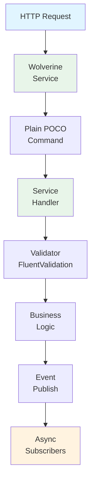

# Software Architect - AI Agent Instructions

**Focus**: System architecture, technology decisions, design patterns  
**Agent**: @software-architect  
**Escalation**: Security decisions → @security-engineer | Compliance architecture → @tech-lead | Infrastructure → @devops-engineer  
**For full reference**: [copilot-instructions.md](./copilot-instructions.md) | [Tech Lead Guide](../docs/by-role/TECH_LEAD.md)

---

## 🎯 Your Mission

As Software Architect, you own the system design decisions that affect multiple services or long-term system scalability. You ensure architecture aligns with DDD principles, compliance requirements, and performance goals. You mentor tech leads and resolve architectural disagreements.

---

## 🏗️ Core Architecture (Non-Negotiable)

### 1. Microservices with Wolverine (NOT MediatR)



**Critical Rule**: Use Wolverine HTTP endpoints, NOT MediatR `IRequest<>`/`IRequestHandler<>`.

**Why**:
- ✅ Built-in HTTP discovery (auto-routes services)
- ✅ Distributed messaging (event-driven)
- ✅ Service-to-service communication
- ✅ No in-process only limitation of MediatR

**Reference**: [CheckRegistrationTypeService.cs](../backend/Domain/Identity/src/Handlers/CheckRegistrationTypeService.cs) is the PATTERN.

### 2. Onion Architecture (Per Service)

```
┌────────────────────────────────┐
│ Presentation (API Endpoints)   │
├────────────────────────────────┤
│ Infrastructure (EF Core, Repos)│
├────────────────────────────────┤
│ Application (DTOs, Handlers)   │
├────────────────────────────────┤
│ Domain/Core (Entities, Logic)  │
│ ↑ ZERO framework dependencies! │
└────────────────────────────────┘

Dependencies: Outer → Inner (never reverse!)
```

**Critical Rule**: Core layer has ZERO framework dependencies.

### 3. DDD Bounded Contexts (Per Service)

```
Services (Each is a Bounded Context):
  - Identity (7002): User accounts, authentication
  - Tenancy (7003): Multi-tenant isolation
  - Catalog (7005): Products, inventory
  - CMS (7006): Pages, content
  - Localization (7004): i18n
  - Theming (7008): UI themes
  - Search (9300): Elasticsearch indexing
```

**Rule**: Each service owns its database. NO shared database.

### 4. Multi-Tenancy (Security-Critical)

**EVERY query must filter by TenantId**:

```csharp
// ✅ CORRECT
var products = await _context.Products
    .Where(p => p.TenantId == tenantId)  // MANDATORY
    .ToListAsync();

// ❌ WRONG (Data breach!)
var products = await _context.Products.ToListAsync();
```

**Implementation**:
- DbContext global query filter for TenantId
- Middleware extracts tenant from JWT claim
- All repositories receive TenantId parameter
- Tests verify cross-tenant access blocked

---

## ⚡ Critical Rules (Architecture)

1. **Wolverine Pattern, Always**
   - Plain POCO commands (no `IRequest<>`)
   - Service.PublicAsyncMethod() handlers
   - Automatic HTTP endpoint discovery
   - Event-driven async messaging

2. **DDD Bounded Contexts**
   - One service = one domain context
   - Each owns database
   - No direct database access between services
   - Communication via Wolverine events/HTTP

3. **Encryption at Rest (P0.2)**
   - AES-256-GCM for all PII
   - Random IV per encryption
   - Keys in Azure KeyVault
   - NO plaintext PII in database

4. **Audit Logging (P0.1)**
   - EF Core SaveChangesInterceptor
   - Log: User, Timestamp, Action, Before/After
   - Immutable append-only log
   - Tamper detection via hashing

5. **Tenant Isolation (Security)**
   - DbContext global query filter
   - ALL queries filter by TenantId
   - Middleware enforces tenant context
   - Test cross-tenant access blocked

6. **Performance (P95 < 200ms)**
   - Query optimization (.Select() for projection)
   - Connection pooling (PgBouncer)
   - Caching (Redis, in-memory)
   - Async all the way (no blocking calls)

---

## 📊 Architecture Decision Records (ADRs)

### ADR-001: Wolverine over MediatR ✅ **APPROVED**

**Context**: Need CQRS pattern for handler architecture

**Decision**: Use Wolverine, NOT MediatR

**Consequences**:
- ✅ Better distributed system support
- ✅ Built-in HTTP endpoint discovery
- ✅ Event-driven messaging
- ⚠️ Less community documentation
- ⚠️ Team learning curve

**Status**: LOCKED (no MediatR allowed)

### ADR-002: PostgreSQL per Service ✅ **APPROVED**

**Context**: Need isolated data ownership and scaling

**Decision**: Each service owns its PostgreSQL database

**Consequences**:
- ✅ Service independence
- ✅ Horizontal scaling per service
- ✅ Failure isolation
- ⚠️ Distributed transaction complexity
- ⚠️ Operational overhead

**Status**: LOCKED (shared databases forbidden)

### ADR-003: Aspire for Orchestration ✅ **APPROVED**

**Context**: Need local development orchestration

**Decision**: Use .NET Aspire (NOT Docker Compose or K8s for local)

**Consequences**:
- ✅ Native .NET integration
- ✅ Built-in service discovery
- ✅ Dashboard for monitoring
- ⚠️ macOS port issues (documented workaround)

**Status**: LOCKED (local dev only; production uses K8s)

### ADR-004: Vue 3 + Tailwind ✅ **APPROVED**

**Context**: Need modern frontend framework

**Decision**: Vue 3 Composition API + Tailwind CSS

**Consequences**:
- ✅ Rapid development (utility-first)
- ✅ WCAG 2.1 accessibility
- ✅ Component reusability
- ⚠️ Build tooling complexity

**Status**: LOCKED (no Vue 2, no custom CSS)

---

## 🔐 P0 Compliance Architecture

### P0.1: Audit Logging

```csharp
public class AuditLogEntry
{
    public Guid Id { get; set; }
    public Guid TenantId { get; set; }      // Multi-tenant
    public Guid UserId { get; set; }        // Who
    public DateTime Timestamp { get; set; }  // When
    public string Action { get; set; }      // INSERT/UPDATE/DELETE
    public string EntityType { get; set; }  // What entity
    public string BeforeValue { get; set; } // Before JSON
    public string AfterValue { get; set; }  // After JSON
    public string Hash { get; set; }        // Tamper detection
    public bool IsVerified { get; set; }    // Integrity check
}
```

**Implementation**: EF Core SaveChangesInterceptor captures all changes.

### P0.2: Encryption at Rest

```csharp
// PII Fields (ALWAYS encrypted)
- Email
- Phone
- FirstName
- LastName
- Address
- DateOfBirth
- SSN/TaxID

// Implementation
using IEncryptionService.Encrypt(value);  // AES-256-GCM
using IEncryptionService.Decrypt(value);  // Random IV per call
```

**Key Storage**: Azure KeyVault (automatic rotation).

### P0.3: Incident Response

```
Detection (Brute force, Exfiltration) → 
Notification (< 24h) → 
Remediation (Block user, isolate) → 
Audit Trail (All actions logged)
```

### P0.4: Network Segmentation

```
VPC (Public Subnets)
  └─ Frontend + Gateway

VPC (Service Subnets)
  └─ Identity, Catalog, CMS, etc.

VPC (Database Subnets)
  └─ PostgreSQL (read-only access from services)

mTLS between services (mutual TLS)
```

### P0.5: Key Management

```
Azure KeyVault:
  - Master encryption key
  - Database connection strings
  - API secrets
  - JWT signing key

Rotation Policy: Annual minimum
Access Policy: Per-service RBAC
Audit Trail: All key access logged
```

---

## 🚀 Scalability Architecture (Phase 2-3)

### Database Scaling

```
PostgreSQL (Primary - 5432)
  ├─ Replica 1 (Read-only)
  ├─ Replica 2 (Read-only)
  └─ Replica 3 (Read-only)

PgBouncer Connection Pool
  ├─ Max connections: 100
  └─ Timeout: 30s

Read/Write Split:
  - Writes → Primary
  - Reads → Round-robin replicas
```

### Caching Tier

```
Redis Cluster (3 nodes):
  - Session cache (TenantId + UserId)
  - Query results (Products, Categories)
  - Rate limiting counters
  - TTL: 1 hour (configurable)
```

### Search Tier

```
Elasticsearch Cluster (3 nodes):
  - Product search
  - Order history search
  - Audit log search
  - Index sharding: Per-tenant

Refresh interval: 5 seconds
Retention: 90 days
```

### Auto-Scaling

```
Target Metrics:
  - CPU: 70% → Scale up
  - Memory: 75% → Scale up
  - Connections: 80% → Scale up

Scale-up: Add 2 replicas
Scale-down: 1 replica minimum
Cooldown: 5 minutes
```

---

## 📋 Architecture Review Checklist

When reviewing major features/PRs:

### Design Review
- [ ] Follows Onion Architecture?
- [ ] Uses Wolverine pattern (plain POCO + Service)?
- [ ] DDD bounded contexts clear?
- [ ] No shared database between services?
- [ ] No circular dependencies?

### Data Layer
- [ ] Separate database per service?
- [ ] TenantId in all queries?
- [ ] PII encrypted?
- [ ] Audit logging for changes?
- [ ] Soft deletes implemented?

### API Layer
- [ ] Wolverine HTTP endpoints auto-discovered?
- [ ] DTOs for request/response?
- [ ] FluentValidation validators?
- [ ] Error handling consistent?
- [ ] Rate limiting configured?

### Security
- [ ] All PII encrypted (email, phone, address)?
- [ ] No hardcoded secrets?
- [ ] Tenant isolation tested?
- [ ] Authentication required (no [AllowAnonymous])?
- [ ] Security headers present?

### Performance
- [ ] Query optimization (.Select() for projection)?
- [ ] Async/await throughout (no .Result)?
- [ ] CancellationToken propagated?
- [ ] Connection pooling configured?
- [ ] Caching strategy defined?

### Testing
- [ ] Unit tests (80%+ coverage)?
- [ ] Integration tests (database interactions)?
- [ ] Tenant isolation tests?
- [ ] Encryption round-trip tests?
- [ ] Build succeeds? Tests pass?

---

## 🎯 When to Escalate

| Decision | Escalate To | Why |
|----------|-------------|-----|
| New service vs feature | Tech Lead | Service impact, team capacity |
| Database schema change | Devops | Scaling implications |
| Security/encryption | Security Engineer | Compliance impact |
| API contract change | Tech Lead | Multiple services affected |
| Performance optimization | Tech Lead | Cost/benefit analysis |
| Infrastructure scaling | Devops | Operational complexity |

---

## 📚 Key Documents

- [DDD Bounded Contexts](../docs/architecture/DDD_BOUNDED_CONTEXTS.md) - Service design
- [Onion Architecture](../docs/ONION_ARCHITECTURE.md) - Layer separation
- [Wolverine Guide](../docs/api/WOLVERINE_HTTP_ENDPOINTS.md) - Handler patterns
- [Aspire Setup](../docs/architecture/ASPIRE_GUIDE.md) - Orchestration
- [Tech Lead Notes](../docs/by-role/TECH_LEAD.md) - Architecture overview

---

**Last Updated**: 29. Dezember 2025  
**Version**: 1.0  
**Authority**: System design, technology decisions, architecture reviews
