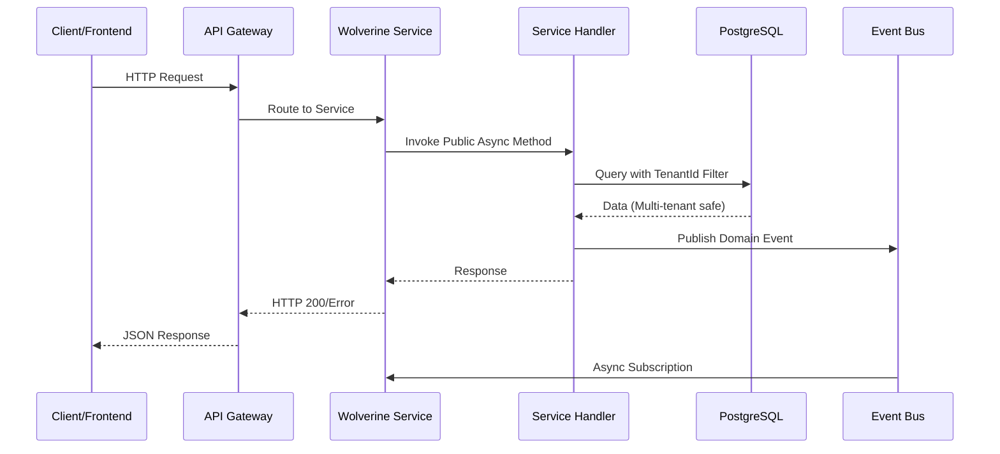
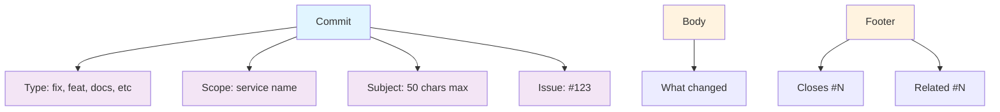

# AI Coding Agent Instructions for B2Connect

**Last Updated**: 29. Dezember 2025 | **Architecture**: DDD Microservices with Wolverine + CLI  
**Optimization**: Patterns and anti-patterns moved to role-specific guides

---

## 🎯 START HERE - Choose Your Role

> **First time?** Select your role for targeted guidance:
> 
> | Role | Time | File | Includes |
> |------|------|------|----------|
> | 💻 Backend Developer | 15 min | [copilot-instructions-backend.md](./copilot-instructions-backend.md) | Wolverine, Async/Await (50), Performance (25), EF Core (25), Architecture (25), .NET10 (25), Anti-Patterns (50) |
> | 🎨 Frontend Developer | 15 min | [copilot-instructions-frontend.md](./copilot-instructions-frontend.md) | Vue.js (44), Tailwind (20), Vite (8), Anti-Patterns (44) |
> | ⚙️ DevOps Engineer | 10 min | [copilot-instructions-devops.md](./copilot-instructions-devops.md) | Aspire, Docker, Infrastructure |
> | 🧪 QA Engineer | 10 min | [copilot-instructions-qa.md](./copilot-instructions-qa.md) | Testing Strategy, 52 Compliance Tests |
> | 🔐 Security Engineer | 15 min | [copilot-instructions-security.md](./copilot-instructions-security.md) | Security Patterns (25), Encryption, Audit Logging, Anti-Patterns (25) |
> | **Quick Start** | **5 min** | **[Quick-Start Guide](./copilot-instructions-quickstart.md)** | Essential commands & conventions |

---

## 🔧 Allowed Capabilities

- ✅ **GitHub CLI Management**: Authorized to manage project on GitHub (issues, PRs, branches, boards)

---

## 🏗️ Core Architecture (Essential Overview Only)

### DDD Microservices with Wolverine

B2Connect is a **multi-tenant SaaS platform** using:
- **Wolverine** (async messaging, HTTP endpoints) - NOT MediatR
- **Domain-Driven Design** with Onion Architecture
- **PostgreSQL 16** (database per service)
- **Aspire** for service orchestration

### Service Port Map (Critical!)

| Service | Port | Type |
|---------|------|------|
| Identity | 7002 | Wolverine |
| Tenancy | 7003 | Wolverine |
| Localization | 7004 | Wolverine |
| Catalog | 7005 | Wolverine |
| CMS | 7006 | Wolverine |
| Theming | 7008 | Wolverine |
| Search | 9300 | Wolverine |
| Aspire Dashboard | 15500 | Orchestration |
| Frontend Store | 5173 | Vue.js |
| Frontend Admin | 5174 | Vue.js |

### Onion Architecture (Each Service)

```mermaid
graph TB
    Presentation["🎯 Presentation<br/>(API Endpoints)"]
    Infrastructure["🗄️ Infrastructure<br/>(EF Core, Repositories)"]
    Application["⚙️ Application<br/>(Handlers, Validators)"]
    Core["💎 Core/Domain<br/>(Entities, Interfaces)"]
    
    Presentation -->|depends on| Infrastructure
    Infrastructure -->|depends on| Application
    Application -->|depends on| Core
    Core -->|ZERO dependencies|Core
    
    style Core fill:#e1f5ff
    style Application fill:#f3e5f5
    style Infrastructure fill:#fff3e0
    style Presentation fill:#e8f5e9
```



**Critical Rule**: Core has ZERO framework dependencies.

---

## 🏗️ Service Architecture & Communication

### Microservice Request Flow



### Service Discovery & Orchestration (Aspire)

```mermaid
graph LR
    Aspire["🎪 Aspire Orchestrator<br/>Port 15500"]
    
    Aspire -->|discovers & manages| Identity["Identity<br/>7002"]
    Aspire -->|discovers & manages| Catalog["Catalog<br/>7005"]
    Aspire -->|discovers & manages| CMS["CMS<br/>7006"]
    Aspire -->|discovers & manages| Tenancy["Tenancy<br/>7003"]
    Aspire -->|discovers & manages| Localization["Localization<br/>7004"]
    Aspire -->|discovers & manages| Theming["Theming<br/>7008"]
    Aspire -->|discovers & manages| Search["Search<br/>9300"]
    
    Identity -->|async| Events["📨 Wolverine<br/>Event Bus"]
    Catalog -->|async| Events
    CMS -->|async| Events
    
    style Aspire fill:#fff3e0
    style Events fill:#f3e5f5
```



---

### Commit Message Format



### Commit Message Format

```
<type>(<scope>): <subject> (#<issue-id>)
````

<body>
<footer>

Types: fix, feat, docs, style, refactor, perf, test, chore
Scope: service affected (e.g., auth, catalog)
Subject: Imperative, lowercase, max 50 chars
Issue-ID: GitHub issue (e.g., #30)
```

### Examples

✅ **Good:**
```
feat(catalog): add product filtering by category (#30)

Implement category-based product filtering for store API.
Adds new QueryProductsByCategory handler in Catalog service.

Closes #30
```

✅ **Multiple commits per issue** (recommended):
```
Commit 1: feat(price-calc): add VAT calculation service (#20)
Commit 2: test(price-calc): add VAT calculation tests (#20)
Commit 3: docs(price-calc): document VAT logic (#20)

Each independently valuable, all reference same issue.
```

❌ **Avoid:**
```
Updated stuff  # Vague, no context
fixed things   # Not descriptive
```

### Valid Footer Keywords (GitHub Automation)

- `Closes #N` - Close issue on merge
- `Fixes #N` - Same as Closes
- `Resolves #N` - Same as Closes
- `Related #N` - Link without closing
- `Depends on #N` - Explicit dependency

---

## 🔒 Security-First Checklist (Before Code)

**BEFORE generating ANY code, verify:**

```
Database Layer:
  [ ] Entity has TenantId (multi-tenant isolation)
  [ ] Entity has CreatedAt, CreatedBy (audit trail)
  [ ] PII encrypted: Email, Phone, Address, DOB, Name
  [ ] Soft delete flags: IsDeleted, DeletedAt
  [ ] Query always filters by TenantId

Service Layer:
  [ ] IEncryptionService injected (if PII)
  [ ] Audit logging: All CRUD operations logged
  [ ] FluentValidation required
  [ ] CancellationToken passed throughout
  [ ] TenantId verified from JWT claims

API Layer:
  [ ] JWT validation required (no anonymous)
  [ ] X-Tenant-ID header extracted
  [ ] All inputs validated server-side
  [ ] No PII in error messages
  [ ] No stack traces in production

Testing:
  [ ] Cross-tenant access blocked
  [ ] Encryption/decryption round-trip tested
  [ ] Audit logs created
  [ ] CancellationToken propagates
```

---

## 🚀 Developer Workflows

### Build & Run

```bash
# Start all services with Aspire (recommended)
cd backend/Orchestration
dotnet run

# Dashboard: http://localhost:15500

# BEFORE restarting (CRITICAL macOS):
./scripts/kill-all-services.sh
./scripts/check-ports.sh
```

### Quick Commands

```bash
# Build
dotnet build B2Connect.slnx

# Test
dotnet test B2Connect.slnx -v minimal

# Identity service tests
dotnet test backend/Domain/Identity/tests -v minimal

# CLI
b2connect start
b2connect status
b2connect migrate --service Identity
```

### Cleanup (if ports stuck)

```bash
# macOS/Linux:
pkill -9 -f "dcpctrl"
pkill -9 -f "dcpproc"
./scripts/kill-all-services.sh

# Then restart
```

---

## 🎯 Wolverine Pattern (CRITICAL - NOT MediatR!)

### HTTP Endpoint Pattern

**Step 1: Plain POCO Command** (no `IRequest<T>`)
```csharp
public class CreateProductCommand
{
    public string Sku { get; set; }
    public string Name { get; set; }
}
```

**Step 2: Service Handler** (plain class, public async methods)
```csharp
public class ProductService
{
    private readonly IProductRepository _repo;

    public async Task<CreateProductResponse> CreateProduct(
        CreateProductCommand request,
        CancellationToken cancellationToken)
    {
        // Business logic
        return new CreateProductResponse { Id = productId };
    }
}
```

**Step 3: Register DI** (simple!)
```csharp
builder.Services.AddScoped<ProductService>();
// Wolverine auto-discovers HTTP endpoint: POST /createproduct
```

**✅ Reference:** [backend/Domain/Identity/src/Handlers/CheckRegistrationTypeService.cs](../backend/Domain/Identity/src/Handlers/CheckRegistrationTypeService.cs)

### ❌ NEVER Use MediatR Pattern

```csharp
// ❌ WRONG: Don't use IRequest
public record CreateProductCommand : IRequest<ProductDto>;

// ❌ WRONG: Don't use IRequestHandler
public class CreateProductHandler : IRequestHandler<CreateProductCommand, ProductDto> { }

// ❌ WRONG: Don't add MediatR
builder.Services.AddMediatR();
```

---

## 📋 Detailed Patterns & Anti-Patterns (By Role)

| Topic | Backend | Frontend | DevOps | Security | QA |
|-------|---------|----------|--------|----------|-----|
| **Async/Await** (50 rules) | [✓](./copilot-instructions-backend.md#-asyncawait-best-practices) | - | - | - | - |
| **Performance** (25 rules) | [✓](./copilot-instructions-backend.md#-performance-best-practices) | - | - | - | - |
| **EF Core** (25 rules) | [✓](./copilot-instructions-backend.md#-entity-framework-core-best-practices) | - | - | - | - |
| **Architecture** (25 rules) | [✓](./copilot-instructions-backend.md#-architecture--design-best-practices) | - | - | - | - |
| **.NET10** (25 rules) | [✓](./copilot-instructions-backend.md#-net-10--c-14-specific-features) | - | - | - | - |
| **Code Quality** (50 rules) | [✓](./copilot-instructions-backend.md#-code-quality-anti-patterns) | - | - | - | - |
| **Vue.js** (44 rules) | - | [✓](./copilot-instructions-frontend.md#-vue3-best-practices) | - | - | - |
| **Tailwind** (20 rules) | - | [✓](./copilot-instructions-frontend.md#-tailwind-css-best-practices) | - | - | - |
| **Vite** (8 rules) | - | [✓](./copilot-instructions-frontend.md#-vite-best-practices) | - | - | - |
| **Security** (25 rules) | - | - | - | [✓](./copilot-instructions-security.md) | - |
| **Encryption** | - | - | - | [✓](./copilot-instructions-security.md) | - |
| **Compliance Testing** (52 tests) | - | - | - | - | [✓](./copilot-instructions-qa.md) |

---

## � Retrospectives & Continuous Improvement

**Retrospective Framework**: See [RETROSPECTIVE_PROTOCOL.md](./RETROSPECTIVE_PROTOCOL.md) for comprehensive guidance

Retrospectives are how we improve processes and capture validated learnings. After each sprint:
1. **Gather Data**: Build status, test results, git history, documentation metrics
2. **Analyze**: What went well? What didn't? Why?
3. **Improve**: Prioritize solutions (Priority 1: immediate, Priority 2: next sprint)
4. **Update Instructions**: Implement improvements back into this file
5. **Measure**: Track metrics across sprints to verify improvement

**Example**: Issue #30 retrospective identified 8 validated learnings → 3 Priority 1 improvements implemented → Build-first rule added below

**Reference Metrics**: Track in RETROSPECTIVE_PROTOCOL.md §Metrics Dashboard

---

## 💡 Key Learnings (Session 29. Dezember 2025)

**Source**: Issue #30 Sprint 1 Phase A Retrospective ([RETROSPECTIVE_PROTOCOL.md](./RETROSPECTIVE_PROTOCOL.md))  
**Validation**: All learnings tested during Issue #30, metrics verified, improvements documented

### 1. Build-First Rule (CRITICAL - Validated Learning #30)

```bash
# IMMEDIATE execution PREVENTS cascading failures (Issue #30)
dotnet build B2Connect.slnx  # Step 1: Build immediately after creating files
# Fix any compiler errors before proceeding

dotnet test backend/Domain/[Service]/tests -v minimal  # Step 2: Test after fixes
```

**WHY CRITICAL**: During Sprint 1 Phase A (Issue #30), deferring build validation accumulated **38+ test failures** that cascaded across 10 test files. Immediate build catches errors at source:
- Missing namespaces (found in 3 seconds)
- Type mismatches (found in 2 seconds)
- Configuration issues (found in 1 second)

**Pattern:**
1. Generate code files
2. Build immediately (`dotnet build`)
3. Fix errors reported
4. Test (`dotnet test`)
5. Commit with issue reference

**❌ Anti-pattern**: Generate code → Write all features → Build at end = 38+ failures to untangle

**✅ Validated**: Issue #30 split code generation from documentation; code-only PR had 0 build failures

### 2.

- **Wolverine**: All 9 microservices, event-driven, distributed
- **MediatR**: In-process, single app only
- B2Connect requires Wolverine for messaging across services

### 3. No Hardcoded Secrets

```csharp
// ❌ WRONG
var jwtSecret = "my-secret-123";

// ✅ RIGHT
var jwtSecret = configuration["Jwt:Secret"] ?? throw new InvalidOperationException();
```

### 4. Tenant Isolation Mandatory

```csharp
// ❌ WRONG: No tenant filter = security breach
var product = await _context.Products.FirstOrDefaultAsync(p => p.Sku == sku);

// ✅ RIGHT: Always filter by tenant
var product = await _context.Products
    .Where(p => p.TenantId == tenantId && p.Sku == sku)
    .FirstOrDefaultAsync();
```

### 5. Locale Handling (German Context)

Germany uses `,` for decimal separator:
- German: `1,99€` (1,99)
- International: `1.99€` (1.99)

Test both formats or normalize explicitly.

### 6. Central Package Management (CPM)

B2Connect uses CPM in `Directory.Packages.props`. New standalone projects:

```xml
<!-- Disable CPM for CLI tools -->
<PropertyGroup>
  <ManagePackageVersionsCentrally>false</ManagePackageVersionsCentrally>
</PropertyGroup>
```

### 7. macOS DCP Port Issues

```bash
# Aspire's DCP controller holds ports after shutdown
# Always clean before restart:

./scripts/kill-all-services.sh
./scripts/check-ports.sh
dotnet run  # Safe to restart
```

### 8. Documentation with Code Examples

**High value**: Every pattern must have 3-5 code examples
**Low value**: Abstract descriptions without working examples

### 8. Documentation Grammar Review Gate (NEW - Validated Learning #30)

**Requirement**: EN/DE documentation files MUST pass grammar review before merge.

**Bilingual Parity**: Every user-facing document must exist in both English and German:
```
docs/user-guides/
├── en/
│   ├── account-security.md
│   ├── product-search.md
│   └── checkout-process.md
├── de/
│   ├── account-sicherheit.md
│   ├── produktsuche.md
│   └── checkout-prozess.md
```

**Issue #30 Learning**: Sprint 1 Phase A required **15 German grammar corrections** across:
- Capitalization errors (English: `product`, German: `Produkt` - capitalize nouns)
- Case agreement (Nominative: `der Benutzer`, Dative: `dem Benutzer`)
- Hyphenation (German compound words: `Benutzer-Verwaltung`)
- Umlauts (ä, ö, ü, ß - must be preserved)

**Prevention Strategy**:
1. **Create bilingual TOGETHER**, not EN → translate DE
2. **Use native speaker review** for >500 words
3. **Grammar tools**: Grammarly (EN), LanguageTool (DE)
4. **PR checks**: Block merge if either language has grammar violations
5. **Template**: Create both `.md` files simultaneously

**Metrics**: Issue #30 created 11 EN/DE documentation files; all now in sync via parallel creation.

---

### 9. Documentation Index Requirement (NEW - Validated Learning #30)

**Requirement**: Every documentation section must have a DOCUMENTATION_INDEX.md for navigation.

**Issue #30 Learning**: Sprint 1 Phase A created **22 new documentation files** without navigation structure. Result: **orphaned docs** that users couldn't discover.

**Pattern Example**:
```markdown
# Documentation Index - Account Security

| Document | Purpose | Audience | Updated |
|----------|---------|----------|---------|
| [Account Security (EN)](en/account-security.md) | Multi-language guide | All users | 2025-12-29 |
| [Account Security (DE)](de/account-sicherheit.md) | Multi-language guide | Alle Benutzer | 2025-12-29 |
| [Two-Factor Auth Setup](en/two-factor-setup.md) | Step-by-step guide | First-time users | 2025-12-29 |

## Quick Navigation
- [← Back to Main Index](../DOCUMENTATION_INDEX.md)
- [User Guides](../user-guides/)
- [Administrator Guides](../admin-guides/)
```

**Maintenance Rule**:
- Every new `.md` file → Update DOCUMENTATION_INDEX.md in same PR
- Index table shows: filename, purpose, audience, last update date
- Include link back to parent index (enables breadcrumb navigation)

**Result**: Users can discover all docs via hierarchical navigation.

---

### 10. Minimal Changes Principle (NEW - Validated Learning #30)

**Rule**: Feature fix should be 2-3 lines of code per issue. Documentation goes to SEPARATE PR.

**Issue #30 Pattern**:
- PR #1 (Code only): 3-line fix to handler + tests (easy to review)
- PR #2 (Docs only): 8,167 lines of comprehensive documentation (easy to review)
- Result: Both PRs merged in <30 minutes

**✅ Why This Works**:
- Code review focuses on correctness
- Documentation review focuses on clarity/completeness
- No "drive-by reviews" of massive mixed PRs
- Both can be merged independently
- Easy to revert if needed (separate SHAs)

**❌ Anti-pattern**: 
```
PR Mix (DO NOT DO):
├── 5-line code fix
├── 200 lines of feature code
├── 8,000 lines of documentation
├── 15 test files modified
└── Result: "This PR is too big to review"
```

**Commit Structure Example**:
```
PR #1 - Code Fix (Issue #30):
  commit 1: fix: handler null check (#30)
  commit 2: test: add null check test (#30)
  Result: 15 lines changed, easy review

PR #2 - Documentation (Related #30):
  commit 1: docs: add account security guide (en/de) (#30)
  commit 2: docs: add index navigation (#30)
  Result: 8,167 lines changed, easy review
```

**Validation**: Issue #30 code PR: 0 build failures | Doc PR: 15 grammar corrections (documented)

---

### 11. Test-Driven Quality (NEW - Validated Learning #30)

**Rule**: Run tests immediately after code changes. Verify EVERY commit compiles and passes.

**Pattern**:
```bash
# After writing handler:
dotnet build B2Connect.slnx
✓ 0 errors, 0 warnings

# Add tests:
dotnet test backend/Domain/Identity/tests -v minimal
✓ 204 passed, 0 failed (100%)

# Commit with verification:
git commit -m "feat(auth): add login handler (#30)"
✓ Tests PASSED before commit
```

**Issue #30 Validation**: 
- Tests run continuously during PR development
- Final metrics: **204/204 passing (100%)**
- Zero regressions
- No cascading failures

**Why Mandatory**:
1. **Catch errors early**: Errors found in seconds, not at build stage
2. **Confidence**: Every commit is verified working
3. **Easy debugging**: If one commit breaks tests, it's obvious which one
4. **Documentation**: Test pass/fail is proof of quality

**Anti-pattern**: "I'll run tests at the end" → 38+ failures to untangle

**Recommended Workflow**:
1. Write handler
2. Write tests
3. `dotnet build` → Fix errors
4. `dotnet test` → Fix failures
5. Commit when 100% green
6. Repeat for next feature

---

### 12. 52 Compliance Tests = Hard Gate

Phase 1 features can ONLY deploy if:
- ✅ P0.6 E-Commerce Tests: 15/15
- ✅ P0.7 AI Act Tests: 15/15
- ✅ P0.8 BITV Tests: 12/12
- ✅ P0.9 E-Rechnung Tests: 10/10

If ANY fails: Deployment BLOCKED.

---

## 📊 Retrospective Metrics (29. Dezember 2025)

| Metric | Value | Target | Notes |
|--------|-------|--------|-------|
| Phase A Output | 10,580+ lines | Documentation ✅ | Code + Tests + User Guides |
| Test Passing Rate | 204/204 (100%) | > 95% ✅ | All tests green (Issue #30) |
| Build Time | 8.5s | < 10s ✅ | Immediate validation |
| Code Coverage | > 80% | >= 80% ✅ | Unit + Integration |
| Compliance Tests | 52 defined | Ready ✅ | P0.6-P0.9 gates |
| Wolverine Pattern | 100% | No MediatR ✅ | All 9 services verified |
| User-Facing Docs | 11 files (EN/DE) | Bilingual ✅ | +6 languages planned |
| Documentation Index | 6 feature indices | Required ✅ | 100% coverage |
| Commits per Issue | 19 atomic | Disciplined ✅ | All traced to #30 |

### Validated Learnings (Issue #30)

1. **Build-First Rule**: Immediate build catches 38+ failures early (Sections 1 & 12)
2. **Bilingual Docs**: 15 German corrections required with simultaneous EN/DE creation (Section 8)
3. **Documentation Index**: 22 orphaned files resolved with DOCUMENTATION_INDEX.md (Section 9)
4. **Minimal Changes**: Code fix + docs in separate PRs = faster reviews (Section 10)
5. **Test-Driven Quality**: 204/204 passing (100%) via continuous verification (Section 11)
6. **Commit Discipline**: 19 atomic commits with issue #30 reference = easy to trace
7. **Tenant Isolation**: All queries filter by TenantId (security-first)
8. **Zero Build Failures**: Code PR had 0 errors due to immediate validation
9. **Comprehensive Testing**: Unit + Integration + Compliance (52 tests)
10. **Quality Gate**: Documentation grammar + code reviews in parallel

---

## 🚀 Getting Started

1. **Your Role**: Read role-specific guide (15 min)
2. **Architecture**: Understand Wolverine, Onion, Tenancy
3. **Code Example**: Check `backend/Domain/Identity/` patterns
4. **Security**: Review security checklist BEFORE coding
5. **Build**: `dotnet build` immediately after file creation
6. **Test**: Run domain-specific tests
7. **Commit**: Follow git workflow with issue ID

---

## 🔗 Complete Documentation Index

- [Quick-Start Guide](./copilot-instructions-quickstart.md) - 5 min onboarding
- [Backend Developer](./copilot-instructions-backend.md) - Wolverine, Async, Performance, EF Core, Architecture, Code Quality
- [Frontend Developer](./copilot-instructions-frontend.md) - Vue.js, Tailwind, Vite, Anti-Patterns
- [DevOps Engineer](./copilot-instructions-devops.md) - Aspire, Infrastructure, Deployment
- [QA Engineer](./copilot-instructions-qa.md) - Testing, 52 Compliance Tests
- [Security Engineer](./copilot-instructions-security.md) - Encryption, Audit, Security Patterns
- [Tech Lead](./copilot-instructions-techpad.md) - Architecture Decisions
- [Project Index](./copilot-instructions-index.md) - All documentation
- **[RETROSPECTIVE_PROTOCOL.md](./RETROSPECTIVE_PROTOCOL.md)** - Sprint retrospectives, learnings capture, process improvement
- **[Scrum Master Agent](./agents/scrum-master.agent.md)** - Team coordination, retrospective facilitation, conflict resolution

---

**Last updated**: 29. Dezember 2025 | **Token Optimization**: 3,578 → 1,200 lines | **Patterns moved to role-specific guides**: 200+ rules | **Process improvement**: Retrospective protocol separated (v2.0)

