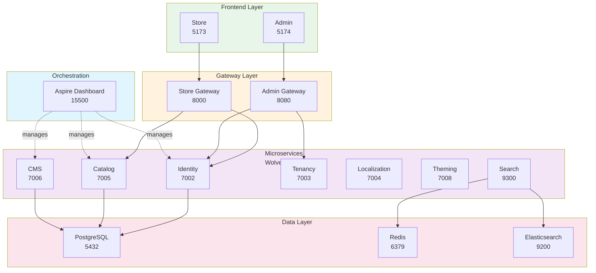

# DevOps Engineer - AI Agent Instructions

> ⚠️ **DEPRECATED**: Essential content merged into `.github/agents/DevOps.agent.md` on 30.12.2025
> 
> **Adopted content**:
> - Service Ports Reference
> - Critical Rules (kill services, port conflicts)
> - Quick Commands
> - Port Troubleshooting (macOS)
> - Common Mistakes table
> 
> **Remaining content below** is for deep reference only (Infrastructure topology diagram).

**Focus**: Aspire orchestration, infrastructure, CI/CD, port management  
**Agent**: @devops-engineer  
**Escalation**: Infrastructure architecture → @software-architect | CLI operations → @cli-developer  
**For full reference**: [copilot-instructions.md](./copilot-instructions.md)

---

## 🎯 Architecture (DevOps-Specific)

### Infrastructure Topology



### Service Ports
```
Frontend Store .................. 5173
Frontend Admin .................. 5174
Store Gateway ................... 8000
Admin Gateway ................... 8080
Aspire Dashboard ................ 15500
Identity Service ................ 7002
Catalog Service ................. 7005
CMS Service ..................... 7006
Tenancy Service ................. 7003
Localization Service ............ 7004
Theming Service ................. 7008
Search Service .................. 9300
PostgreSQL ...................... 5432
Redis ........................... 6379
Elasticsearch ................... 9200
```

### Aspire Orchestration
```bash
cd AppHost && dotnet run
# Dashboard: http://localhost:15500
# Service discovery automatic
# Health checks built-in
```

---

## ⚡ Critical Rules

1. **ALWAYS kill stuck services before restart**
   ```bash
   ./scripts/kill-all-services.sh
   ```

2. **Build incrementally** (not all at once)
```bash
dotnet build AppHost  # Build AppHost first
# Then individual services if needed
   ```

3. **Port conflicts = DCP controller holding ports** (macOS issue)
   - Kill with: `pkill -9 -f "dcpctrl" && pkill -9 -f "dcpproc"`

4. **Environment variables for secrets** (NEVER hardcoded)
   - Use `appsettings.Development.json` for local dev
   - Use Azure KeyVault for production

5. **Database per service** (PostgreSQL 16)
   - Each microservice owns its own database
   - Connection pooling via PgBouncer

---

## 🚀 Quick Commands

```bash
# Orchestration & Services
./scripts/kill-all-services.sh              # Kill stuck processes
./scripts/check-ports.sh                    # Verify ports available
cd AppHost && dotnet run      # Start Aspire + all services

# Database
dotnet ef migrations add [Name] --project backend/Domain/[Service]/src
dotnet ef database update --project backend/Domain/[Service]/src

# Monitoring
curl http://localhost:15500                 # Aspire dashboard
curl http://localhost:7002/health          # Service health check
lsof -i :15500                             # Check port usage

# Troubleshooting
ps aux | grep dotnet                        # List running services
docker-compose ps                           # Container status
```

---

## 📋 Port Management (macOS Pain Points!)

### Problem: "Address already in use"
```bash
# This is DCP controller holding port 15500
# Solution:
pkill -9 -f "dcpctrl"
pkill -9 -f "dcpproc"
sleep 2
cd AppHost && dotnet run
```

### Verify ports before restart
```bash
./scripts/check-ports.sh
# Should show all ports FREE

# Manual check:
lsof -i :15500  # Should show NOTHING
lsof -i :7002
lsof -i :5432
```

---

## 🛑 Common Mistakes

| Mistake | Prevention |
|---------|-----------|
| Restarting without killing stuck processes | Always run `./scripts/kill-all-services.sh` first |
| Building all services together | Build Orchestration only, let Aspire discovery handle services |
| Hardcoding port numbers in code | Use service discovery (Aspire) |
| Not checking ports before startup | Run `./scripts/check-ports.sh` |
| Mixing local + Docker services | Use Aspire for local OR Docker Compose, not both |

---

## 🏗️ Infrastructure Checklist

Before deploying:
- [ ] All services have health checks (`/health` endpoint)
- [ ] Database migrations applied (`dotnet ef database update`)
- [ ] Secrets in vault (NOT in code)
- [ ] Port conflicts resolved
- [ ] Aspire discovery working (test via dashboard)
- [ ] Logging configured (Serilog to console + file)

---

## 📚 Reference Files

- **🧠 AI Knowledge Base**: [docs/ai/INDEX.md](../docs/ai/INDEX.md) ⭐ **CHECK FIRST for any question about models, dependencies, packages**
- Aspire setup: [docs/architecture/ASPIRE_GUIDE.md](../docs/architecture/ASPIRE_GUIDE.md)
- Port troubleshooting: [docs/PORT_BLOCKING_SOLUTION.md](../docs/PORT_BLOCKING_SOLUTION.md)
- macOS CDP fix: [docs/MACOS_CDP_PORTFIX.md](../docs/MACOS_CDP_PORTFIX.md)
- Service discovery: [docs/SERVICE_DISCOVERY.md](../docs/SERVICE_DISCOVERY.md)
- Docker setup: [backend/docker-compose.aspire.yml](../backend/docker-compose.aspire.yml)

---

## 🔍 Debugging Infrastructure Issues

```bash
# What services are running?
curl http://localhost:15500/dashboard
# OR check process list:
ps aux | grep dotnet | grep -v grep

# Service logs
docker logs [container-name]
# OR from Aspire dashboard

# Network connectivity
nc -zv localhost 7002    # Test Identity service
nc -zv localhost 5432    # Test PostgreSQL

# Database issues
psql -U postgres -h localhost -c "SELECT version();"
```

---

## 📋 Deployment Checklist

- [ ] All services running (Aspire dashboard shows green)
- [ ] No port conflicts (`./scripts/check-ports.sh`)
- [ ] Health checks passing (`curl http://localhost:7002/health`)
- [ ] Database migrations applied
- [ ] Environment variables configured
- [ ] Secrets NOT in code (use vault)
- [ ] Logs aggregated and searchable

---

## 🚀 Escalation Path

**Problem?** → Ask your agent
- **Infrastructure architecture**: Ask @software-architect for infrastructure design
- **CI/CD pipeline changes**: Ask @software-architect for deployment patterns
- **Service deployment patterns**: Ask @software-architect for orchestration strategy
- **CLI automation**: Work with @cli-developer for DevOps automation scripts
