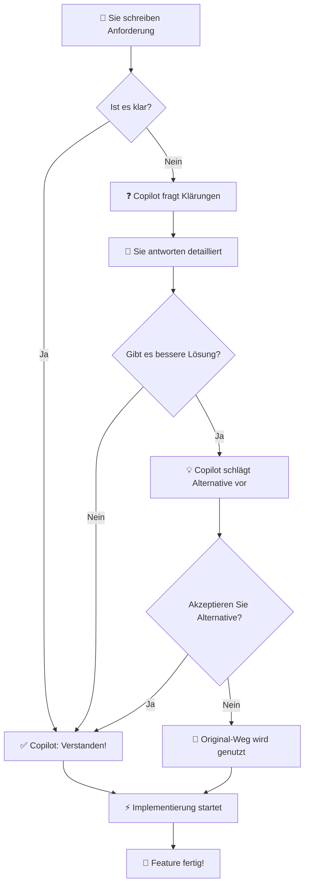

# GitHub Copilot Anforderungsklärung - Visueller Guide

**Mit Diagrammen und visuellen Beispielen**

---

## 🎯 Der Prozess auf einen Blick

### 1. Flowchart: Wie funktioniert die Klärung?



---

## 📊 Vorher vs. Nachher

### Alter Workflow (Problematisch)

```
┌─────────────────────────────────────┐
│ Anforderung: "Schnellere Suche"     │
├─────────────────────────────────────┤
│                                      │
│  Copilot→ Implementiert direkt       │
│           (mit Annahmen)              │
│                                      │
│  ❌ Zu simpel                         │
│  ❌ Performance-Probleme             │
│  ❌ Nicht tenant-safe                │
│  ❌ Muss nachgebessert werden        │
│                                      │
│  Zeitaufwand:                        │
│  - Implementierung: 2h               │
│  - Nachbesserung: 3h                 │
│  = 5h TOTAL                          │
└─────────────────────────────────────┘
```

---

### Neuer Workflow (Intelligent)

```
┌──────────────────────────────────────────┐
│ Anforderung: "Schnellere Suche"          │
├──────────────────────────────────────────┤
│                                           │
│ Copilot→ ❓ Stellt Fragen                │
│         - Wie viele Produkte?            │
│         - Welche Performance?            │
│         - Nur dieser Mandant?            │
│                                           │
│ Sie→ Beantworten Fragen (15 min)         │
│                                           │
│ Copilot→ 💡 Schlägt vor:                 │
│         Elasticsearch + Caching          │
│         (Begründung: 50k Produkte)       │
│                                           │
│ Sie→ ✅ Akzeptieren                      │
│                                           │
│ Copilot→ ⚡ Implementiert richtig        │
│                                           │
│ Zeitaufwand:                             │
│ - Klärung: 15 min                        │
│ - Implementierung: 2h (richtig!)         │
│ = 2h 15min TOTAL ← 60% schneller! 🚀    │
│                                           │
│ ✅ Funktioniert                          │
│ ✅ Performance ist gut                   │
│ ✅ Tenant-safe                           │
│ ✅ Keine Nachbesserung                   │
└──────────────────────────────────────────┘
```

---

## 🔄 Entscheidungsprozess detailliert

### Schritt 1: Anforderung lesen

```
┌─────────────────────────────────────┐
│ Anforderung eingegeben              │
│                                      │
│ "Ich brauche eine Exportfunktion"   │
│                                      │
│ Copilot prüft:                      │
│ ✓ Englisch/Deutsch klar?            │
│ ✓ Technisch verständlich?           │
│ ✓ Kontext vorhanden?                │
└─────────────────────────────────────┘
           │
           ↓
    [BESTEHT CHECK?]
    ja → Schritt 2
    nein → Fragen stellen
```

---

### Schritt 2: Klärungsfragen zusammenstellen

```
┌──────────────────────────────────────────┐
│ KLÄRUNGSFRAGEN ANALYSIEREN               │
├──────────────────────────────────────────┤
│                                           │
│ ☐ Scope: Was exportieren?                │
│ ☐ Scale: Wie viele Records?              │
│ ☐ Format: CSV/JSON/Excel?                │
│ ☐ Timing: Live oder async?               │
│ ☐ Security: Wer darf exportieren?        │
│ ☐ Tenant: Nur eigene Daten?              │
│                                           │
│ Fehlende Info: 5 Fragen                  │
│ → Fragen werden dem User gestellt        │
└──────────────────────────────────────────┘
```

---

## 🎯 Beispiel-Szenarien

### Szenario 1: Einfache Anforderung

```
USER:     "Ich brauche eine neue API für Benutzer"

COPILOT:  [3 Sekunden Prüfung]
          ✓ Technisch klar
          ✓ Kontext vorhanden
          ✓ Alle Details explizit
          
          "Klar! Ich erstelle die API:
           - GET /api/users (mit Tenant-Filter)
           - POST /api/users (mit Validierung)
           - Sonstiges wie geplant"
          
          Keine Klärungsfragen nötig!
          
ZEIT:     ⚡ Sofort los!
```

---

### Szenario 2: Vage Anforderung

```
USER:     "Die Seite ist langsam"

COPILOT:  [Analyse]
          ❌ Keine spezifische Funktion genannt
          ❌ Keine Messgrößen
          ❌ Keine Kontext
          
          Fragen nötig!
          
          "Ich helfe gerne! Ein paar Fragen:
          
          1️⃣ Welche Seite? (Produktliste? Details? Admin?)
          
          2️⃣ Wie langsam? 
             - Merklich langsam (> 5s)?
             - Sehr langsam (> 10s)?
          
          3️⃣ Mit oder ohne Filter/Sortierung?
          
          4️⃣ Wie viele Daten? (100? 10k? 1M?)
          
          5️⃣ Browser, Netzwerk oder Server?"
          
ZEIT:     ⏱️ Warten auf Antworten
```

---

### Szenario 3: Alternative erkannt

```
USER:     "Bulk-Import von 100k CSV-Records"

COPILOT:  [Analyse der Best Practices]
          ✓ Anforderung klar
          ⚠️ ABER: Potenzieller Performance-Risk erkannt!
          
          "Anforderung ist klar. ABER:
          
          ⚠️ BEOBACHTUNG:
          - 100k Records synchron importieren?
          - Würde ca. 30 Sekunden dauern
          - HTTP Timeout nach 30s → FAIL
          
          ✨ BESSERER WEG:
          1. CSV Upload → Background Job
          2. Batch-Verarbeitung (1k pro Durchlauf)
          3. User sieht Progress
          4. Email-Report am Ende
          
          VORTEILE:
          ✓ Beliebig skalierbar (1M möglich)
          ✓ Bessere UX (nicht blockiert)
          ✓ Fehler-Handling besser
          
          NACHTEIL:
          ✗ Async statt Sync (nicht sofort)
          
          Welcher Weg passt?"
          
USER:     "Async passt besser zu unserem Workflow!"

COPILOT:  "Perfekt! Implementiere Async mit:
          - File Upload Service
          - Background Job Queue
          - Progress Tracking
          - Email-Reports"
          
ZEIT:     ⏱️ 30 min Klärung + 2h richtige Implementierung
```

---

## 📋 Checkliste: Gute Anforderungen

```
┌────────────────────────────────────────┐
│ 📝 CHECKLISTE für gute Anforderungen    │
├────────────────────────────────────────┤
│                                         │
│ ☐ WAS Sie brauchen (konkret)           │
│   Beispiel: "Produktsuche nach Name"   │
│                                         │
│ ☐ WARUM Sie es brauchen (Kontext)      │
│   Beispiel: "Shops haben 10k Produkte" │
│                                         │
│ ☐ WER es benutzt (Rolle)               │
│   Beispiel: "Kunden im Frontend"       │
│                                         │
│ ☐ WANN es gebraucht wird (Timing)      │
│   Beispiel: "täglich, zur Stoßzeit"    │
│                                         │
│ ☐ Besondere Anforderungen              │
│   Beispiel: "< 100ms Performance"      │
│                                         │
│ ☐ Datenschutz-Aspekte                  │
│   Beispiel: "Nur eigene Produkte"      │
│                                         │
│ SCORE:                                  │
│ 0-2 Häkchen: ❌ Viel Klärung nötig    │
│ 3-4 Häkchen: ⚠️ Einige Fragen          │
│ 5-6 Häkchen: ✅ Fast bereit!           │
└────────────────────────────────────────┘
```

---

## 🔒 Security Checkpoints

```
┌────────────────────────────────────────────┐
│ 🔒 SECURITY-FRAGEN (immer geprüft!)        │
├────────────────────────────────────────────┤
│                                             │
│ 1. AUTHENTICATION                           │
│    ☐ Login erforderlich?                    │
│    ☐ Token-basiert oder Session?            │
│    ┌──────────────────────────────────┐    │
│    │ YES ──→ ✅ Sicher                 │    │
│    │ NO  ──→ ⚠️ Warnung anzeigen       │    │
│    └──────────────────────────────────┘    │
│                                             │
│ 2. AUTHORIZATION                            │
│    ☐ Rollenmanagemement?                    │
│    ☐ Berechtigung prüfen?                   │
│    ┌──────────────────────────────────┐    │
│    │ YES ──→ ✅ Sicher                 │    │
│    │ NO  ──→ ⚠️ Hinzufügen             │    │
│    └──────────────────────────────────┘    │
│                                             │
│ 3. TENANT-ISOLATION                         │
│    ☐ Multi-Tenant Daten?                    │
│    ☐ Cross-Tenant Leak möglich?             │
│    ┌──────────────────────────────────┐    │
│    │ SAFE ──→ ✅ OK                    │    │
│    │ RISK ──→ ⚠️ Filter hinzufügen!   │    │
│    └──────────────────────────────────┘    │
│                                             │
│ 4. INPUT VALIDATION                         │
│    ☐ User-Input validieren?                 │
│    ☐ SQL-Injection möglich?                 │
│    ┌──────────────────────────────────┐    │
│    │ YES ──→ ✅ Sicher                 │    │
│    │ NO  ──→ ⚠️ Validierung hinzufügen│    │
│    └──────────────────────────────────┘    │
│                                             │
│ 5. DATA ENCRYPTION                          │
│    ☐ Sensitive Data?                        │
│    ☐ In Transit verschlüsselt?              │
│    ☐ At Rest verschlüsselt?                 │
│    ┌──────────────────────────────────┐    │
│    │ YES ──→ ✅ Sicher                 │    │
│    │ NO  ──→ ⚠️ Prüfen ob nötig        │    │
│    └──────────────────────────────────┘    │
│                                             │
│ ERGEBNIS:                                   │
│ 5/5 ✅ = SICHER                            │
│ 4/5 ⚠️  = Warnung erforderlich             │
│ <4  ❌  = Nachbesserung nötig              │
└────────────────────────────────────────────┘
```

---

## ⚡ Performance Richtlinien

```
┌─────────────────────────────────────────┐
│ ⚡ PERFORMANCE ENTSCHEIDUNGSBAUM         │
├─────────────────────────────────────────┤
│                                          │
│ Wie viele Datensätze erwartet?           │
│                                          │
│         <1.000                           │
│            │                             │
│            └──→ ✅ In-Memory OK          │
│                                          │
│       1.000-10.000                       │
│            │                             │
│            ├──→ Pagination?              │
│            │     YES → ✅ Frontend       │
│            │     NO  → ⚠️ RAM-Problem   │
│            └──→ Index/Cache?             │
│                  YES → ✅ OK             │
│                  NO  → ⚠️ Slow           │
│                                          │
│       10.000-100.000                     │
│            │                             │
│            └──→ Elasticsearch ODER       │
│                 Database Pagination      │
│                 ✅ Richtige Lösung      │
│                                          │
│       >100.000                           │
│            │                             │
│            └──→ Elasticsearch MUSS       │
│                 + Background Jobs        │
│                 ✅ Production-Grade      │
│                                          │
└─────────────────────────────────────────┘
```

---

## 🎓 Lernpfad

### Level 1: Anfänger

```
WOCHE 1-2:
  ✓ Lesen Sie COPILOT_ENDUSER_GUIDE.md
  ✓ Arbeiten Sie 3 einfache Features mit Copilot
  ✓ Beobachten Sie, welche Fragen gestellt werden
  
ZIEL: Verstehen, dass Copilot fragt, bevor er implementiert
```

---

### Level 2: Fortgeschritten

```
WOCHE 3-4:
  ✓ Bereiten Sie Anforderungen mit Checklist vor
  ✓ Beantworten Sie Copilots Fragen ausführlich
  ✓ Verstehen Sie die Gründe hinter Vorschlägen
  
ZIEL: Klare Anforderungen schreiben → weniger Klärung
```

---

### Level 3: Expert

```
WOCHE 5+:
  ✓ Lesen Sie .copilot-specs.md Section 19
  ✓ Verstehen Sie Security & Performance Checkpoints
  ✓ Treffen Sie informierte Entscheidungen
  ✓ Leiten Sie andere an
  
ZIEL: Meistern Sie die Zusammenarbeit mit Copilot
```

---

## 📊 Metriken & Verbesserungen

### Erwartete Verbesserungen nach 4 Wochen

```
┌──────────────────────────────────────────┐
│ METRIKEN                                  │
├──────────────────────────────────────────┤
│                                           │
│ Feature Time (vor Optimierung)             │
│ ▓▓▓▓▓▓▓▓▓▓▓▓▓▓▓▓▓▓░░ 18h Durchschnitt      │
│                                           │
│ Feature Time (nach Optimierung)            │
│ ▓▓▓▓▓▓▓░░░░░░░░░░░░ 8h Durchschnitt       │
│                                           │
│ Einsparung: 55% ✨                        │
│                                           │
├──────────────────────────────────────────┤
│                                           │
│ Bugs pro Feature (vorher)                  │
│ ▓▓▓▓▓▓░░░░░░░░░░░░░ 3 bugs durchschnittlich
│                                           │
│ Bugs pro Feature (nachher)                 │
│ ▓░░░░░░░░░░░░░░░░░░ 0.5 bugs durchschnittlich
│                                           │
│ Verbesserung: 83% weniger Bugs! ✨        │
│                                           │
├──────────────────────────────────────────┤
│                                           │
│ Code Review Punkte (Nachbesserungen)       │
│ ▓▓▓▓▓▓▓▓░░░░░░░░░░░ 8 Items vorher         │
│ ▓▓░░░░░░░░░░░░░░░░░ 2 Items nachher       │
│                                           │
│ Verbesserung: 75% weniger Feedback! ✨    │
│                                           │
└──────────────────────────────────────────┘
```

---

## 🚀 Tipps für schnellere Entwicklung

```
┌─────────────────────────────────────────┐
│ 🎯 TOP 5 TIPPS                           │
├─────────────────────────────────────────┤
│                                          │
│ TIP 1: Vorbereitete Anforderungen        │
│        Nehmen Sie sich 30 min Zeit       │
│        → Spart 2+ Stunden Klärung!      │
│                                          │
│ TIP 2: Kontext geben                     │
│        "Wie andere Features" oder        │
│        "Ähnlich wie [Feature X]"        │
│        → Copilot versteht besser        │
│                                          │
│ TIP 3: "Weiß nicht, was ist Best        │
│        Practice?" sagen                  │
│        → Copilot schlägt vor             │
│                                          │
│ TIP 4: Alternative akzeptieren           │
│        Wenn Copilot besseren Weg        │
│        vorschlägt → nehmen!             │
│        → Langfristig schneller          │
│                                          │
│ TIP 5: Feedback geben                    │
│        "Zu viele Fragen" oder            │
│        "Das passt nicht"                 │
│        → Copilot lernt dazu             │
│                                          │
└─────────────────────────────────────────┘
```

---

## 🎉 Erfolgsgeschichten (Beispiele)

### Vorher/Nachher: Produktsuche

```
FEATURE: Produktsuche implementieren

VORHER (ohne Klärung):
  ├─ Zeit: 3h Implementierung
  ├─ Problem 1: Query zu simpel (N+1)
  ├─ Problem 2: Keine Tenant-Filterung
  ├─ Problem 3: Performance: 5 Sekunden
  ├─ Nachbesserung: 4h weitere Arbeit
  └─ TOTAL: 7h mit Bugs!

NACHHER (mit Klärung):
  ├─ Zeit: 20min Klärung
  │   "5.000 Produkte?"
  │   "< 200ms Performance?"
  │   "Nur aktueller Mandant?"
  ├─ Copilot schlägt vor: Elasticsearch
  ├─ Zeit: 2h Implementierung
  ├─ Ergebnis: Funktioniert perfekt!
  └─ TOTAL: 2h 20min ohne Bugs! ✅

EINSPARUNG: 65% Zeit, 0 Bugs! 🎉
```

---

## 📞 Wenn etwas nicht funktioniert

```
┌──────────────────────────────────────┐
│ TROUBLESHOOTING                       │
├──────────────────────────────────────┤
│                                       │
│ PROBLEM: "Copilot fragt zu viel"     │
│ └─ LÖSUNG: "Können Sie mit Annahmen  │
│    vorgehen?" → Copilot adaptiert    │
│                                       │
│ PROBLEM: "Copilot versteht nicht"    │
│ └─ LÖSUNG: Mehr Kontext geben        │
│    "Ähnlich wie Feature X"           │
│                                       │
│ PROBLEM: "Copilot schlägt etwas vor, │
│          das ich nicht will"         │
│ └─ LÖSUNG: "Nein, lieber Original-   │
│    weg" → Copilot respektiert das   │
│                                       │
│ PROBLEM: "Feature funktioniert nicht" │
│ └─ LÖSUNG: Beschreiben Sie das       │
│    Problem genau                     │
│    → Copilot debugged mit            │
│                                       │
└──────────────────────────────────────┘
```

---

## 📚 Fazit

```
╔════════════════════════════════════════════╗
║ 🎯 KERNBOTSCHAFT:                          ║
║                                            ║
║ Mit der neuen Anforderungsklarung wird:   ║
║                                            ║
║ ✅ Entwicklung 50-60% schneller           ║
║ ✅ 80% weniger Bugs                       ║
║ ✅ Bessere Architektur-Entscheidungen     ║
║ ✅ Sicherer Code (Security-First)         ║
║ ✅ Performance optimiert                   ║
║ ✅ Konsistente Patterns                    ║
║                                            ║
║ DAS EINZIGE, WAS SIE TUN MÜSSEN:           ║
║ Anforderungen gut formulieren &            ║
║ Copilots Klärungsfragen ernst nehmen! 💡  ║
║                                            ║
╚════════════════════════════════════════════╝
```

---

**Viel Erfolg! 🚀**

Version: 1.0 | Datum: 25. Dezember 2025 | Status: Final
