# Cloud Infrastructure Architecture

**DocID**: `ARCH-CLOUD-001`  
**Related**: [PROJECT_DEPENDENCY_GRAPH.md](PROJECT_DEPENDENCY_GRAPH.md) (Application Architecture)

---

## Overview

Dieses Dokument beschreibt die Cloud-Infrastruktur für B2XGate als Multi-Tenant SaaS-Plattform.

```mermaid
%%{init: {'theme': 'base'}}%%
flowchart TB
    subgraph Internet["🌐 Internet"]
        Users["👥 Tenants & Users"]
        Admins["👨‍💼 Administrators"]
    end

    subgraph Edge["Edge Layer"]
        CDN["☁️ CDN<br/>Static Assets"]
        WAF["🛡️ WAF<br/>Web Application Firewall"]
        DDoS["🔒 DDoS Protection"]
    end

    subgraph LoadBalancing["Load Balancing Layer"]
        GLB["⚖️ Global Load Balancer<br/>DNS-based Routing"]
        RProxy["🔀 Reverse Proxy Cluster<br/>Traefik / YARP"]
    end

    subgraph Compute["Compute Layer"]
        subgraph K8s["Kubernetes Cluster"]
            GW["Gateway Pods"]
            Workers["Worker Pods"]
            MCP["MCP Server Pods"]
        end
    end

    subgraph Data["Data Layer"]
        subgraph Primary["Primary Region"]
            PG_P["🐘 PostgreSQL Primary"]
            Redis_P["📦 Redis Primary"]
            ES_P["🔍 Elasticsearch"]
        end
        subgraph Replica["Replica Region"]
            PG_R["🐘 PostgreSQL Replica"]
            Redis_R["📦 Redis Replica"]
        end
    end

    subgraph AI["AI Services"]
        OpenAI["🤖 Azure OpenAI"]
        LocalLLM["🧠 Local LLM<br/>Fallback"]
    end

    Users --> CDN
    Admins --> WAF
    CDN --> WAF
    WAF --> DDoS
    DDoS --> GLB
    GLB --> RProxy
    RProxy --> K8s
    GW --> Primary
    Workers --> Primary
    MCP --> AI
    Primary -.->|Replication| Replica

    classDef edge fill:#e1f5fe,stroke:#01579b
    classDef compute fill:#fff3e0,stroke:#e65100
    classDef data fill:#f3e5f5,stroke:#7b1fa2
    classDef ai fill:#fce4ec,stroke:#c2185b

    class CDN,WAF,DDoS,GLB,RProxy edge
    class K8s,GW,Workers,MCP compute
    class PG_P,Redis_P,ES_P,PG_R,Redis_R data
    class OpenAI,LocalLLM ai
```



---

## Deployment Topology

### Region Strategy

```mermaid
%%{init: {'theme': 'base'}}%%
flowchart LR
    subgraph EU["🇪🇺 EU Region (Primary)"]
        EU_K8s["K8s Cluster<br/>3 Availability Zones"]
        EU_DB["PostgreSQL<br/>Primary + Standby"]
        EU_Cache["Redis Cluster<br/>3 Nodes"]
    end

    subgraph DR["🇩🇪 DR Region (Standby)"]
        DR_K8s["K8s Cluster<br/>Scaled Down"]
        DR_DB["PostgreSQL<br/>Async Replica"]
        DR_Cache["Redis<br/>Read Replica"]
    end

    EU_DB -->|"Async Replication<br/>< 1s lag"| DR_DB
    EU_Cache -->|"Cross-Region Sync"| DR_Cache
    EU_K8s -.->|"Failover"| DR_K8s

    classDef primary fill:#c8e6c9,stroke:#2e7d32
    classDef standby fill:#ffecb3,stroke:#ff8f00

    class EU_K8s,EU_DB,EU_Cache primary
    class DR_K8s,DR_DB,DR_Cache standby
```



### Availability Zones

| Component | Zone A | Zone B | Zone C |
|-----------|--------|--------|--------|
| Gateway Pods | 2 | 2 | 2 |
| Worker Pods | 3 | 3 | 3 |
| MCP Server Pods | 1 | 1 | 1 |
| PostgreSQL | Primary | Standby | - |
| Redis | Node 1 | Node 2 | Node 3 |
| Elasticsearch | Data 1 | Data 2 | Data 3 |

---

## High Availability

### Service Level Objectives (SLO)

| Metric | Target | Measurement |
|--------|--------|-------------|
| Availability | 99.9% | Monthly uptime |
| API Latency (p95) | < 200ms | Per request |
| API Latency (p99) | < 500ms | Per request |
| Error Rate | < 0.1% | 5xx responses |
| Recovery Time (RTO) | < 15 min | From incident |
| Data Loss (RPO) | < 1 min | Transaction loss |

### Redundancy Model


### Health Checks

```yaml
# Kubernetes Probes Configuration
livenessProbe:
  httpGet:
    path: /health/live
    port: 8080
  initialDelaySeconds: 10
  periodSeconds: 10
  failureThreshold: 3

readinessProbe:
  httpGet:
    path: /health/ready
    port: 8080
  initialDelaySeconds: 5
  periodSeconds: 5
  failureThreshold: 2

startupProbe:
  httpGet:
    path: /health/startup
    port: 8080
  initialDelaySeconds: 0
  periodSeconds: 5
  failureThreshold: 30
```

---

## Auto-Scaling Strategy

### Horizontal Pod Autoscaler (HPA)


### Scaling Configuration

| Service | Min | Max | CPU Target | Memory Target | Custom Metric |
|---------|-----|-----|------------|---------------|---------------|
| Store Gateway | 3 | 20 | 70% | 80% | RPS > 1000 |
| Admin Gateway | 2 | 10 | 70% | 80% | - |
| Management Gateway | 2 | 5 | 70% | 80% | - |
| MCP Servers | 2 | 8 | 60% | 70% | Queue > 100 |
| Workers | 3 | 30 | 80% | 85% | Jobs pending |

### Vertical Pod Autoscaler (VPA)

```yaml
# VPA für MCP Server (AI-intensive)
apiVersion: autoscaling.k8s.io/v1
kind: VerticalPodAutoscaler
metadata:
  name: mcp-server-vpa
spec:
  targetRef:
    apiVersion: apps/v1
    kind: Deployment
    name: mcp-server
  updatePolicy:
    updateMode: Auto
  resourcePolicy:
    containerPolicies:
    - containerName: mcp-server
      minAllowed:
        cpu: 500m
        memory: 1Gi
      maxAllowed:
        cpu: 4
        memory: 8Gi
```

---

## Security Zones

### Network Segmentation


### Network Policies

| Source Zone | Target Zone | Allowed Ports | Protocol |
|-------------|-------------|---------------|----------|
| DMZ | Application | 8000, 8080, 8090 | HTTPS |
| Application | Data | 5432, 6379, 9200 | TCP |
| Application | AI Services | 443 | HTTPS |
| Management | All | 22, 443 | SSH/HTTPS |
| Data | Data | Cluster ports | TCP |

### Zero Trust Principles

1. **Identity Verification**: Alle Service-to-Service Calls via mTLS
2. **Least Privilege**: RBAC für alle Kubernetes Resources
3. **Micro-Segmentation**: Network Policies pro Namespace
4. **Continuous Verification**: JWT Token Validation bei jedem Request

---

## Secrets Management

### Architecture


### Secret Rotation

| Secret Type | Rotation Interval | Method |
|-------------|-------------------|--------|
| Database Passwords | 30 days | Vault Dynamic Secrets |
| API Keys | 90 days | Automated Rotation |
| TLS Certificates | 90 days | cert-manager + Let's Encrypt |
| Service Tokens | 24 hours | Short-lived JWT |
| Encryption Keys | 365 days | Manual with Audit |

---

## Observability Stack

### Three Pillars


### Key Metrics

#### Business Metrics
- Active Tenants / Orders per Hour / Revenue
- Cart Abandonment Rate / Conversion Rate

#### Technical Metrics
- Request Rate (RPS) / Error Rate / Latency (p50, p95, p99)
- CPU / Memory / Disk Usage
- Database Connections / Query Time
- Cache Hit Rate / Queue Depth

### Alerting Rules

| Alert | Condition | Severity | Response |
|-------|-----------|----------|----------|
| High Error Rate | 5xx > 1% for 5m | Critical | PagerDuty |
| High Latency | p99 > 2s for 10m | Warning | Slack |
| Pod CrashLoop | Restarts > 3 in 5m | Critical | PagerDuty |
| DB Connection Pool | Usage > 80% | Warning | Slack |
| Disk Space | Usage > 85% | Warning | Slack |
| Certificate Expiry | < 14 days | Warning | Email |

---

## Disaster Recovery

### Backup Strategy


### Recovery Procedures

| Scenario | RTO | RPO | Procedure |
|----------|-----|-----|-----------|
| Pod Failure | < 30s | 0 | Auto-restart by K8s |
| Node Failure | < 2m | 0 | Pod rescheduling |
| Zone Failure | < 5m | 0 | Cross-zone failover |
| Region Failure | < 15m | < 1m | DR region activation |
| Data Corruption | < 1h | < 1h | Point-in-time recovery |
| Total Loss | < 4h | < 24h | Full restore from backup |

### DR Runbook


---

## Cost Optimization

### Resource Tiers

| Environment | Compute | Database | Purpose |
|-------------|---------|----------|---------|
| Production | Standard_D4s_v3 | Gen5 8 vCore | Full capacity |
| Staging | Standard_D2s_v3 | Gen5 4 vCore | Pre-production |
| Development | Standard_B2s | Gen5 2 vCore | Dev/Test |

### Cost Allocation by Tenant


### Optimization Strategies

1. **Reserved Instances**: 1-3 Jahr Reservierungen für Base Load
2. **Spot Instances**: Worker Pods für batch processing
3. **Right-sizing**: VPA recommendations umsetzen
4. **Auto-shutdown**: Dev/Staging außerhalb Arbeitszeiten
5. **Data Lifecycle**: Cold storage für alte Logs

---

## Compliance & Governance

### Compliance Frameworks

| Framework | Scope | Status |
|-----------|-------|--------|
| GDPR | All EU tenant data | ✅ Compliant |
| ISO 27001 | Information Security | 🔄 In Progress |
| SOC 2 Type II | Security & Availability | 📋 Planned |
| PCI DSS | Payment Processing | ✅ via Provider |

### Data Residency

```mermaid
%%{init: {'theme': 'base'}}%%
flowchart LR
    subgraph EU["🇪🇺 EU Data Center"]
        EU_Data["EU Tenant Data"]
    end

    subgraph US["🇺🇸 US Data Center"]
        US_Data["US Tenant Data"]
    end

    subgraph Global["🌍 Global"]
        CDN["CDN (Edge)"]
        Analytics["Anonymized<br/>Analytics"]
    end

    EU_Data -.->|"GDPR Compliant"| Analytics
    US_Data -.->|"Anonymized"| Analytics
    CDN --> EU & US

    classDef eu fill:#bbdefb,stroke:#1565c0
    classDef us fill:#c8e6c9,stroke:#2e7d32
    classDef global fill:#fff3e0,stroke:#e65100

    class EU_Data eu
    class US_Data us
    class CDN,Analytics global
```



---

## Infrastructure as Code

### Repository Structure

```
infrastructure/
├── terraform/
│   ├── modules/
│   │   ├── kubernetes/
│   │   ├── database/
│   │   ├── networking/
│   │   └── monitoring/
│   ├── environments/
│   │   ├── production/
│   │   ├── staging/
│   │   └── development/
│   └── global/
├── kubernetes/
│   ├── base/
│   ├── overlays/
│   │   ├── production/
│   │   ├── staging/
│   │   └── development/
│   └── charts/
└── ansible/
    ├── playbooks/
    └── roles/
```

### GitOps Workflow


---

## References

- [PROJECT_DEPENDENCY_GRAPH.md](PROJECT_DEPENDENCY_GRAPH.md) - Application Architecture
- [ADR-055](../../.ai/decisions/ADR-055-cloud-platform-selection.md) - Cloud Platform Selection
- [HOSTING_INFRASTRUCTURE.md](components/HOSTING_INFRASTRUCTURE.md) - Hosting Details
- [KB-070](../../.ai/knowledgebase/tools-and-tech/aspire-net10-compatibility.md) - Aspire Compatibility

---

**Last Updated**: 11. Januar 2026  
**Owner**: @CloudArchitect  
**Review Cycle**: Quarterly
