# Development Infrastructure

**DocID**: `ARCH-DEV-001`  
**Related**: [PROJECT_DEPENDENCY_GRAPH.md](PROJECT_DEPENDENCY_GRAPH.md) | [CLOUD_INFRASTRUCTURE.md](CLOUD_INFRASTRUCTURE.md)

---

## Overview

Dieses Dokument beschreibt die Entwicklungsinfrastruktur für B2XGate - lokale Entwicklung, CI/CD Pipelines, und Developer Tools.

```mermaid
%%{init: {'theme': 'base'}}%%
flowchart TB
    subgraph Dev["👨‍💻 Developer Workstation"]
        IDE["VS Code / Rider"]
        Docker["Docker Desktop"]
        SDK[".NET 10 SDK"]
        Node["Node.js 22"]
    end

    subgraph Local["🏠 Local Development"]
        Aspire["Aspire AppHost"]
        LocalDB["PostgreSQL<br/>(Container)"]
        LocalRedis["Redis<br/>(Container)"]
        LocalES["Elasticsearch<br/>(Container)"]
    end

    subgraph VCS["📦 Version Control"]
        GitHub["GitHub Repository"]
        Actions["GitHub Actions"]
        Packages["GitHub Packages"]
    end

    subgraph CI["🔄 CI/CD Pipeline"]
        Build["Build & Test"]
        Security["Security Scans"]
        Deploy["Deploy"]
    end

    subgraph Envs["🌍 Environments"]
        DevEnv["Development"]
        Staging["Staging"]
        Prod["Production"]
    end

    Dev --> Local
    Dev -->|"git push"| GitHub
    GitHub --> Actions
    Actions --> Build --> Security --> Deploy
    Deploy --> DevEnv --> Staging --> Prod

    classDef dev fill:#e3f2fd,stroke:#1565c0
    classDef local fill:#e8f5e9,stroke:#2e7d32
    classDef vcs fill:#fff3e0,stroke:#e65100
    classDef ci fill:#f3e5f5,stroke:#7b1fa2
    classDef env fill:#fce4ec,stroke:#c2185b

    class IDE,Docker,SDK,Node dev
    class Aspire,LocalDB,LocalRedis,LocalES local
    class GitHub,Actions,Packages vcs
    class Build,Security,Deploy ci
    class DevEnv,Staging,Prod env
```



---

## Local Development Setup

### Prerequisites

| Tool | Version | Purpose |
|------|---------|---------|
| .NET SDK | 10.0+ | Backend development |
| Node.js | 22 LTS | Frontend development |
| Docker Desktop | Latest | Container runtime |
| VS Code | Latest | Primary IDE |
| Git | 2.40+ | Version control |

### Quick Start

```bash
# 1. Clone Repository
git clone https://github.com/your-org/B2XGate.git
cd B2XGate

# 2. Install Dependencies
dotnet restore
cd src/frontend/Store && npm install
cd ../Admin && npm install
cd ../Management && npm install

# 3. Start Backend (Aspire)
dotnet run --project src/backend/Infrastructure/Hosting/AppHost

# 4. Start Frontend (separate terminal)
cd src/frontend/Store && npm run dev
```

### Aspire AppHost Architecture

```mermaid
%%{init: {'theme': 'base'}}%%
flowchart TB
    subgraph AppHost["🚀 Aspire AppHost"]
        Orch["Orchestrator"]
        Dashboard["Aspire Dashboard<br/>:15500"]
    end

    subgraph Services["Backend Services"]
        Store["Store Gateway<br/>:8000"]
        Admin["Admin Gateway<br/>:8080"]
        Mgmt["Management Gateway<br/>:8090"]
        Notif["Notifications<br/>:8095"]
    end

    subgraph Infra["Infrastructure (Containers)"]
        PG["PostgreSQL<br/>:5432"]
        Redis["Redis<br/>:6379"]
        ES["Elasticsearch<br/>:9200"]
    end

    subgraph Frontend["Frontends (npm dev)"]
        FE_Store["Store UI<br/>:3000"]
        FE_Admin["Admin UI<br/>:3001"]
        FE_Mgmt["Management UI<br/>:3002"]
    end

    Orch --> Store & Admin & Mgmt & Notif
    Orch --> PG & Redis & ES
    Store & Admin & Mgmt --> PG & Redis & ES
    FE_Store -->|"API"| Store
    FE_Admin -->|"API"| Admin
    FE_Mgmt -->|"API"| Mgmt

    classDef apphost fill:#fff3e0,stroke:#e65100
    classDef service fill:#e8f5e9,stroke:#2e7d32
    classDef infra fill:#e1f5fe,stroke:#01579b
    classDef frontend fill:#f3e5f5,stroke:#7b1fa2

    class Orch,Dashboard apphost
    class Store,Admin,Mgmt,Notif service
    class PG,Redis,ES infra
    class FE_Store,FE_Admin,FE_Mgmt frontend
```



### VS Code Tasks

```json
// Available Tasks (tasks.json)
{
  "backend-start": "Start Aspire AppHost",
  "frontend-start": "Start Store Frontend",
  "frontend-admin-start": "Start Admin Frontend",
  "build-backend": "Build all .NET projects",
  "test-backend": "Run all backend tests",
  "lint-frontend": "Run ESLint on frontends"
}
```

**Keyboard Shortcuts:**
- `Ctrl+Shift+B` → Build Backend
- `Ctrl+Shift+T` → Run Tests

---

## Development Environments

### Environment Configuration

```mermaid
%%{init: {'theme': 'base'}}%%
flowchart LR
    subgraph Local["🏠 Local"]
        L_DB["In-Memory DB"]
        L_Cache["In-Memory Cache"]
        L_AI["Mock AI"]
    end

    subgraph Dev["🔧 Development"]
        D_DB["Shared PostgreSQL"]
        D_Cache["Shared Redis"]
        D_AI["Azure OpenAI<br/>(Dev Key)"]
    end

    subgraph Staging["🎭 Staging"]
        S_DB["Dedicated PostgreSQL"]
        S_Cache["Dedicated Redis"]
        S_AI["Azure OpenAI<br/>(Staging)"]
    end

    subgraph Prod["🚀 Production"]
        P_DB["HA PostgreSQL"]
        P_Cache["Redis Cluster"]
        P_AI["Azure OpenAI<br/>(Production)"]
    end

    Local --> Dev --> Staging --> Prod

    classDef local fill:#e3f2fd,stroke:#1565c0
    classDef dev fill:#fff3e0,stroke:#e65100
    classDef staging fill:#e8f5e9,stroke:#2e7d32
    classDef prod fill:#ffcdd2,stroke:#c62828

    class L_DB,L_Cache,L_AI local
    class D_DB,D_Cache,D_AI dev
    class S_DB,S_Cache,S_AI staging
    class P_DB,P_Cache,P_AI prod
```



### Environment Variables

| Variable | Local | Development | Staging | Production |
|----------|-------|-------------|---------|------------|
| `ASPNETCORE_ENVIRONMENT` | Development | Development | Staging | Production |
| `Database__Provider` | inmemory | postgresql | postgresql | postgresql |
| `ConnectionStrings__Default` | - | Dev DB | Staging DB | Prod DB |
| `Redis__Enabled` | false | true | true | true |
| `AI__Provider` | mock | azure | azure | azure |
| `Logging__Level` | Debug | Information | Information | Warning |

### appsettings Hierarchy

```
appsettings.json                 ← Base configuration
├── appsettings.Development.json ← Local overrides
├── appsettings.Staging.json     ← Staging overrides
└── appsettings.Production.json  ← Production overrides (secrets via Vault)
```

---

## CI/CD Pipeline

### Pipeline Architecture


### GitHub Actions Workflows

```yaml
# .github/workflows/ci.yml (vereinfacht)
name: CI Pipeline

on:
  push:
    branches: [main, develop]
  pull_request:
    branches: [main]

jobs:
  build:
    runs-on: ubuntu-latest
    steps:
      - uses: actions/checkout@v4
      - uses: actions/setup-dotnet@v4
        with:
          dotnet-version: '10.0.x'
      - run: dotnet restore
      - run: dotnet build --no-restore
      - run: dotnet test --no-build --collect:"XPlat Code Coverage"

  lint:
    runs-on: ubuntu-latest
    steps:
      - uses: actions/checkout@v4
      - uses: actions/setup-node@v4
      - run: npm ci
      - run: npm run lint

  security:
    runs-on: ubuntu-latest
    steps:
      - uses: actions/checkout@v4
      - uses: github/codeql-action/init@v3
      - uses: github/codeql-action/analyze@v3
```

### Quality Gates

| Gate | Tool | Threshold | Blocking |
|------|------|-----------|----------|
| Build | dotnet build | Success | ✅ Yes |
| Unit Tests | xUnit | 100% pass | ✅ Yes |
| Code Coverage | Coverlet | ≥ 80% | ✅ Yes |
| Linting | ESLint / StyleCop | 0 errors | ✅ Yes |
| SAST | CodeQL | 0 critical | ✅ Yes |
| SCA | Dependabot | 0 critical | ✅ Yes |
| SonarCloud | SonarCloud | Quality Gate | ⚠️ Warning |

### Branch Strategy


| Branch | Purpose | Deploy To | Protection |
|--------|---------|-----------|------------|
| `main` | Production-ready | Production | Required reviews, CI pass |
| `develop` | Integration | Development | CI pass |
| `feature/*` | New features | - | - |
| `release/*` | Release prep | Staging | Required reviews |
| `hotfix/*` | Emergency fixes | Staging → Prod | Required reviews |

---

## Developer Tools

### IDE Extensions (VS Code)

| Extension | Purpose |
|-----------|---------|
| C# Dev Kit | .NET development |
| Vue - Official | Vue.js support |
| ESLint | JavaScript linting |
| Prettier | Code formatting |
| GitHub Copilot | AI assistance |
| Docker | Container management |
| REST Client | API testing |
| GitLens | Git integration |

### CLI Tools


### Useful Commands

```bash
# Backend
dotnet build B2X.slnx                    # Build all
dotnet test B2X.slnx                     # Run all tests
dotnet watch run --project src/backend/Store/API  # Hot reload

# Frontend
npm run dev                              # Start dev server
npm run build                            # Production build
npm run lint                             # Run linter
npm run test                             # Run tests

# Docker
docker compose up -d                     # Start infrastructure
docker compose logs -f postgres          # View logs
docker compose down -v                   # Stop and clean

# Aspire
aspire run                               # Start AppHost
aspire dashboard                         # Open dashboard

# GitHub
gh pr create                             # Create PR
gh pr checks                             # View CI status
gh release create v1.0.0                 # Create release
```

---

## Testing Infrastructure

### Test Pyramid

```mermaid
%%{init: {'theme': 'base'}}%%
flowchart TB
    subgraph E2E["🔺 E2E Tests (Few)"]
        Playwright["Playwright"]
    end

    subgraph Integration["🔷 Integration Tests (Some)"]
        API["API Tests"]
        DB["Database Tests"]
    end

    subgraph Unit["🟩 Unit Tests (Many)"]
        Backend["Backend Unit"]
        Frontend["Frontend Unit"]
    end

    E2E --> Integration --> Unit

    classDef e2e fill:#ffcdd2,stroke:#c62828
    classDef integration fill:#fff3e0,stroke:#e65100
    classDef unit fill:#c8e6c9,stroke:#2e7d32

    class Playwright e2e
    class API,DB integration
    class Backend,Frontend unit
```



### Test Configuration

| Test Type | Framework | Location | Command |
|-----------|-----------|----------|---------|
| Backend Unit | xUnit + Shouldly | `src/tests/Unit/` | `dotnet test` |
| Backend Integration | xUnit + TestContainers | `src/tests/Integration/` | `dotnet test` |
| Frontend Unit | Vitest | `src/frontend/*/tests/` | `npm run test` |
| E2E | Playwright | `src/tests/E2E/` | `npx playwright test` |

### Test Database Strategy


---

## Code Quality Tools

### Static Analysis


### Code Coverage

| Component | Target | Current | Tool |
|-----------|--------|---------|------|
| Backend Core | 80% | - | Coverlet |
| Backend API | 70% | - | Coverlet |
| Frontend Components | 70% | - | Vitest |
| E2E Critical Paths | 100% | - | Playwright |

---

## Debugging

### Backend Debugging


**launch.json Configurations:**
- `.NET Core Launch` - Debug Backend
- `Attach to Process` - Attach to running service
- `Docker: Attach` - Debug in container

### Frontend Debugging

| Tool | Purpose |
|------|---------|
| Vue DevTools | Component inspection |
| Browser DevTools | Network, Console, Elements |
| VS Code Debugger | Breakpoints in TypeScript |
| Vite HMR | Hot Module Replacement |

### Logging

```csharp
// Structured Logging with Serilog
Log.Information("Processing order {OrderId} for tenant {TenantId}", 
    order.Id, tenantContext.TenantId);

// Log Levels
Log.Verbose()   // Detailed tracing
Log.Debug()     // Debugging info
Log.Information() // Normal operations
Log.Warning()   // Potential issues
Log.Error()     // Errors
Log.Fatal()     // Critical failures
```

---

## Database Development

### Migrations

```bash
# Create Migration
dotnet ef migrations add AddUserTable \
  --project src/backend/Infrastructure/Persistence \
  --startup-project src/backend/Store/API

# Apply Migration
dotnet ef database update \
  --project src/backend/Infrastructure/Persistence \
  --startup-project src/backend/Store/API

# Rollback
dotnet ef database update PreviousMigration
```

### Database Tools

| Tool | Purpose |
|------|---------|
| pgAdmin | PostgreSQL GUI |
| DBeaver | Universal DB client |
| EF Core Power Tools | Visual migration design |
| Respawn | Test database reset |

---

## Documentation

### Documentation as Code

```mermaid
%%{init: {'theme': 'base'}}%%
flowchart LR
    subgraph Source["📝 Source"]
        MD["Markdown Files"]
        Code["Code Comments"]
        OpenAPI["OpenAPI Specs"]
    end

    subgraph Generate["⚙️ Generate"]
        DocFX["DocFX"]
        Swagger["Swagger UI"]
        Mermaid["Mermaid Diagrams"]
    end

    subgraph Output["📚 Output"]
        Site["Documentation Site"]
        API_Docs["API Documentation"]
        Diagrams["Architecture Diagrams"]
    end

    MD --> DocFX --> Site
    Code --> DocFX --> Site
    OpenAPI --> Swagger --> API_Docs
    MD --> Mermaid --> Diagrams

    classDef source fill:#e1f5fe,stroke:#01579b
    classDef generate fill:#fff3e0,stroke:#e65100
    classDef output fill:#e8f5e9,stroke:#2e7d32

    class MD,Code,OpenAPI source
    class DocFX,Swagger,Mermaid generate
    class Site,API_Docs,Diagrams output
```



### Key Documentation

| Document | Location | Purpose |
|----------|----------|---------|
| README.md | Root | Project overview |
| QUICK_START_GUIDE.md | Root | Getting started |
| Architecture Docs | `docs/architecture/` | System design |
| API Reference | `/swagger` | API documentation |
| ADRs | `.ai/decisions/` | Architecture decisions |

---

## Troubleshooting

### Common Issues

| Problem | Solution |
|---------|----------|
| Port already in use | `npx kill-port 8000` or check Docker |
| Database connection failed | Ensure Docker containers are running |
| npm install fails | Delete `node_modules` and `package-lock.json` |
| dotnet restore fails | Check `nuget.config` and network |
| Hot reload not working | Restart dev server |

### Health Check Scripts

```bash
# Check all services
./scripts/service-health.sh

# Kill all services
./scripts/kill-all-services.sh

# Check ports
netstat -an | grep LISTEN | grep -E "8000|8080|8090|3000"
```

### Getting Help

1. **Check Documentation** → `docs/` folder
2. **Search Issues** → GitHub Issues
3. **Ask Team** → Slack #dev-help
4. **Create Issue** → Use issue templates

---

## References

- [PROJECT_DEPENDENCY_GRAPH.md](PROJECT_DEPENDENCY_GRAPH.md) - Application Architecture
- [CLOUD_INFRASTRUCTURE.md](CLOUD_INFRASTRUCTURE.md) - Production Infrastructure
- [GETTING_STARTED.md](../guides/GETTING_STARTED.md) - Detailed Setup Guide
- [DEVELOPMENT.md](../guides/DEVELOPMENT.md) - Development Guidelines

---

**Last Updated**: 11. Januar 2026  
**Owner**: @DevOps  
**Review Cycle**: Monthly
