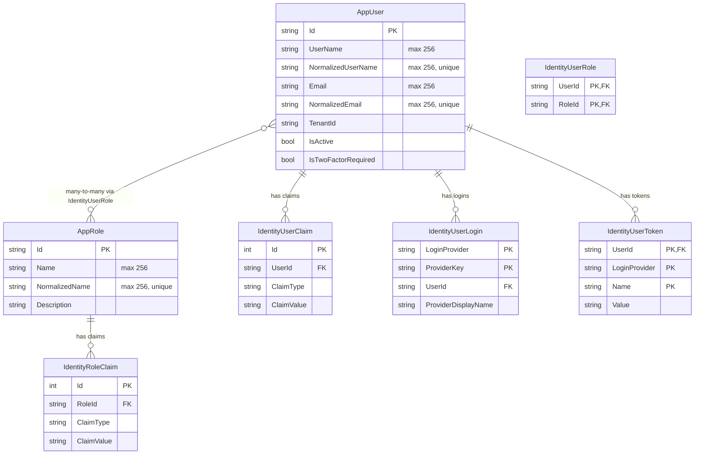
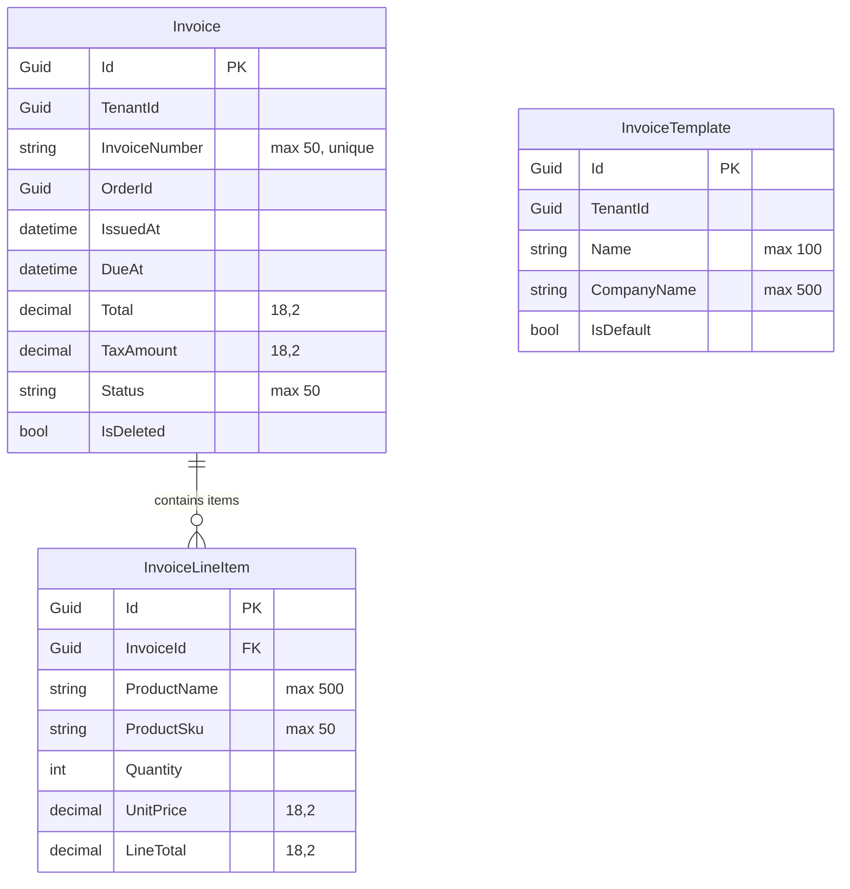
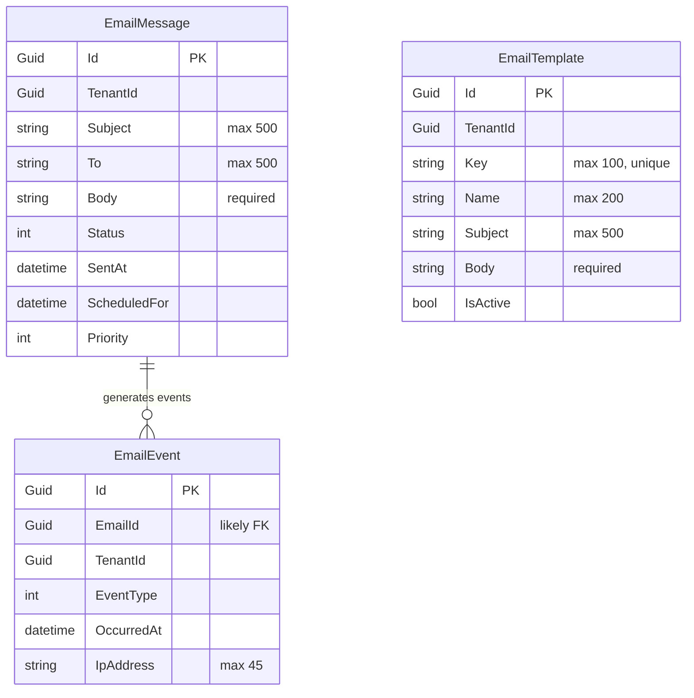
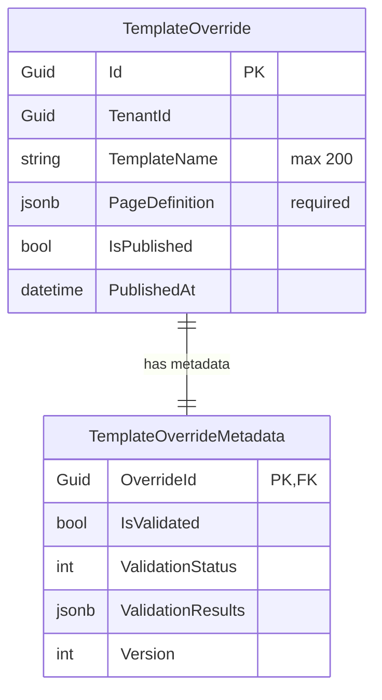
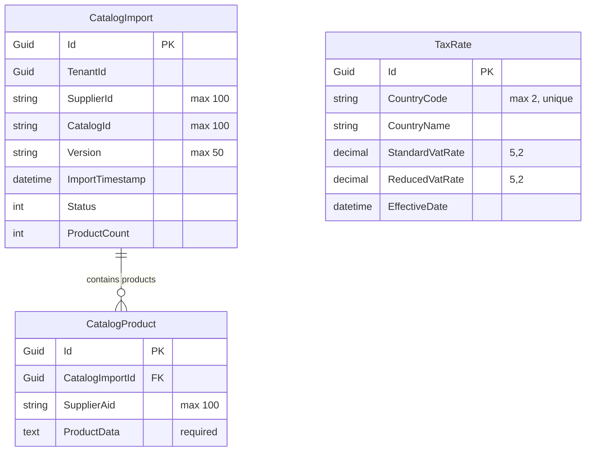
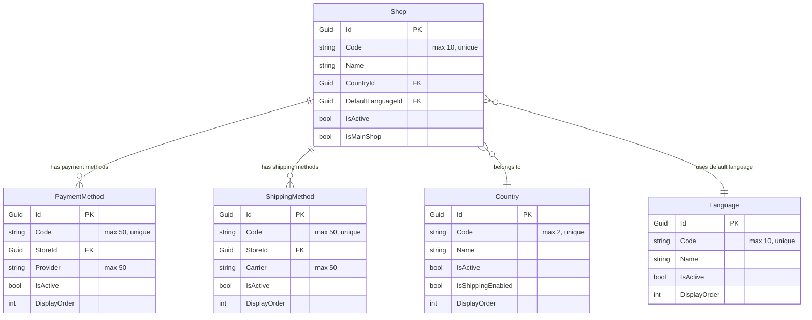
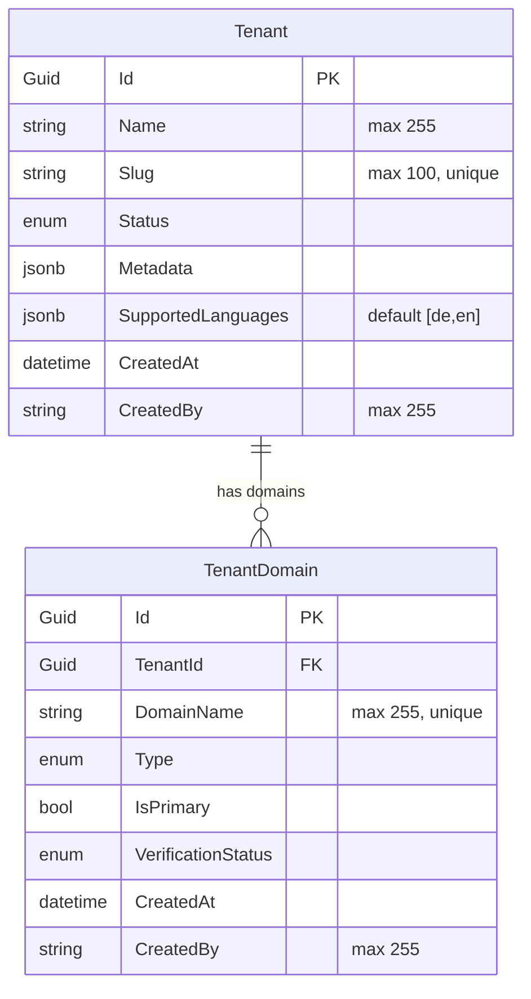
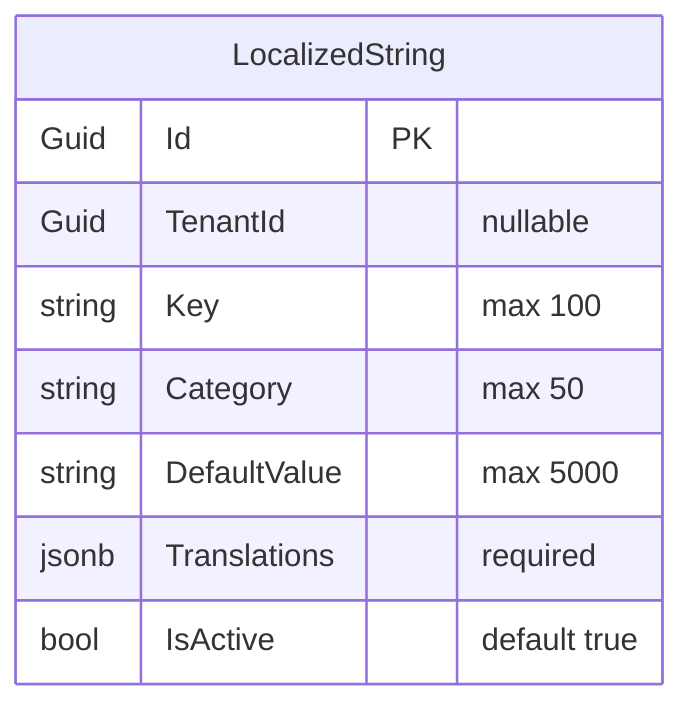

```mermaid
erDiagram
    AiConsumptionRecord {
        int Id PK
        string TenantId "max 36"
        string RequestId "max 36, unique"
        string Provider "max 50"
        int TokensUsed
        decimal Cost "10,4"
        datetime Timestamp
    }
    
    AiProviderConfiguration {
        string Provider "max 50, PK"
        string BaseUrl "max 500"
        bool IsActive "default true"
    }
    
    AiUsageMetrics {
        string TenantId PK
        date Date PK
        int RequestCount "default 0"
        int TotalTokens "default 0"
        decimal TotalCost "10,4, default 0"
    }
    
    PromptAuditLog {
        int Id PK
        string TenantId "max 36"
        string ToolType "max 100"
        string Key "max 100"
        datetime CreatedAt
    }
    
    PromptVersion {
        int Id PK
        string TenantId "max 36"
        string ToolType "max 100"
        string Key "max 100"
        int Version
    }
    
    SystemPrompt {
        string TenantId PK
        string ToolType "max 100, PK"
        string Key "max 100, PK"
        string Content "required"
        bool IsActive
    }
    
    TenantAiConfiguration {
        string TenantId PK
        string Provider "max 50, PK"
        string Model "max 100"
        bool IsActive
    }
```

# Unified ER-Model Map for B2X Project Services

## Overview
This document provides a comprehensive Entity-Relationship (ER) map for all main business services in the B2X project. Each service (DbContext) is listed with its entities, properties, relationships, and multi-tenancy aspects. Infrastructure contexts (e.g., MonitoringDbContext) are excluded as requested.

## AuthDbContext (Identity Management)
**Purpose**: User authentication, roles, and identity management  
**Multi-tenancy**: AppUser has TenantId field

### Entities
- **AppRole**: Id (string, PK), ConcurrencyStamp, Description, Name (max 256), NormalizedName (max 256)  
  *Indexes*: NormalizedName (unique)  
  *Seed data*: Admin role with Id "admin-role"

- **AppUser**: Id (string, PK), AccessFailedCount (int), AccountType (int), ConcurrencyStamp, Email (max 256), EmailConfirmed (bool), FirstName, IsActive (bool), IsDeletable (bool), IsTwoFactorRequired (bool), LastName, LockoutEnabled (bool), LockoutEnd (datetime?), NormalizedEmail (max 256), NormalizedUserName (max 256), PasswordHash, PhoneNumber, PhoneNumberConfirmed (bool), SecurityStamp, TenantId (string), TwoFactorEnabled (bool), UserName (max 256)  
  *Indexes*: NormalizedEmail, NormalizedUserName (unique)  
  *Seed data*: Admin user with Id "admin-001", TenantId "default"

- **IdentityRoleClaim<string>**: Id (int, PK), ClaimType, ClaimValue, RoleId (string, FK to AppRole)

- **IdentityUserClaim<string>**: Id (int, PK), ClaimType, ClaimValue, UserId (string, FK to AppUser)

- **IdentityUserLogin<string>**: LoginProvider + ProviderKey (PK composite), ProviderDisplayName, UserId (string, FK to AppUser)

- **IdentityUserRole<string>**: UserId (string, FK to AppUser) + RoleId (string, FK to AppRole) (PK composite)  
  *Seed data*: Links admin user to admin role

- **IdentityUserToken<string>**: UserId + LoginProvider + Name (PK composite), Value

### ER Diagram


---

## CustomerDbContext (Customer Billing & Invoicing)
**Purpose**: Invoice management, templates, and customer billing  
**Multi-tenancy**: Invoice and InvoiceTemplate have TenantId fields

### Entities
- **Invoice**: Id (Guid, PK), BuyerAddress, BuyerAddressEncrypted, BuyerCountry (max 2), BuyerName, BuyerNameEncrypted, BuyerVatId (max 50), CreatedAt (datetime), CreatedBy (max 50), DeletedAt (datetime?), DueAt (datetime), OrderId (Guid), IssuedAt (datetime), IsDeleted (bool), IsErechnung (bool), InvoiceNumber (max 50, required), ModifiedAt (datetime?), ModifiedBy (max 50), PaymentMethod (max 50), PaidAt (datetime?), PaymentStatus (max 50), PdfContent (byte[]), PdfHash (max 64), PdfGeneratedAt (datetime?), ReverseChargeApplies (bool), ReverseChargeNote (max 500), SellerAddress (max 1000), SellerName (max 500, required), SellerVatId (max 50), Status (max 50, required), ShippingCost (decimal 18,2), ShippingTaxAmount (decimal 18,2), SubTotal (decimal 18,2), TaxAmount (decimal 18,2), TaxRate (decimal 5,4), TenantId (Guid), Total (decimal 18,2), XmlContent, XmlGeneratedAt (datetime?)  
  *Indexes*: InvoiceNumber, IssuedAt, OrderId, TenantId+Id

- **InvoiceLineItem**: Id (Guid, PK), CreatedAt (datetime), InvoiceId (Guid, FK to Invoice), LinSubTotal (decimal 18,2), LineTaxAmount (decimal 18,2), LineTaxRate (decimal 5,4), LineTotal (decimal 18,2), ProductId (Guid), ProductName (max 500, required), ProductSku (max 50, required), Quantity (int), UnitPrice (decimal 18,2)  
  *Indexes*: InvoiceId

- **InvoiceTemplate**: Id (Guid, PK), CompanyAddress (max 1000), CompanyEmail (max 100), CompanyLogo, CompanyName (max 500, required), CompanyPhone (max 20), CompanyVatId (max 50), CompanyWebsite (max 200), CreatedAt (datetime), DeliveryNotes (max 2000), FooterText (max 2000), IsDefault (bool), ModifiedAt (datetime?), Name (max 100, required), PaymentInstructions (max 2000), TaxNoteB2b, TaxNoteB2c, TenantId (Guid)  
  *Indexes*: TenantId+IsDefault

### Relationships
- Invoice --1:N--> InvoiceLineItem (one-to-many, cascade delete)

### ER Diagram


---

## EmailDbContext (Email Management)
**Purpose**: Email messaging, templates, and event tracking  
**Multi-tenancy**: All entities have TenantId fields

### Entities
- **EmailEvent**: Id (Guid, PK), EmailId (Guid), EventType (int), IpAddress (max 45), Metadata (max 1000), OccurredAt (datetime), TenantId (Guid), UserAgent (max 500)  
  *Indexes*: EmailId, TenantId, TenantId+OccurredAt, TenantId+EventType+OccurredAt

- **EmailMessage**: Id (Guid, PK), Bcc (max 1000), Body (required), Cc (max 1000), CreatedAt (datetime), FailedAt (datetime?), IsHtml (bool), LastError (max 2000), MaxRetries (int), MessageId (max 100), NextRetryAt (datetime?), Priority (int), RetryCount (int), ScheduledFor (datetime?), SentAt (datetime?), Status (int), Subject (max 500, required), TemplateKey (max 100), TenantId (Guid), To (max 500, required), Variables (jsonb, required)  
  *Indexes*: ScheduledFor, Status, TenantId, Status+NextRetryAt, TenantId+CreatedAt, TenantId+Status

- **EmailTemplate**: Id (Guid, PK), Body (required), CreatedAt (datetime), CreatedBy (max 100), Description (max 1000), IsActive (bool), IsHtml (bool), Key (max 100, required), Name (max 200, required), Subject (max 500, required), TenantId (Guid), UpdatedAt (datetime), Variables (jsonb, required)  
  *Indexes*: TenantId, TenantId+CreatedAt, TenantId+IsActive, TenantId+Key (unique)

### Relationships
- EmailEvent.EmailId likely references EmailMessage.Id (implied FK, not explicitly defined in snapshot)

### ER Diagram


---

## CmsDbContext (Content Management System)
**Purpose**: Template overrides for CMS pages  
**Multi-tenancy**: TemplateOverride has TenantId field

### Entities
- **TemplateOverride**: Id (Guid, PK), CreatedAt (datetime), IsPublished (bool), PageDefinition (jsonb, required), PublishedAt (datetime), TemplateName (max 200, required), TenantId (Guid), UpdatedAt (datetime)

- **TemplateOverrideMetadata**: OverrideId (Guid, PK, FK to TemplateOverride), IsValidated (bool), ValidationStatus (int), ValidationResults (jsonb), Version (int)

### Relationships
- TemplateOverride --1:1--> TemplateOverrideMetadata (one-to-one, cascade delete)

### ER Diagram


---

## CatalogDbContext (Product Catalog)
**Purpose**: Catalog imports, products, and tax rates  
**Multi-tenancy**: CatalogImport has TenantId field

### Entities
- **CatalogImport**: Id (Guid, PK), CatalogId (max 100, required), CreatedAt (datetime), Description (max 500), ImportTimestamp (datetime), ProductCount (int), Status (int), SupplierId (max 100, required), TenantId (Guid), UpdatedAt (datetime?), Version (max 50)  
  *Indexes*: TenantId, TenantId+SupplierId+CatalogId+ImportTimestamp (unique)

- **CatalogProduct**: Id (Guid, PK), CatalogImportId (Guid, FK to CatalogImport), CreatedAt (datetime), ProductData (text, required), SupplierAid (max 100, required)  
  *Indexes*: CatalogImportId, CatalogImportId+SupplierAid (unique)

- **TaxRate**: Id (Guid, PK), CountryCode (max 2, required), CountryName (required), CreatedAt (datetime), EffectiveDate (datetime), EndDate (datetime?), ReducedVatRate (decimal 5,2?), StandardVatRate (decimal 5,2, required), UpdatedAt (datetime?)  
  *Indexes*: CountryCode (unique)  
  *Seed data*: EU tax rates for 27 countries (AT, BE, BG, HR, CY, CZ, DK, EE, FI, FR, DE, GR, HU, IE, IT, LV, LT, LU, MT, NL, PL, PT, RO, SK, SI, ES, SE)

### Relationships
- CatalogImport --1:N--> CatalogProduct (one-to-many, cascade delete)

### ER Diagram


---

## McpDbContext (AI/MCP Management)
**Purpose**: AI consumption tracking, prompt management, and provider configurations  
**Multi-tenancy**: Multiple entities have TenantId fields

### Entities
- **AiConsumptionRecord**: Id (int, PK), Cost (decimal 10,4), Duration (TimeSpan), Error, Provider (max 50, required), RequestId (max 36, required), Success (bool), TenantId (max 36, required), Timestamp (datetime), TokensUsed (int), ToolName (max 100, required)  
  *Indexes*: RequestId (unique), TenantId+Timestamp

- **AiProviderConfiguration**: Provider (max 50, PK), BaseUrl (max 500, required), IsActive (bool, default true), SupportedModels (required)

- **AiUsageMetrics**: TenantId (max 36) + Date (PK composite), RequestCount (int, default 0), TotalCost (decimal 10,4, default 0), TotalTokens (int, default 0)

- **PromptAuditLog**: Id (int, PK), Action (max 50, required), CreatedAt (datetime), Key (max 100, required), NewValue (required), OldValue (required), TenantId (max 36, required), ToolType (max 100, required), UserId (max 36, required)

- **PromptVersion**: Id (int, PK), Content (required), CreatedAt (datetime), CreatedBy (required), Key (max 100, required), TenantId (max 36, required), ToolType (max 100, required), Version (int)  
  *Indexes*: TenantId+ToolType+Key+Version

- **SystemPrompt**: TenantId (max 36) + ToolType (max 100) + Key (max 100) (PK composite), Content (required), CreatedAt (datetime), IsActive (bool), UpdatedAt (datetime), Version (int, default 1)

- **TenantAiConfiguration**: TenantId (max 36) + Provider (max 50) (PK composite), ApiKeyEncrypted (required), CreatedAt (datetime), IsActive (bool), Model (max 100, required), MonthlyBudget (decimal), UpdatedAt (datetime)

### Relationships
- No explicit foreign keys defined in snapshot (mostly independent entities)

### ER Diagram


---

## StoreDbContext (Store Configuration)
**Purpose**: Store settings, languages, countries, payment and shipping methods  
**Multi-tenancy**: Not explicitly multi-tenant (shared across tenants)

### Entities
- **Shop**: Id (Guid, PK), Code (max 10, unique), Name, IsActive, IsMainShop, CountryId (FK to Country), DefaultLanguageId (FK to Language), LogoUrl, Description, DisplayOrder  
  *Indexes*: Code (unique), IsActive, IsMainShop

- **Language**: Id (Guid, PK), Code (max 10, unique), Name, IsActive, DisplayOrder  
  *Indexes*: Code (unique), IsActive, DisplayOrder

- **Country**: Id (Guid, PK), Code (max 2, unique), CodeAlpha3 (max 3), Name, IsActive, Region, IsShippingEnabled, DisplayOrder  
  *Indexes*: Code (unique), IsActive, Region, IsShippingEnabled, DisplayOrder

- **PaymentMethod**: Id (Guid, PK), Code (max 50, unique), Name, StoreId (Guid, FK to Shop), IsActive, DisplayOrder, Provider (max 50), Category (max 50), Configuration (jsonb), Fees (decimal)  
  *Indexes*: Code (unique), StoreId, IsActive, DisplayOrder

- **ShippingMethod**: Id (Guid, PK), Code (max 50, unique), Name, StoreId (Guid, FK to Shop), IsActive, DisplayOrder, Carrier (max 50), ServiceName (max 100), Cost (decimal), EstimatedDays (int)  
  *Indexes*: Code (unique), StoreId, IsActive, DisplayOrder

### Relationships
- Shop --N:1--> Country (many-to-one, set null on delete)
- Shop --N:1--> Language (many-to-one, set null on delete)
- PaymentMethod --N:1--> Shop (many-to-one, cascade delete)
- ShippingMethod --N:1--> Shop (many-to-one, cascade delete)

### ER Diagram


---

## TenancyDbContext (Multi-Tenant Management)
**Purpose**: Tenant and domain management for multi-tenancy  
**Multi-tenancy**: Core tenancy entities (not tenant-specific data)

### Entities
- **Tenant**: Id (Guid, PK), Name (max 255, required), Slug (max 100, required, unique), LogoUrl (max 500), Status (enum), SuspensionReason (max 500), Metadata (jsonb), LocalizedDescription (jsonb), SupportedLanguages (jsonb, default ["de","en"]), CreatedAt, UpdatedAt, CreatedBy (max 255), UpdatedBy (max 255)  
  *Indexes*: Slug (unique)  
  *Seed data*: Default tenant with Id from SeedConstants

- **TenantDomain**: Id (Guid, PK), TenantId (Guid, FK to Tenant), DomainName (max 255, required, unique), Type (enum), IsPrimary (bool), VerificationStatus (enum), VerificationToken (max 100), SslStatus (enum), CreatedAt, UpdatedAt, CreatedBy (max 255), UpdatedBy (max 255)  
  *Indexes*: DomainName (unique), TenantId+IsPrimary, VerificationStatus

### Relationships
- TenantDomain --N:1--> Tenant (many-to-one, cascade delete)  
  *Seed data*: Default domain linked to default tenant

### ER Diagram


---

## LocalizationDbContext (Localization Management)
**Purpose**: Localized strings and translations  
**Multi-tenancy**: LocalizedString has nullable TenantId field

### Entities
- **LocalizedString**: Id (Guid, PK), Category (max 50, required), CreatedAt (datetime), CreatedBy (Guid?), DefaultValue (max 5000, required), IsActive (bool, default true), Key (max 100, required), TenantId (Guid?), Translations (required), UpdatedAt (datetime)  
  *Indexes*: Category, CreatedAt, TenantId, Key+Category+TenantId (unique)

### Relationships
- No foreign keys defined

### ER Diagram


---

## Cross-Service Relationships
Based on the snapshots, there are limited explicit cross-service relationships. However, potential logical connections include:

- **OrderId in Invoice** (CustomerDbContext) may reference orders from a Store/Order service (not in these snapshots)
- **ProductId in InvoiceLineItem** (CustomerDbContext) may reference products from CatalogDbContext
- **TenantId fields** across services indicate multi-tenant isolation, with shared tenant contexts
- **Email events** (EmailDbContext) may relate to user actions from AuthDbContext

## Multi-Tenancy Summary
- **AuthDbContext**: AppUser.TenantId (string)
- **CustomerDbContext**: Invoice.TenantId, InvoiceTemplate.TenantId (Guid)
- **EmailDbContext**: All entities have TenantId (Guid)
- **CmsDbContext**: TemplateOverride.TenantId (Guid)
- **CatalogDbContext**: CatalogImport.TenantId (Guid)
- **McpDbContext**: Multiple entities have TenantId (string)
- **LocalizationDbContext**: LocalizedString.TenantId (Guid, nullable)
- **TenancyDbContext**: Core tenant management (not tenant-specific)

## Key Business Entities
Core business entities span:
- **Identity**: Users, roles, authentication
- **Tenancy**: Tenant and domain management
- **Store**: Shop configuration, languages, countries, payment/shipping
- **Catalog**: Product imports, tax rates
- **Customer**: Invoices, billing
- **CMS**: Template overrides
- **Email**: Messaging and templates
- **Localization**: Translated content
- **AI/MCP**: Consumption tracking and configurations

This ER map provides a foundation for understanding the B2X system's data architecture across all analyzed services.

## Unified System ER Diagram
```mermaid
erDiagram
    %% Core Identity & Tenancy
    Tenant ||--o{ TenantDomain : "has domains"
    Tenant ||--o{ AppUser : "contains users"
    Tenant ||--o{ Invoice : "has invoices"
    Tenant ||--o{ EmailMessage : "sends emails"
    Tenant ||--o{ TemplateOverride : "customizes CMS"
    Tenant ||--o{ CatalogImport : "imports catalogs"
    Tenant ||--o{ LocalizedString : "localizes content"
    
    %% Store Configuration (shared across tenants)
    Shop ||--o{ PaymentMethod : "offers payments"
    Shop ||--o{ ShippingMethod : "offers shipping"
    Shop }o--|| Country : "located in"
    Shop }o--|| Language : "defaults to"
    
    %% Business Relationships
    Invoice ||--o{ InvoiceLineItem : "contains items"
    CatalogImport ||--o{ CatalogProduct : "contains products"
    EmailMessage ||--o{ EmailEvent : "generates events"
    TemplateOverride ||--|| TemplateOverrideMetadata : "has metadata"
    
    %% Cross-Service Logical Links (dashed lines)
    InvoiceLineItem ..o{ CatalogProduct : "references products"
    Invoice ..o{ EmailMessage : "sends notifications"
    AppUser ..o{ EmailMessage : "receives emails"
    
    %% Key Entities
    Tenant {
        Guid Id PK
        string Name
        string Slug "unique"
    }
    
    AppUser {
        string Id PK
        string TenantId
        string Email
    }
    
    Invoice {
        Guid Id PK
        Guid TenantId
        Guid OrderId
        decimal Total
    }
    
    CatalogImport {
        Guid Id PK
        Guid TenantId
        string SupplierId
    }
    
    Shop {
        Guid Id PK
        string Code "unique"
        bool IsMainShop
    }
```