# Project Dependency Graph

**DocID**: `ARCH-DEPS-001`  
**Status**: ✅ Current as of January 11, 2026  
**Architecture**: Onion Architecture with DDD Bounded Contexts

> **See also**: [CLOUD_INFRASTRUCTURE.md](CLOUD_INFRASTRUCTURE.md) (Production) | [DEVELOPMENT_INFRASTRUCTURE.md](DEVELOPMENT_INFRASTRUCTURE.md) (Development)

> **Reverse Proxy**: Das Projekt `B2X.ReverseProxy` implementiert Tenant-Resolution mit YARP → siehe [Reverse Proxy](#reverse-proxy-b2xreverseproxy)

## Cloud Deployment Architecture (Multi-Tenant)

### Architecture Overview (C4 Style)

```mermaid
%%{init: {'theme': 'base', 'themeVariables': { 'fontSize': '14px'}}}%%
flowchart TB
    subgraph External["🌐 External"]
        direction LR
        Cust["👤 Customer<br/><i>shop.tenant.de</i>"]
        Admin["👔 Tenant Admin<br/><i>admin.tenant.de</i>"]
        Platform["🏢 Platform Admin<br/><i>mgmt.b2xgate.de</i>"]
    end

    subgraph Edge["🛡️ Edge Layer"]
        DNS["DNS<br/><small>Cloudflare</small>"]
        Proxy["Reverse Proxy<br/><small>Traefik / YARP</small><br/>──────────<br/>SSL · Tenant ID · Rate Limit"]
    end

    subgraph Presentation["📱 Presentation Layer"]
        direction LR
        subgraph StoreUI[" "]
            StoreFE["🛒 Store<br/>Frontend"]
            StoreMCP["🤖 Store<br/>MCP"]
        end
        subgraph AdminUI[" "]
            AdminFE["📊 Admin<br/>Frontend"]
            AdminMCP["🤖 Admin<br/>MCP"]
        end
        subgraph MgmtUI[" "]
            MgmtFE["⚙️ Management<br/>Frontend"]
            MgmtMCP["🤖 Mgmt<br/>MCP"]
        end
    end

    subgraph Gateway["⚡ Gateway Layer"]
        direction LR
        StoreGW["Store Gateway<br/><small>/api/store/*</small>"]
        AdminGW["Admin Gateway<br/><small>/api/admin/*</small>"]
        MgmtGW["Management Gateway<br/><small>/api/mgmt/*</small>"]
        NotifyGW["Notifications<br/><small>/api/notify/*</small>"]
    end

    subgraph Services["🔧 Domain Services"]
        direction LR
        Catalog["Catalog"]
        Orders["Orders"]
        CMS["CMS"]
        Identity["Identity"]
        Tenancy["Tenancy"]
        Search["Search"]
    end

    subgraph Data["💾 Data Layer"]
        direction LR
        DB[("PostgreSQL<br/><small>Multi-Tenant RLS</small>")]
        Vec[("pgvector<br/><small>Embeddings</small>")]
        Cache[("Redis<br/><small>Cache</small>")]
        ES[("Elasticsearch<br/><small>Search</small>")]
    end

    subgraph AI["🧠 AI Backend"]
        LLM["LLM Provider<br/><small>Azure OpenAI / Local</small>"]
    end

    %% External to Edge
    Cust --> DNS
    Admin --> DNS
    Platform --> DNS
    DNS --> Proxy

    %% Edge to Presentation (Static)
    Proxy -->|"static"| StoreFE
    Proxy -->|"static"| AdminFE
    Proxy -->|"static"| MgmtFE

    %% Edge to Gateway (API)
    Proxy -->|"api"| StoreGW
    Proxy -->|"api"| AdminGW
    Proxy -->|"api"| MgmtGW
    Proxy -->|"api"| NotifyGW

    %% Frontend to MCP
    StoreFE -.-> StoreMCP
    AdminFE -.-> AdminMCP
    MgmtFE -.-> MgmtMCP

    %% MCP to Gateway
    StoreMCP --> StoreGW
    AdminMCP --> AdminGW
    MgmtMCP --> MgmtGW

    %% MCP to AI
    StoreMCP -.-> LLM
    AdminMCP -.-> LLM
    MgmtMCP -.-> LLM

    %% Gateway to Services
    StoreGW --> Catalog & Orders & Search
    AdminGW --> Catalog & CMS & Orders
    MgmtGW --> Tenancy & CMS & Identity
    NotifyGW --> Identity

    %% Services to Data
    Catalog --> DB & ES
    Orders --> DB
    CMS --> DB
    Identity --> DB & Cache
    Tenancy --> DB
    Search --> ES & Vec

    %% AI to Data
    LLM --> Vec

    %% Styles
    classDef store fill:#4CAF50,stroke:#2E7D32,color:#fff
    classDef admin fill:#2196F3,stroke:#1565C0,color:#fff
    classDef mgmt fill:#9C27B0,stroke:#6A1B9A,color:#fff
    classDef notify fill:#FF9800,stroke:#E65100,color:#fff
    classDef ai fill:#E91E63,stroke:#C2185B,color:#fff
    classDef infra fill:#607D8B,stroke:#37474F,color:#fff
    classDef external fill:#fff,stroke:#333,color:#333

    class Cust,StoreFE,StoreMCP,StoreGW store
    class Admin,AdminFE,AdminMCP,AdminGW admin
    class Platform,MgmtFE,MgmtMCP,MgmtGW mgmt
    class NotifyGW notify
    class LLM ai
    class DNS,Proxy,DB,Vec,Cache,ES,Catalog,Orders,CMS,Identity,Tenancy,Search infra
```



### Simplified System View

```mermaid
%%{init: {'theme': 'base'}}%%
graph LR
    subgraph Users["Users"]
        U1["🛒 Customer"]
        U2["👔 Tenant Admin"]
        U3["🏢 Platform Admin"]
    end

    subgraph B2XGate["B2XGate Platform"]
        subgraph FE["Frontends + AI"]
            F1["Store + MCP"]
            F2["Admin + MCP"]
            F3["Management + MCP"]
        end
        subgraph BE["Backend APIs"]
            B1["Store API"]
            B2["Admin API"]
            B3["Mgmt API"]
        end
        DB[("Data")]
    end

    subgraph External["External Systems"]
        ERP["ERP Systems"]
        Email["Email Provider"]
        AI["LLM Provider"]
    end

    U1 --> F1 --> B1
    U2 --> F2 --> B2
    U3 --> F3 --> B3
    B1 & B2 & B3 --> DB
    B1 <--> ERP
    B2 --> Email
    F1 & F2 & F3 -.-> AI

    classDef store fill:#4CAF50,stroke:#2E7D32,color:#fff
    classDef admin fill:#2196F3,stroke:#1565C0,color:#fff
    classDef mgmt fill:#9C27B0,stroke:#6A1B9A,color:#fff

    class U1,F1,B1 store
    class U2,F2,B2 admin
    class U3,F3,B3 mgmt
```



### Routing Detail

| Route Pattern | Target | Description |
|---------------|--------|-------------|
| `/*` | Static Frontends | HTML, JS, CSS, Assets |
| `/api/store/*` | Store Gateway (:8000) | Products, Cart, Orders |
| `/api/admin/*` | Admin Gateway (:8080) | Catalog Management |
| `/api/mgmt/*` | Management Gateway (:8090) | Tenants, Domains |
| `/api/notify/*` | Notifications (:8095) | Email, Push, Webhooks |

### Color Legend


| Color | Context | Description |
|-------|---------|-------------|
| 🟢 **Grün** | Store | Customer-facing Shop (B2C) |
| 🔵 **Blau** | Admin | Tenant Administration |
| 🟣 **Violett** | Management | Platform Management (B2XGate Betreiber) |
| 🟠 **Orange** | Notifications | Cross-cutting Notifications |
| ⚫ **Grau** | Infrastructure | Shared Infrastructure (Proxy, DB, Cache) |

---

## Access Points (CLI, MCP, API)

B2XGate bietet mehrere Zugriffspunkte für unterschiedliche Anwendungsfälle:

### Access Points Overview

```mermaid
flowchart TB
    subgraph Users["👥 BENUTZER"]
        Customer["🛒 Shop Customer"]
        TenantAdmin["👔 Tenant Admin"]
        PlatformAdmin["🏢 Platform Admin"]
        Developer["💻 Developer"]
        Automation["⚙️ Automation/Scripts"]
    end

    subgraph WebUI["🌐 WEB FRONTENDS"]
        StoreFE["Store Frontend"]
        AdminFE["Admin Frontend"]
        MgmtFE["Management Frontend"]
    end

    subgraph CLI["⌨️ CLI TOOLS"]
        CLIOps["B2X.CLI.Operations<br/>─────────────────<br/>• Health checks<br/>• Cache management<br/>• Log analysis"]
        CLIAdmin["B2X.CLI.Administration<br/>─────────────────<br/>• Tenant provisioning<br/>• User management<br/>• Bulk operations"]
        CLIMgmt["B2X.CLI<br/>─────────────────<br/>• Platform config<br/>• Database migrations<br/>• Deployment tools"]
    end

    subgraph MCP["🤖 MCP SERVERS (Production AI)"]
        StoreMCP["B2X.Store.MCP<br/>─────────────────<br/>• Smart Search<br/>• Recommendations<br/>• Shop Assistant"]
        AdminMCP["B2X.Admin.MCP<br/>─────────────────<br/>• Smart Data Integration<br/>• Auto Categorization<br/>• Content Generation"]
        MgmtMCP["B2X.Management.MCP<br/>─────────────────<br/>• Anomaly Detection<br/>• Revenue Forecast<br/>• Security Alerts"]
    end

    subgraph APIs["⚡ REST/GraphQL APIs"]
        StoreAPI["Store API<br/>/api/store/*"]
        AdminAPI["Admin API<br/>/api/admin/*"]
        MgmtAPI["Management API<br/>/api/mgmt/*"]
        NotifyAPI["Notifications API<br/>/api/notify/*"]
    end

    subgraph Backend["🔧 BACKEND SERVICES"]
        Services["Domain Services<br/>(Catalog, Orders, CMS, etc.)"]
        DB[(PostgreSQL)]
    end

    %% User to Interface connections
    Customer --> StoreFE
    TenantAdmin --> AdminFE
    TenantAdmin --> CLIAdmin
    PlatformAdmin --> MgmtFE
    PlatformAdmin --> CLIMgmt
    Developer --> CLI
    Automation --> APIs
    Automation --> CLI

    %% Frontend to API
    StoreFE --> StoreAPI
    AdminFE --> AdminAPI
    MgmtFE --> MgmtAPI

    %% Frontend to MCP (AI Features)
    StoreFE -.->|"AI Features"| StoreMCP
    AdminFE -.->|"AI Features"| AdminMCP
    MgmtFE -.->|"AI Features"| MgmtMCP

    %% CLI to API
    CLIOps --> StoreAPI
    CLIOps --> AdminAPI
    CLIAdmin --> AdminAPI
    CLIAdmin --> MgmtAPI
    CLIMgmt --> MgmtAPI

    %% MCP to API (Backend calls)
    StoreMCP --> StoreAPI
    AdminMCP --> AdminAPI
    MgmtMCP --> MgmtAPI

    %% API to Services
    StoreAPI --> Services
    AdminAPI --> Services
    MgmtAPI --> Services
    NotifyAPI --> Services
    Services --> DB

    %% Colors
    classDef store fill:#4CAF50,stroke:#2E7D32,color:#fff
    classDef admin fill:#2196F3,stroke:#1565C0,color:#fff
    classDef mgmt fill:#9C27B0,stroke:#6A1B9A,color:#fff
    classDef notify fill:#FF9800,stroke:#E65100,color:#fff
    classDef cli fill:#00BCD4,stroke:#0097A7,color:#fff
    classDef mcp fill:#E91E63,stroke:#C2185B,color:#fff
    classDef infra fill:#607D8B,stroke:#37474F,color:#fff

    class StoreFE,StoreAPI store
    class AdminFE,AdminAPI,CLIAdmin admin
    class MgmtFE,MgmtAPI,CLIMgmt mgmt
    class NotifyAPI notify
    class CLIOps cli
    class StoreMCP,AdminMCP,MgmtMCP mcp
    class Services,DB infra
```



### Access Point Matrix

| Zugriffspunkt | Zielgruppe | Authentifizierung | Use Cases |
|---------------|------------|-------------------|-----------|
| **Store Frontend** | Endkunden | Optional (Guest/Login) | Produkte browsen, Bestellungen |
| **Admin Frontend** | Tenant Admins | JWT + Tenant Claim | Katalog pflegen, Bestellungen verwalten |
| **Management Frontend** | Platform Admins | JWT + Platform Role | Tenants verwalten, Domains konfigurieren |
| **Store API** | Frontends, Mobile Apps | API Key / JWT | Programmatischer Shop-Zugriff |
| **Admin API** | Frontends, CLI, Automation | JWT + Tenant Claim | Tenant-Administration |
| **Management API** | Frontends, CLI | JWT + Platform Role | Platform-Management |
| **CLI Operations** | DevOps, Support | API Key + Secret | Health checks, Debugging |
| **CLI Administration** | Tenant Admins | JWT Token | Bulk-Operationen, Scripting |
| **CLI Management** | Platform Admins | JWT + Platform Role | Deployment, Migrations |
| **B2X.Store.MCP** | Store Frontend | Tenant Context | Smart Search, Recommendations, Chatbot |
| **B2X.Admin.MCP** | Admin Frontend | JWT + Tenant Claim | Data Integration, Content Generation |
| **B2X.Management.MCP** | Management Frontend | JWT + Platform Role | Analytics, Anomaly Detection |

### CLI Tools Detail


#### CLI Usage Examples

```bash
# Operations (DevOps/Support)
b2x-ops health-check --all
b2x-ops cache-clear --tenant acme
b2x-ops logs-tail --service store-gateway --level error

# Administration (Tenant Admin)
b2x-admin tenant-create --name "ACME GmbH" --plan pro
b2x-admin catalog-import --file products.csv --tenant acme
b2x-admin user-invite --email admin@acme.de --role TenantAdmin

# Management (Platform Admin)
b2x db-migrate --target latest
b2x domain-add --tenant acme --domain shop.acme.de
b2x tenant-provision --config tenant-acme.yaml
```

### MCP Servers Detail

MCP Server ermöglichen **AI-gestützte Features** in den Production Frontends:

```mermaid
flowchart TB
    subgraph Frontends["Production Frontends"]
        StoreFE["🛒 Store Frontend"]
        AdminFE["👔 Admin Frontend"]
        MgmtFE["🏢 Management Frontend"]
    end

    subgraph MCPLayer["MCP Server Layer (Production)"]
        subgraph StoreMCP["B2X.Store.MCP"]
            S1["🔍 Smart Search<br/>Semantic product search"]
            S2["💡 Recommendations<br/>Personalized suggestions"]
            S3["💬 Shop Assistant<br/>Product Q&A chatbot"]
            S4["📝 Review Summary<br/>AI-generated summaries"]
        end

        subgraph AdminMCP["B2X.Admin.MCP"]
            A1["📊 Smart Data Integration<br/>CSV/Excel mapping"]
            A2["🏷️ Auto Categorization<br/>Product classification"]
            A3["✍️ Content Generation<br/>Descriptions, SEO"]
            A4["📈 Sales Insights<br/>Trend analysis"]
        end

        subgraph MgmtMCP["B2X.Management.MCP"]
            M1["🔔 Anomaly Detection<br/>Unusual patterns"]
            M2["📉 Churn Prediction<br/>Tenant risk analysis"]
            M3["💰 Revenue Forecast<br/>Platform projections"]
            M4["🛡️ Security Alerts<br/>Threat detection"]
        end
    end

    subgraph AIBackend["AI Backend"]
        LLM["LLM Provider<br/>(Azure OpenAI / Local)"]
        Embeddings["Embedding Service<br/>(Vector Search)"]
        Analytics["Analytics Engine"]
    end

    subgraph Data["Data Layer"]
        DB[(PostgreSQL)]
        VectorDB[(Vector Store<br/>pgvector)]
        Cache[(Redis)]
    end

    StoreFE --> StoreMCP
    AdminFE --> AdminMCP
    MgmtFE --> MgmtMCP

    S1 & S2 & S3 & S4 --> LLM
    S1 & S2 --> Embeddings
    A1 & A2 & A3 & A4 --> LLM
    A1 --> Embeddings
    M1 & M2 & M3 & M4 --> Analytics
    M1 & M4 --> LLM

    LLM --> Cache
    Embeddings --> VectorDB
    Analytics --> DB

    classDef store fill:#4CAF50,stroke:#2E7D32,color:#fff
    classDef admin fill:#2196F3,stroke:#1565C0,color:#fff
    classDef mgmt fill:#9C27B0,stroke:#6A1B9A,color:#fff
    classDef ai fill:#E91E63,stroke:#C2185B,color:#fff
    classDef data fill:#607D8B,stroke:#37474F,color:#fff

    class StoreFE,S1,S2,S3,S4 store
    class AdminFE,A1,A2,A3,A4 admin
    class MgmtFE,M1,M2,M3,M4 mgmt
    class LLM,Embeddings,Analytics ai
    class DB,VectorDB,Cache data
```



#### MCP Features by Frontend

| Frontend | MCP Server | Feature | Description |
|----------|------------|---------|-------------|
| **Store** | B2X.Store.MCP | Smart Search | Semantische Produktsuche ("rotes Kleid für Hochzeit") |
| **Store** | B2X.Store.MCP | Recommendations | Personalisierte Produktempfehlungen |
| **Store** | B2X.Store.MCP | Shop Assistant | Chatbot für Produktfragen |
| **Store** | B2X.Store.MCP | Review Summary | KI-Zusammenfassung von Bewertungen |
| **Admin** | B2X.Admin.MCP | Smart Data Integration | Automatisches CSV/Excel Column Mapping |
| **Admin** | B2X.Admin.MCP | Auto Categorization | Automatische Produktkategorisierung |
| **Admin** | B2X.Admin.MCP | Content Generation | SEO-Texte, Produktbeschreibungen |
| **Admin** | B2X.Admin.MCP | Sales Insights | Verkaufstrends, Bestseller-Analyse |
| **Management** | B2X.Management.MCP | Anomaly Detection | Ungewöhnliche Muster erkennen |
| **Management** | B2X.Management.MCP | Churn Prediction | Tenant-Abwanderungsrisiko |
| **Management** | B2X.Management.MCP | Revenue Forecast | Umsatzprognosen |
| **Management** | B2X.Management.MCP | Security Alerts | Bedrohungserkennung |

#### Smart Data Integration (Admin MCP) - Detail


#### Shop Assistant (Store MCP) - Detail

```mermaid
sequenceDiagram
    autonumber
    participant C as Customer
    participant FE as Store Frontend
    participant MCP as B2X.Store.MCP
    participant LLM as LLM Provider
    participant Vec as Vector Store
    participant API as Store API

    Note over C,API: AI-Powered Product Q&A

    C->>FE: "Welches Werkzeug brauche<br/>ich für Laminat verlegen?"
    FE->>MCP: POST /mcp/assistant<br/>{query, tenant_id, session_id}
    MCP->>Vec: Semantic search<br/>in product catalog
    Vec-->>MCP: Relevant products:<br/>Stichsäge, Hammer, Zugeisen...
    MCP->>LLM: Generate answer with<br/>product context
    LLM-->>MCP: "Für Laminat benötigen Sie:<br/>1. Stichsäge für Zuschnitte<br/>2. Zugeisen für letzte Reihe..."
    MCP-->>FE: Answer + product links
    FE->>C: Show answer with<br/>product cards
    C->>FE: Click "Stichsäge"
    FE->>API: GET /api/store/products/{id}
```



### Development Tools (nicht Production)

> **Hinweis**: Folgende Tools sind **nur für Development** gedacht und nicht Teil der Production-Architektur:
> 
> - **RoslynMCP** - Code-Analyse für Entwickler in VS Code
> - **WolverineMCP** - CQRS Pattern Validation für Entwickler
> - **Chrome DevTools MCP** - E2E Testing Support
> 
> Diese sind in `.vscode/mcp.json` konfiguriert und werden nicht deployed.

### API Authentication Flow


### Extended Color Legend


| Color | Context | Description |
|-------|---------|-------------|
| 🟢 **Grün** | Store | Customer-facing Shop (B2C) |
| 🔵 **Blau** | Admin | Tenant Administration |
| 🟣 **Violett** | Management | Platform Management (B2XGate Betreiber) |
| 🟠 **Orange** | Notifications | Cross-cutting Notifications |
| 🔵 **Cyan** | CLI | Command Line Tools |
| 💗 **Pink** | MCP | AI/MCP Integration |
| ⚫ **Grau** | Infrastructure | Shared Infrastructure |

### Request Flow (Sequence Diagram)


### System Context (C4 Diagram)


### Container Diagram (C4)


                                         │
                                         ▼
┌─────────────────────────────────────────────────────────────────────────────┐
│                            ORCHESTRATION LAYER                              │
│  ┌───────────────────────────────────────────────────────────────────────┐  │
│  │                          B2X.AppHost                                   │  │
│  │                    (Aspire Orchestration)                              │  │
│  └───────────────────────────────────────────────────────────────────────┘  │
└─────────────────────────────────────────────────────────────────────────────┘
                                    │
                 ┌──────────────────┼──────────────────┐
                 ▼                  ▼                  ▼
┌─────────────────────────────────────────────────────────────────────────────┐
│                              GATEWAY LAYER                                  │
│  ┌─────────────────────────────────┐  ┌─────────────────────────────────┐  │
│  │         B2X.Store               │  │         B2X.Admin               │  │
│  │       (Store Gateway)           │  │       (Admin Gateway)           │  │
│  └─────────────────────────────────┘  └─────────────────────────────────┘  │
│  ┌─────────────────────────────────┐  ┌─────────────────────────────────┐  │
│  │       B2X.Management            │  │      B2X.Notifications          │  │
│  │     (Management Gateway / BFF)  │  │    (Notifications Gateway)      │  │
│  │                                 │  │                                 │  │
│  │  Domain Management:             │  │  • Email notifications          │  │
│  │  • Custom domain registration   │  │  • Push notifications           │  │
│  │  • SSL certificate provisioning │  │  • Webhook delivery             │  │
│  │  • Tenant configuration         │  │                                 │  │
│  │  • Rate limit policies          │  │                                 │  │
│  └─────────────────────────────────┘  └─────────────────────────────────┘  │
└─────────────────────────────────────────────────────────────────────────────┘
                                    │
┌─────────────────────────────────────────────────────────────────────────────┐
│                              DOMAIN LAYER                                   │
│  ┌─────────────────────────────────────────────────────────────────────┐    │
│  │ BOUNDED CONTEXTS                                                     │    │
│  │  ┌────────────┐ ┌────────────┐ ┌────────────┐ ┌────────────┐       │    │
│  │  │ Catalog    │ │ Identity   │ │ Tenancy    │ │ Localization│       │    │
│  │  │ Categories │ │ Legal      │ │ Theming    │ │ Search      │       │    │
│  │  │ Variants   │ │ Compliance │ │ ERP        │ │ Email       │       │    │
│  │  │ Orders     │ │ Customer   │ │            │ │ SDI         │       │    │
│  │  └────────────┘ └────────────┘ └────────────┘ └────────────┘       │    │
│  └─────────────────────────────────────────────────────────────────────┘    │
└─────────────────────────────────────────────────────────────────────────────┘
                                    │
┌─────────────────────────────────────────────────────────────────────────────┐
│                           INFRASTRUCTURE LAYER                              │
│  ┌─────────────────────────────────────────────────────────────────────┐    │
│  │ SHARED INFRASTRUCTURE                                                │    │
│  │  ┌────────────┐ ┌────────────┐ ┌────────────┐ ┌────────────┐       │    │
│  │  │ Middleware │ │ Messaging  │ │ Monitoring │ │ Search     │       │    │
│  │  │            │ │ (Wolverine)│ │ (OTel)     │ │ (Elastic)  │       │    │
│  │  └────────────┘ └────────────┘ └────────────┘ └────────────┘       │    │
│  │  ┌────────────────────────────────────────────────────────────┐    │    │
│  │  │           B2X.Shared.Infrastructure (EF Core, Redis)       │    │    │
│  │  └────────────────────────────────────────────────────────────┘    │    │
│  └─────────────────────────────────────────────────────────────────────┘    │
└─────────────────────────────────────────────────────────────────────────────┘
                                    │
┌─────────────────────────────────────────────────────────────────────────────┐
│                             KERNEL LAYER                                    │
│  ┌─────────────────────────────────────────────────────────────────────┐    │
│  │ SHARED KERNEL (DDD Core)                                             │    │
│  │  ┌────────────────────┐  ┌────────────────────┐                     │    │
│  │  │ B2X.Shared.Core    │  │ B2X.Shared.Kernel  │                     │    │
│  │  │ (Entities, VOs)    │  │ (Base abstractions)│                     │    │
│  │  └────────────────────┘  └────────────────────┘                     │    │
│  │  ┌────────────────────┐  ┌────────────────────┐                     │    │
│  │  │ B2X.Types          │  │ B2X.Utils          │                     │    │
│  │  │ (Type definitions) │  │ (Helper utilities) │                     │    │
│  │  └────────────────────┘  └────────────────────┘                     │    │
│  └─────────────────────────────────────────────────────────────────────┘    │
└─────────────────────────────────────────────────────────────────────────────┘
                                    │
┌─────────────────────────────────────────────────────────────────────────────┐
│                           CROSS-CUTTING LAYER                               │
│  ┌───────────────────────────────────────────────────────────────────────┐  │
│  │                      B2X.ServiceDefaults                               │  │
│  │             (OpenTelemetry, HealthChecks, Service Discovery)           │  │
│  └───────────────────────────────────────────────────────────────────────┘  │
└─────────────────────────────────────────────────────────────────────────────┘
```

---

## Detailed Dependency Graph (split diagrams)

### Orchestration & Gateways


### Kernel & Infrastructure


### Store Bounded Context (focused)


### Admin & Management Contexts


### Shared Domain, Services & AI

    CatalogAPI --> Search
    CatalogAPI --> SharedSearch
    CatalogAPI --> DomainSearch

    Identity --> ServiceDefaults
    Identity --> Kernel
    Identity --> Core
    Identity --> Middleware
    Identity --> Infrastructure
    Identity --> Messaging

    Tenancy --> ServiceDefaults
    Tenancy --> Kernel
    Tenancy --> Core
    Tenancy --> Infrastructure
    Tenancy --> Middleware
    Tenancy --> Messaging

    %% Infrastructure dependencies
    Infrastructure --> Kernel
    Infrastructure --> Core

    Messaging --> Kernel
    Messaging --> Core

    Middleware --> Kernel
    Middleware --> Core
    Middleware --> Utils

    %% Kernel dependencies
    Core --> Kernel
    Core --> Types

    Types --> Kernel

    %% Search domain
    Search --> Core
    DomainSearch --> Core
```

---

## Layer Definitions

### 1. Orchestration Layer (Top)
**Purpose**: Application composition and service orchestration

| Project | Description | Layer |
|---------|-------------|-------|
| `B2X.AppHost` | Aspire orchestration host | Orchestration |

### 2. Gateway Layer
**Purpose**: API endpoints, request routing, authentication

| Project | Bounded Context | Description |
|---------|-----------------|-------------|
| `B2X.Store` | Store | Storefront gateway (tenant-scoped) |
| `B2X.Admin` | Admin | Administration gateway (tenant-scoped) |
| `B2X.Management` | Management | Platform management gateway / BFF |
| `B2X.Notifications` | Cross-cutting | Email, Push, Webhooks |

#### Management Gateway - Domain Administration

The Management Gateway handles platform-level configuration including:

| Feature | Description |
|---------|-------------|
| **Custom Domain Registration** | Register `shop.customer.de` for a tenant |
| **DNS Verification** | Verify CNAME records point to proxy |
| **SSL Provisioning** | Trigger Let's Encrypt certificate issuance |
| **Tenant Domain Mapping** | Map domains → tenant IDs in database |
| **Rate Limit Policies** | Configure per-tenant request limits |
| **Proxy Config Sync** | Push updates to Reverse Proxy (Traefik/YARP) |

```
Management Frontend → Management Gateway → TenantDomain Table
                                        → Reverse Proxy Config API
                                        → Let's Encrypt ACME
```

### Reverse Proxy (B2X.ReverseProxy)

**Purpose**: Tenant resolution, request routing, load balancing

**Location**: `src/backend/Infrastructure/Hosting/ReverseProxy/`

**Technology**: YARP (Yet Another Reverse Proxy) - .NET native

```mermaid
%%{init: {'theme': 'base'}}%%
flowchart TB
    subgraph Internet["🌐 Incoming Requests"]
        R1["tenant1.b2xgate.com/api/products"]
        R2["shop.customer.de/checkout"]
        R3["admin.tenant2.b2xgate.com/orders"]
    end

    subgraph Proxy["🔀 B2X.ReverseProxy"]
        Resolve["TenantResolutionMiddleware"]
        Route["YARP Routing"]
        LB["Load Balancer"]
    end

    subgraph Gateways["⚡ Gateways"]
        Store["Store Gateway :8000"]
        Admin["Admin Gateway :8080"]
        Mgmt["Management Gateway :8090"]
    end

    R1 --> Resolve
    R2 --> Resolve
    R3 --> Resolve
    Resolve -->|"X-Tenant-ID: uuid"| Route
    Route --> LB
    LB --> Store & Admin & Mgmt

    classDef internet fill:#e3f2fd,stroke:#1565c0
    classDef proxy fill:#fff3e0,stroke:#e65100
    classDef gateway fill:#e8f5e9,stroke:#2e7d32

    class R1,R2,R3 internet
    class Resolve,Route,LB proxy
    class Store,Admin,Mgmt gateway
```



#### Tenant Resolution Flow


#### Project Structure

```
src/backend/Infrastructure/Hosting/ReverseProxy/
├── B2X.ReverseProxy.csproj
├── Program.cs                              # YARP setup + middleware
├── appsettings.json                        # Route configuration
├── appsettings.Development.json            # Dev domain mappings
├── Middleware/
│   └── TenantResolutionMiddleware.cs       # Domain → Tenant resolution
└── Services/
    ├── ITenantDomainResolver.cs            # Abstraction
    └── TenantDomainResolver.cs             # Implementation with caching
```

#### Route Configuration (YARP)

| Route | Pattern | Target Cluster |
|-------|---------|----------------|
| `store-route` | `/store/{**catch-all}` | Store Gateway |
| `admin-route` | `/admin/{**catch-all}` | Admin Gateway |
| `management-route` | `/management/{**catch-all}` | Management Gateway |
| `api-store-route` | `/api/store/{**catch-all}` | Store Gateway |
| `api-admin-route` | `/api/admin/{**catch-all}` | Admin Gateway |
| `default-route` | `{**catch-all}` | Store Gateway |

#### Tenant Resolution Strategies

| Strategy | Pattern | Example | Lookup |
|----------|---------|---------|--------|
| **Subdomain** | `{slug}.b2xgate.com` | `tenant1.b2xgate.com` | Direct from slug |
| **Custom Domain** | Any | `shop.customer.de` | Database lookup |
| **Path-based** | `/tenant/{slug}/*` | `/tenant/demo/products` | From path |

#### Key Features

- ✅ **Hot-Reload**: Route configuration changes without restart
- ✅ **Health Checks**: Active health checking of backend clusters
- ✅ **Load Balancing**: Round-robin across multiple gateway instances
- ✅ **Caching**: 5-minute tenant resolution cache
- ✅ **Observability**: OpenTelemetry tracing via ServiceDefaults

### 3. Domain Layer - Bounded Contexts
**Purpose**: Business logic, domain entities, CQRS handlers

#### Store Bounded Context
| Project | Description |
|---------|-------------|
| `B2X.Catalog.API` | Product catalog management |
| `B2X.Categories` | Category hierarchy |
| `B2X.Variants` | Product variants |
| `B2X.Domain.Search` | Search domain logic |
| `B2X.Store.Search` | Store search gateway |
| `B2X.Orders.API` | Order processing |
| `B2X.Customer.API` | Customer management |

#### Admin Bounded Context
| Project | Description |
|---------|-------------|
| `B2X.Legal.API` | Legal compliance |
| `B2X.Compliance.API` | Business compliance |
| `B2X.CLI.Administration` | Admin CLI tools |

#### Management Bounded Context
| Project | Description |
|---------|-------------|
| `B2X.CMS` | Content management system (Domain + API) |
| `B2X.Email` | Email templates (Domain + API) |
| `B2X.CLI` | Management CLI |

#### Shared Domain
| Project | Description |
|---------|-------------|
| `B2X.Identity.API` | Authentication/Authorization |
| `B2X.Tenancy.API` | Multi-tenancy |
| `B2X.Localization.API` | i18n/l10n |
| `B2X.Theming.API` | Theme configuration |
| `B2X.Theming.Layout` | Layout definitions |
| `B2X.Search` | Search domain |
| `B2X.ERP` | ERP integration |
| `B2X.ERP.Abstractions` | ERP contracts |
| `B2X.SmartDataIntegration` | AI data integration |
| `B2X.SmartDataIntegration.API` | SDI API |
| `B2X.PatternAnalysis` | Pattern analysis |
| `B2X.Api.Validation` | API validation |

### 4. Infrastructure Layer
**Purpose**: Data access, external services, cross-cutting concerns

| Project | Description |
|---------|-------------|
| `B2X.Shared.Infrastructure` | EF Core, Redis, database access |
| `B2X.Shared.Messaging` | Wolverine message bus |
| `B2X.Shared.Middleware` | HTTP middleware |
| `B2X.Shared.Monitoring` | OpenTelemetry, metrics |
| `B2X.Shared.Search` | Elasticsearch infrastructure |

### 5. Kernel Layer (Core)
**Purpose**: Fundamental abstractions, base types, DDD building blocks

| Project | Description | Dependencies |
|---------|-------------|--------------|
| `B2X.Shared.Kernel` | Base abstractions, IEntity, IAggregate | None (root) |
| `B2X.Types` | Type definitions | Kernel |
| `B2X.Shared.Core` | Entities, Value Objects, Domain Events | Kernel, Types |
| `B2X.Utils` | Helper utilities | Kernel |

### 6. Cross-Cutting Layer
**Purpose**: Service defaults, health checks, telemetry

| Project | Description |
|---------|-------------|
| `B2X.ServiceDefaults` | OpenTelemetry, HealthChecks, Service Discovery |

### 7. Services Layer
**Purpose**: Background services, adapters

| Project | Description |
|---------|-------------|
| `B2X.IdsConnectAdapter` | IDS Connect punchout adapter |
| `B2X.SearchService` | Search indexing service |

### 8. AI/MCP Layer
**Purpose**: AI assistants, MCP servers

| Project | Description |
|---------|-------------|
| `RoslynMCP` | Roslyn analysis MCP |
| `WolverineMCP` | Wolverine patterns MCP |
| `B2X.Admin.MCP` | Admin AI assistant |

---

## Dependency Matrix

```
                           ┌─────────────────────────────────────────────────────────────────┐
                           │ Target Projects →                                               │
                           │                                                                 │
Source ↓                   │ Kernel │ Types │ Core │ Utils │ Infra │ Msg │ Midw │ SrvDef │
───────────────────────────┼────────┼───────┼──────┼───────┼───────┼─────┼──────┼────────┤
B2X.AppHost                │        │       │  ✓   │       │       │     │      │   ✓    │
B2X.Store                  │        │  ✓    │      │  ✓    │  ✓    │     │  ✓   │   ✓    │
B2X.Admin                  │   ✓    │       │  ✓   │       │  ✓    │  ✓  │  ✓   │   ✓    │
B2X.CMS                    │   ✓    │       │  ✓   │       │  ✓    │  ✓  │  ✓   │   ✓    │
B2X.Catalog.API            │   ✓    │       │  ✓   │       │  ✓    │  ✓  │  ✓   │   ✓    │
B2X.Identity.API           │   ✓    │       │  ✓   │       │  ✓    │  ✓  │  ✓   │   ✓    │
B2X.Tenancy.API            │   ✓    │       │  ✓   │       │  ✓    │  ✓  │  ✓   │   ✓    │
B2X.Shared.Infrastructure  │   ✓    │       │  ✓   │       │       │     │      │        │
B2X.Shared.Messaging       │   ✓    │       │  ✓   │       │       │     │      │        │
B2X.Shared.Middleware      │   ✓    │       │  ✓   │  ✓    │       │     │      │        │
B2X.Shared.Core            │   ✓    │  ✓    │      │       │       │     │      │        │
B2X.Types                  │   ✓    │       │      │       │       │     │      │        │
B2X.Search                 │        │       │  ✓   │       │       │     │      │        │
───────────────────────────┴────────┴───────┴──────┴───────┴───────┴─────┴──────┴────────┘

Legend: ✓ = Direct dependency
```

---

## Build Order (Topological Sort)

```bash
# Layer 0: No dependencies
B2X.Shared.Kernel

# Layer 1: Depends only on Kernel
B2X.Types

# Layer 2: Depends on Kernel + Types
B2X.Shared.Core
B2X.ServiceDefaults

# Layer 3: Depends on Core
B2X.Utils
B2X.Search
B2X.Shared.Infrastructure
B2X.Shared.Messaging

# Layer 4: Depends on Infrastructure components
B2X.Shared.Middleware
B2X.Shared.Search
B2X.Shared.Monitoring

# Layer 5: Domain APIs (Shared)
B2X.Identity.API
B2X.Tenancy.API
B2X.Localization.API
B2X.Theming.API
B2X.ERP.Abstractions
B2X.ERP

# Layer 6: Domain APIs (Bounded Contexts)
B2X.Catalog.API
B2X.Categories
B2X.Variants
B2X.Domain.Search
B2X.Orders.API
B2X.Customer.API
B2X.Legal.API
B2X.Compliance.API
B2X.Email
B2X.CMS
B2X.SmartDataIntegration
B2X.SmartDataIntegration.API

# Layer 7: Gateways
B2X.Store
B2X.Admin
B2X.Store.Search
B2X.Management
B2X.Notifications

# Layer 8: CLI Tools
B2X.CLI
B2X.CLI.Administration
B2X.CLI.Operations

# Layer 9: Services
B2X.IdsConnectAdapter
B2X.SearchService

# Layer 10: Orchestration
B2X.AppHost

# Parallel: AI/MCP (independent)
RoslynMCP
WolverineMCP
B2X.Admin.MCP
```

---

## Circular Dependency Check

✅ **No circular dependencies detected**

The architecture follows strict layering:
- Kernel → Infrastructure → Domain → Gateway → Orchestration
- Higher layers depend on lower layers
- No reverse dependencies

---

## References

- [ARCH-001] Project Structure
- [ADR-002] Onion Architecture
- [ADR-001] Wolverine CQRS
- [ADR-004] PostgreSQL Multitenancy
- [ADR-022] Multi-Tenant Domain Management
- [DDD Bounded Contexts](DDD_BOUNDED_CONTEXTS.md)

---

## Tenant Domain Management (via Management Gateway)

### Domain Registration Flow

```
┌─────────────────────────────────────────────────────────────────────────────┐
│                     MANAGEMENT FRONTEND                                     │
│                     (mgmt.b2xgate.de)                                       │
│  ┌───────────────────────────────────────────────────────────────────────┐  │
│  │  Tenant: "ACME GmbH"                                                   │  │
│  │                                                                        │  │
│  │  Custom Domains:                                                       │  │
│  │  ┌─────────────────────────────────────────────────────────────────┐  │  │
│  │  │ Domain              │ Status      │ SSL      │ Actions          │  │  │
│  │  ├─────────────────────┼─────────────┼──────────┼──────────────────┤  │  │
│  │  │ acme.b2xgate.de     │ ✅ Active   │ ✅ Valid │ [Primary]        │  │  │
│  │  │ shop.acme-gmbh.de   │ ✅ Active   │ ✅ Valid │ [Delete]         │  │  │
│  │  │ store.acme.com      │ ⏳ Pending  │ ⏳ Pending│ [Verify DNS]    │  │  │
│  │  └─────────────────────────────────────────────────────────────────┘  │  │
│  │                                                                        │  │
│  │  [+ Add Custom Domain]                                                 │  │
│  └───────────────────────────────────────────────────────────────────────┘  │
└─────────────────────────────────────────────────────────────────────────────┘
                                         │
                                         ▼
┌─────────────────────────────────────────────────────────────────────────────┐
│                     MANAGEMENT GATEWAY API                                  │
│                                                                             │
│  POST /api/management/tenants/{tenantId}/domains                            │
│  {                                                                          │
│    "domain": "store.acme.com",                                              │
│    "type": "custom"  // "subdomain" | "custom"                              │
│  }                                                                          │
│                                                                             │
│  Response:                                                                  │
│  {                                                                          │
│    "id": "dom_abc123",                                                      │
│    "domain": "store.acme.com",                                              │
│    "status": "pending_dns_verification",                                    │
│    "dnsInstructions": {                                                     │
│      "type": "CNAME",                                                       │
│      "name": "store",                                                       │
│      "value": "proxy.b2xgate.de"                                            │
│    }                                                                        │
│  }                                                                          │
└─────────────────────────────────────────────────────────────────────────────┘
                                         │
                                         ▼
┌─────────────────────────────────────────────────────────────────────────────┐
│                     DATABASE (TenantDomains Table)                          │
│                                                                             │
│  ┌─────────────────────────────────────────────────────────────────────┐    │
│  │ id       │ tenant_id │ domain           │ status    │ ssl_expires   │    │
│  ├──────────┼───────────┼──────────────────┼───────────┼───────────────┤    │
│  │ dom_001  │ acme      │ acme.b2xgate.de  │ active    │ 2026-04-11    │    │
│  │ dom_002  │ acme      │ shop.acme-gmbh.de│ active    │ 2026-03-15    │    │
│  │ dom_003  │ acme      │ store.acme.com   │ pending   │ NULL          │    │
│  └─────────────────────────────────────────────────────────────────────┘    │
└─────────────────────────────────────────────────────────────────────────────┘
                                         │
                                         ▼
┌─────────────────────────────────────────────────────────────────────────────┐
│                     REVERSE PROXY CONFIG SYNC                               │
│                                                                             │
│  Management Gateway pushes config to Traefik/YARP:                          │
│                                                                             │
│  # Dynamic routing rule (Traefik example)                                   │
│  http:                                                                      │
│    routers:                                                                 │
│      acme-store:                                                            │
│        rule: "Host(`acme.b2xgate.de`) || Host(`shop.acme-gmbh.de`)"         │
│        middlewares:                                                         │
│          - tenant-header-acme                                               │
│        service: store-gateway                                               │
│        tls:                                                                 │
│          certResolver: letsencrypt                                          │
│                                                                             │
│    middlewares:                                                             │
│      tenant-header-acme:                                                    │
│        headers:                                                             │
│          customRequestHeaders:                                              │
│            X-Tenant-ID: "acme"                                              │
└─────────────────────────────────────────────────────────────────────────────┘
```

### Presentation Layer Projects

| Project | Location | Description |
|---------|----------|-------------|
| Store Frontend | `src/frontend/Store` | Customer-facing shop (Nuxt 4) |
| Admin Frontend | `src/frontend/Admin` | Tenant administration (Nuxt 4) |
| Management Frontend | `src/frontend/Management` | Platform management (Nuxt 4) |

### Edge/Proxy Layer (Production)

| Component | Technology Options | Purpose |
|-----------|-------------------|---------|
| Reverse Proxy | Traefik / YARP / nginx | Routing, SSL, Tenant Resolution |
| CDN | Cloudflare / Azure Front Door | Static assets, DDoS protection |
| DNS | Cloudflare / Route53 | Domain management, GeoDNS |

---

**Last Updated**: January 11, 2026  
**Maintained by**: @Architect
