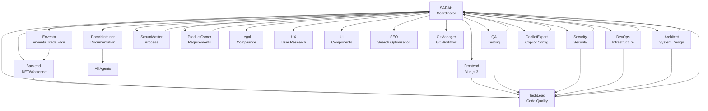

# Agent Collaboration Graph

This diagram illustrates the collaboration structure among the B2X project agents, coordinated by @SARAH.

**Legend:**
- **SARAH** (Coordinator): Handles delegation, quality gates, and conflict resolution
- **Domain Agents**: Execute specific tasks in their areas
- **Collaboration Lines**: Show primary interaction flows
- **Quality Gates**: Feedback loops for approval and sign-off

This graph represents the hierarchical coordination with @SARAH at the center, ensuring compliance with [GL-008] Governance Policies and [GL-002] Subagent Delegation.