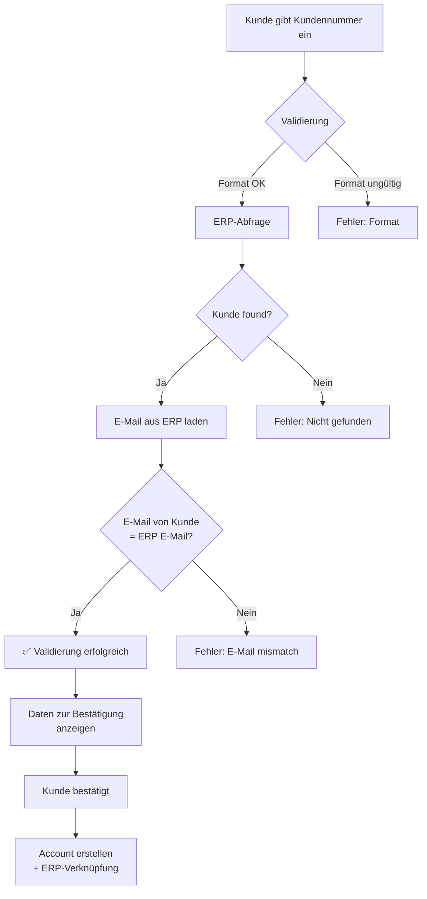
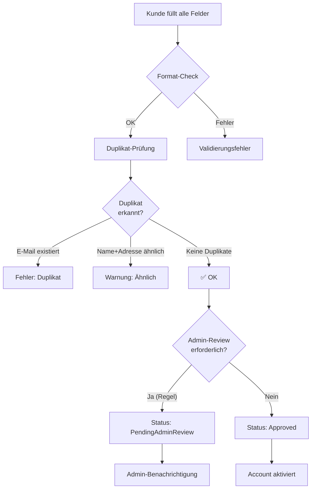

# Vereinfachte Registrierung für Bestandskunden

**Version:** 1.0  
**Status:** In Planung  
**Priorisierung:** P1 (High)  
**Zieltermin:** KW 2/3 2026

---

## 1. Business-Anforderung

### Problem
- Bestehende ERP-Kunden müssen sich vollständig registrieren (alle Felder ausfüllen)
- Höheres Risiko für Datenduplikate (unterschiedliche Schreibweisen, Tippfehler)
- Schlechte User Experience für bekannte Kunden
- Keine Verifizierung gegen ERP-Masterdaten

### Ziele
1. ✅ **UX-Verbesserung**: Schnellere Registration für Bestandskunden
2. ✅ **Datenkonsistenz**: Keine Duplikate durch ERP-Validierung
3. ✅ **Datenqualität**: Stammdaten aus ERP importieren, nicht neu eingeben
4. ✅ **Sicherheit**: Identitätsverifizierung vor Registrierung

---

## 2. Use Cases

### UC1: Bestandskunde mit Kundennummer registriert sich

```
Akteur: Bestandskunde (im ERP erfasst)
Auslöser: Besucht Frontend-Store und klickt "Registrieren"

Ablauf:
1. System zeigt Registrierungsformular mit Option "Bestehender Kunde?"
2. Kunde gibt Kundennummer + E-Mail ein
3. System validiert gegen ERP:
   - Kundennummer existiert?
   - E-Mail entspricht Kundendaten?
4. System zeigt Daten zur Bestätigung:
   - Firmenname
   - Adresse (Rechnungs-/Lieferadresse)
   - Kontaktperson
5. Kunde bestätigt oder korrigiert Daten
6. System erstellt Account mit bestätigten Daten
7. Account wird zum Catalog Service synchronisiert
8. Kunde ist sofort registriert und kann sich einloggen

Erfolg: Account erstellt, E-Mail-Bestätigung versendet
Fehler: Kundennummer nicht gefunden, E-Mail stimmt nicht überein
```

### UC2: Bestandskunde mit E-Mail registriert sich

```
Akteur: Bestandskunde (E-Mail in ERP)
Auslöser: "Mit E-Mail registrieren"

Ablauf:
1. Kunde gibt E-Mail ein
2. System prüft ERP:
   - Existiert diese E-Mail dort?
   - Ggf. mehrdeutig? (mehrere Kunden mit gleicher E-Mail)
3. Wenn eindeutig:
   - Daten anzeigen zur Bestätigung
4. Wenn mehrdeutig:
   - Kunde muss Kundennummer eingeben
5. Rest wie UC1

Erfolg: Account erstellt
Fehler: E-Mail nicht gefunden, nicht eindeutig, keine Kundennummer
```

### UC3: Neukunde registriert sich

```
Akteur: Neukunde (nicht im ERP)
Auslöser: "Ich bin Neukunde"

Ablauf:
1. Vollständiges Registrierungsformular anzeigen
2. Alle Felder erforderlich:
   - Vorname, Nachname
   - E-Mail, Telefon
   - Adresse, Firmenname
3. Auf Duplikate prüfen (E-Mail, Name+Adresse)
4. Optional: Admin-Bestätigung vor Aktivierung
5. Account erstellt, aber mit Status "Pending"

Erfolg: Account erstellt, E-Mail-Bestätigung versendet
Fehler: Duplikat erkannt, Validierungsfehler
```

---

## 3. Data Model

### Neue Entitäten in Identity Service

```csharp
// Identity/Core/Entities/UserRegistration.cs
public class UserRegistration : AggregateRoot
{
    public Guid UserId { get; set; }
    public Guid TenantId { get; set; }
    
    // Registrierungs-Typ
    public RegistrationType Type { get; set; } // ExistingCustomer, NewCustomer
    public RegistrationSource Source { get; set; } // CustomerNumber, Email, Manual
    
    // ERP-Verknüpfung
    public string? ErpCustomerId { get; set; }  // Kundennummer aus ERP
    public string? ErpSystemId { get; set; }    // z.B. SAP, Oracle
    public bool ErpValidated { get; set; }
    public DateTime? ErpValidatedAt { get; set; }
    
    // Registrierungs-Status
    public RegistrationStatus Status { get; set; } // Pending, Verified, Completed, Rejected
    public string? RejectionReason { get; set; }
    
    // Audit
    public DateTime CreatedAt { get; set; }
    public DateTime ModifiedAt { get; set; }
    public DateTime? CompletedAt { get; set; }
    
    public static UserRegistration CreateForExistingCustomer(
        Guid tenantId,
        string erpCustomerId,
        RegistrationSource source) =>
        new()
        {
            TenantId = tenantId,
            Type = RegistrationType.ExistingCustomer,
            Source = source,
            ErpCustomerId = erpCustomerId,
            Status = RegistrationStatus.Pending,
            CreatedAt = DateTime.UtcNow
        };
}

// Enums
public enum RegistrationType
{
    ExistingCustomer = 1,  // Im ERP erfasst
    NewCustomer = 2        // Neukunde
}

public enum RegistrationSource
{
    CustomerNumber = 1,    // Registrierung über Kundennummer
    Email = 2,            // Registrierung über E-Mail
    Manual = 3            // Manuelle Eingabe (Neukunde)
}

public enum RegistrationStatus
{
    Pending = 1,          // Initial
    VerificationNeeded = 2, // ERP-Validierung notwendig
    Verified = 3,         // ERP validiert
    Completed = 4,        // Erfolgreich abgeschlossen
    Rejected = 5          // Abgelehnt
}
```

### Erweiterte User Entity

```csharp
// Identity/Core/Entities/User.cs (erweitert)
public class User : AggregateRoot
{
    // ... existierende Felder ...
    
    // ERP-Verknüpfung
    public string? ErpCustomerId { get; set; }
    public string? ErpSystemId { get; set; }
    
    // Registrierungs-Kontext
    public RegistrationType? RegistrationType { get; set; }
    public RegistrationSource? RegistrationSource { get; set; }
    
    // Verifizierung
    public bool IsErpVerified { get; set; }
    public DateTime? ErpVerifiedAt { get; set; }
    
    // Status für Neukunden-Validierung
    public UserVerificationStatus VerificationStatus { get; set; }
        = UserVerificationStatus.PendingEmailVerification;
    
    // Domain Event
    public void RegisterAsExistingCustomer(
        string erpCustomerId,
        string erpSystemId,
        RegistrationSource source)
    {
        ErpCustomerId = erpCustomerId;
        ErpSystemId = erpSystemId;
        RegistrationType = RegistrationType.ExistingCustomer;
        RegistrationSource = source;
        IsErpVerified = true;
        ErpVerifiedAt = DateTime.UtcNow;
        
        RaiseEvent(new ExistingCustomerRegisteredEvent(
            Id, TenantId, erpCustomerId, erpSystemId, source));
    }
    
    public void MarkAsNewCustomer()
    {
        RegistrationType = RegistrationType.NewCustomer;
        VerificationStatus = UserVerificationStatus.PendingEmailVerification;
        
        RaiseEvent(new NewCustomerRegistrationStartedEvent(Id, TenantId));
    }
}

public enum UserVerificationStatus
{
    PendingEmailVerification = 1,
    PendingAdminReview = 2,
    Approved = 3,
    Rejected = 4
}
```

---

## 4. API Design

### Endpoint 1: Registrierungs-Typ abfragen

```http
POST /api/auth/registration/check-type
Content-Type: application/json

{
    "value": "KD-12345",  // Kundennummer oder E-Mail
    "type": "customer_number"  // oder "email"
}

# Response (200 OK - existierender Kunde)
{
    "status": "existing_customer",
    "erpCustomerId": "KD-12345",
    "data": {
        "companyName": "Musterfirma GmbH",
        "contactPerson": "Max Mustermann",
        "email": "max@musterfirma.de",
        "phone": "+49 89 123456",
        "address": {
            "street": "Musterstr. 1",
            "postalCode": "80331",
            "city": "München",
            "country": "DE"
        }
    },
    "message": "Kunde gefunden. Bestätigen Sie Ihre Daten."
}

# Response (404 - nicht gefunden)
{
    "status": "not_found",
    "message": "Keine Kundennummer mit diesem Wert gefunden"
}

# Response (400 - Validierungsfehler)
{
    "status": "validation_error",
    "errors": [
        {
            "field": "value",
            "code": "INVALID_FORMAT",
            "message": "Ungültiges Format für Kundennummer"
        }
    ]
}
```

### Endpoint 2: Bestandskunde registrieren

```http
POST /api/auth/registration/existing-customer
Content-Type: application/json

{
    "erpCustomerId": "KD-12345",
    "email": "max@musterfirma.de",
    "password": "SecurePassword123!",
    "agreeToTerms": true,
    "source": "customer_number"  // oder "email"
}

# Response (201 Created - Erfolg)
{
    "success": true,
    "user": {
        "id": "550e8400-e29b-41d4-a716-446655440000",
        "email": "max@musterfirma.de",
        "firstName": "Max",
        "lastName": "Mustermann",
        "registrationType": "existing_customer",
        "erpCustomerId": "KD-12345"
    },
    "message": "Registrierung erfolgreich. Bitte bestätigen Sie Ihre E-Mail.",
    "nextStep": "verify_email"
}

# Response (409 Conflict - Duplikat)
{
    "success": false,
    "code": "ACCOUNT_EXISTS",
    "message": "Ein Konto mit dieser E-Mail existiert bereits",
    "suggestion": "Möchten Sie sich einloggen oder das Passwort zurücksetzen?"
}

# Response (422 - Validierungsfehler)
{
    "success": false,
    "code": "VALIDATION_ERROR",
    "errors": [
        {
            "field": "email",
            "code": "MISMATCH_WITH_ERP",
            "message": "Die E-Mail stimmt nicht mit den ERP-Daten überein"
        }
    ]
}
```

### Endpoint 3: Neukunde registrieren (erweitertes Formular)

```http
POST /api/auth/registration/new-customer
Content-Type: application/json

{
    "firstName": "Max",
    "lastName": "Mustermann",
    "email": "max@example.com",
    "password": "SecurePassword123!",
    "phone": "+49 89 123456",
    "companyName": "Beispiel GmbH",
    "address": {
        "street": "Musterstr. 1",
        "postalCode": "80331",
        "city": "München",
        "country": "DE",
        "type": "billing"  // billing, shipping, both
    },
    "agreeToTerms": true,
    "allowMarketing": false
}

# Response (201 Created)
{
    "success": true,
    "user": {
        "id": "...",
        "email": "max@example.com",
        "registrationType": "new_customer",
        "verificationStatus": "pending_email_verification"
    },
    "message": "Registrierung erfolgreich (admin_review_pending)",
    "nextStep": "verify_email"
}

# Response (409 - Duplikat erkannt)
{
    "success": false,
    "code": "DUPLICATE_DETECTED",
    "duplicates": [
        {
            "field": "email",
            "existingUserId": "550e8400-...",
            "suggestion": "account_exists"
        }
    ],
    "message": "Ein Konto mit dieser E-Mail existiert bereits"
}
```

### Endpoint 4: Admin-Validierung für Bestandskunden (optional)

```http
POST /api/admin/registrations/{registrationId}/validate
Content-Type: application/json
Authorization: Bearer <admin-jwt>

{
    "action": "approve",  // oder "reject"
    "reason": "Kundennummer in SAP bestätigt"
}

# Response (200 OK)
{
    "success": true,
    "registration": {
        "id": "550e8400-...",
        "userId": "550e8400-...",
        "status": "verified",
        "validatedAt": "2025-12-28T10:00:00Z"
    }
}
```

---

## 5. Datenvalidierungs-Flow

### Validierung Bestandskunde



### Validierung Neukunde



---

## 6. ERP-Integrationskonzept

### Option A: REST-API des ERP (empfohlen)

```csharp
// Infrastructure/ExternalServices/ErpCustomerService.cs
public interface IErpCustomerService
{
    /// <summary>
    /// Sucht einen Kunden nach Kundennummer
    /// </summary>
    Task<ErpCustomerDto?> GetCustomerByIdAsync(string customerId);
    
    /// <summary>
    /// Sucht Kunden nach E-Mail
    /// </summary>
    Task<IEnumerable<ErpCustomerDto>> GetCustomersByEmailAsync(string email);
    
    /// <summary>
    /// Validiert eine E-Mail gegen die ERP-Kundendaten
    /// </summary>
    Task<bool> ValidateCustomerEmailAsync(string customerId, string email);
}

public class ErpCustomerDto
{
    public string CustomerId { get; set; }
    public string CompanyName { get; set; }
    public string ContactFirstName { get; set; }
    public string ContactLastName { get; set; }
    public string Email { get; set; }
    public string Phone { get; set; }
    
    public ErpAddressDto BillingAddress { get; set; }
    public ErpAddressDto ShippingAddress { get; set; }
    
    public bool IsActive { get; set; }
    public decimal CreditLimit { get; set; }
    public string PaymentTerms { get; set; }
}

// Implementation
public class SapCustomerService : IErpCustomerService
{
    private readonly HttpClient _httpClient;
    private readonly ILogger<SapCustomerService> _logger;
    
    public async Task<ErpCustomerDto?> GetCustomerByIdAsync(string customerId)
    {
        try
        {
            var response = await _httpClient.GetAsync(
                $"/odata/v4/customers('{customerId}')?$format=json");
            
            if (!response.IsSuccessStatusCode)
                return null;
            
            var json = await response.Content.ReadAsStringAsync();
            return JsonSerializer.Deserialize<ErpCustomerDto>(json);
        }
        catch (Exception ex)
        {
            _logger.LogError(ex, "ERP customer lookup failed");
            throw new ErpIntegrationException($"Cannot lookup customer {customerId}", ex);
        }
    }
    
    public async Task<IEnumerable<ErpCustomerDto>> GetCustomersByEmailAsync(string email)
    {
        var filter = $"contains(email, '{Uri.EscapeDataString(email)}')";
        var response = await _httpClient.GetAsync(
            $"/odata/v4/customers?$filter={filter}&$format=json");
        
        if (!response.IsSuccessStatusCode)
            return Enumerable.Empty<ErpCustomerDto>();
        
        // Parse response...
    }
    
    public async Task<bool> ValidateCustomerEmailAsync(string customerId, string email)
    {
        var customer = await GetCustomerByIdAsync(customerId);
        return customer?.Email?.Equals(email, StringComparison.OrdinalIgnoreCase) ?? false;
    }
}
```

### Option B: File-basierter Import (für Start)

```csharp
// Infrastructure/ExternalServices/CsvCustomerService.cs
public class CsvCustomerService : IErpCustomerService
{
    private readonly ILogger<CsvCustomerService> _logger;
    
    /// <summary>
    /// Lädt Kundendaten aus CSV-Datei (Fallback für lokale Entwicklung)
    /// </summary>
    public async Task<ErpCustomerDto?> GetCustomerByIdAsync(string customerId)
    {
        var csv = await File.ReadAllLinesAsync("data/customers.csv");
        
        foreach (var line in csv.Skip(1))
        {
            var parts = line.Split(',');
            if (parts[0] == customerId)
            {
                return new ErpCustomerDto
                {
                    CustomerId = parts[0],
                    CompanyName = parts[1],
                    ContactFirstName = parts[2],
                    ContactLastName = parts[3],
                    Email = parts[4],
                    Phone = parts[5]
                };
            }
        }
        
        return null;
    }
}
```

---

## 7. Implementierungs-Roadmap

### Phase 1: Backend (3-4 Tage)

**Task 1.1**: Datenmodell erweitern
- [ ] UserRegistration Entity erstellen
- [ ] Enums definieren
- [ ] User Entity erweitern (ErpCustomerId, etc.)
- [ ] Migrations erstellen
- [ ] Tests schreiben

**Task 1.2**: ERP-Integration
- [ ] IErpCustomerService Interface
- [ ] REST-Client implementieren (oder CSV-Fallback)
- [ ] Fehlerbehandlung
- [ ] Unit Tests

**Task 1.3**: CQRS Handler
- [ ] `CheckRegistrationTypeQuery` Handler
- [ ] `RegisterExistingCustomerCommand` Handler
- [ ] `RegisterNewCustomerCommand` Handler
- [ ] Validatoren (FluentValidation)
- [ ] Integration Tests

**Task 1.4**: API Endpoints
- [ ] `/api/auth/registration/check-type` (POST)
- [ ] `/api/auth/registration/existing-customer` (POST)
- [ ] `/api/auth/registration/new-customer` (POST)
- [ ] `/api/admin/registrations/{id}/validate` (POST)
- [ ] Error Handling

### Phase 2: Frontend (3-4 Tage)

**Task 2.1**: Store Frontend (Vue)
- [ ] Registration Type Selection Component
- [ ] ExistingCustomerForm Component
- [ ] NewCustomerForm Component
- [ ] Validation & Error States
- [ ] Styling (Tailwind)

**Task 2.2**: Logic & State Management (Pinia)
- [ ] registrationStore (type, data, status)
- [ ] userService API calls
- [ ] Error handling & messaging
- [ ] Local state management

**Task 2.3**: Integration
- [ ] Routing Setup
- [ ] Redirect nach erfolgreicher Registrierung
- [ ] E-Mail Verification Flow
- [ ] Error Messaging

### Phase 3: Testing (2-3 Tage)

**Task 3.1**: Unit Tests
- [ ] Handler Tests (Backend)
- [ ] Component Tests (Frontend)
- [ ] Store Tests (Pinia)

**Task 3.2**: Integration Tests
- [ ] API Endpoints (Postman/Integration Test)
- [ ] ERP Lookup + Registration Flow
- [ ] Duplikat-Erkennung

**Task 3.3**: E2E Tests
- [ ] Complete Registration Flow (Playwright)
- [ ] Error Scenarios

---

## 8. Duplikat-Prävention

### Strategie: Multi-Field Deduplication

```csharp
// Application/Services/DuplicateDetectionService.cs
public interface IDuplicateDetectionService
{
    Task<DuplicateCheckResult> CheckForDuplicatesAsync(
        UserRegistrationDto registration,
        CancellationToken ct = default);
}

public class DuplicateDetectionService : IDuplicateDetectionService
{
    private readonly IUserRepository _userRepository;
    private readonly FuzzyMatcher _fuzzyMatcher;
    
    public async Task<DuplicateCheckResult> CheckForDuplicatesAsync(
        UserRegistrationDto registration,
        CancellationToken ct)
    {
        var result = new DuplicateCheckResult { IsDuplicate = false };
        
        // 1. Exakte E-Mail Suche (Höchste Priorität)
        var emailMatch = await _userRepository
            .FindByEmailAsync(registration.Email, ct);
        if (emailMatch != null)
        {
            result.IsDuplicate = true;
            result.Matches.Add(new DuplicateMatch
            {
                Type = DuplicateType.ExactEmail,
                Confidence = 1.0m,
                ExistingUserId = emailMatch.Id
            });
            return result;
        }
        
        // 2. Fuzzy Name + Adresse (für Neukunden)
        if (registration.Type == RegistrationType.NewCustomer)
        {
            var similarMatches = await _userRepository
                .FindSimilarAsync(
                    registration.FirstName,
                    registration.LastName,
                    registration.Address.Street,
                    ct);
            
            foreach (var match in similarMatches)
            {
                var similarity = CalculateSimilarity(
                    registration.FirstName,
                    registration.LastName,
                    match.FirstName,
                    match.LastName);
                
                if (similarity > 0.85m) // 85% Ähnlichkeit
                {
                    result.Matches.Add(new DuplicateMatch
                    {
                        Type = DuplicateType.SimilarProfile,
                        Confidence = similarity,
                        ExistingUserId = match.Id,
                        SimilarityDetails = $"Name: {similarity:P0}"
                    });
                }
            }
        }
        
        // 3. ERP Duplikat (für Bestandskunden)
        if (!string.IsNullOrEmpty(registration.ErpCustomerId))
        {
            var erpMatch = await _userRepository
                .FindByErpIdAsync(registration.ErpCustomerId, ct);
            if (erpMatch != null)
            {
                result.IsDuplicate = true;
                result.Matches.Add(new DuplicateMatch
                {
                    Type = DuplicateType.ErpId,
                    Confidence = 1.0m,
                    ExistingUserId = erpMatch.Id
                });
                return result;
            }
        }
        
        return result;
    }
    
    private decimal CalculateSimilarity(string first1, string last1, 
        string first2, string last2)
    {
        // Levenshtein Distance Implementation
        var firstSim = _fuzzyMatcher.Similarity(first1, first2);
        var lastSim = _fuzzyMatcher.Similarity(last1, last2);
        return (firstSim + lastSim) / 2m;
    }
}

public class DuplicateCheckResult
{
    public bool IsDuplicate { get; set; }
    public List<DuplicateMatch> Matches { get; set; } = [];
    public string? Recommendation { get; set; }
}

public enum DuplicateType
{
    ExactEmail = 1,
    PhoneNumber = 2,
    SimilarProfile = 3,
    ErpId = 4
}
```

---

## 9. Fehlerbehandlung

### Validierungsfehler

| Code | Bedeutung | HTTP | Aktion |
|------|-----------|------|--------|
| `INVALID_FORMAT` | Format ungültig (Kundennr.) | 400 | Retry |
| `CUSTOMER_NOT_FOUND` | Keine Kundennummer im ERP | 404 | Alternativ: Neukunde-Form |
| `EMAIL_MISMATCH` | ERP E-Mail ≠ eingegeben | 422 | Korrigieren oder Neukunde |
| `ACCOUNT_EXISTS` | E-Mail bereits registriert | 409 | Login oder PW-Reset |
| `DUPLICATE_DETECTED` | Ähnlicher Account vorhanden | 409 | Bestätigung oder Neukunde |
| `ERP_UNAVAILABLE` | ERP nicht erreichbar | 503 | Retry oder Offline-Modus |

---

## 10. Security-Anforderungen

### Datenschutz

- [ ] **E-Mail-Validierung**: Nur verifizierte E-Mail = aktiver Account
- [ ] **ERP-Daten**: Nur über verschlüsselte Verbindung (TLS)
- [ ] **Audit Logging**: Alle Registrierungsversuche protokollieren
- [ ] **Rate Limiting**: Max. 3 Versuche pro E-Mail / 5 Min

### Authentifizierung

```csharp
// Middleware/RegistrationRateLimitMiddleware.cs
public class RegistrationRateLimitMiddleware
{
    public async Task InvokeAsync(HttpContext context)
    {
        if (context.Request.Path.StartsWithSegments("/api/auth/registration"))
        {
            var ipAddress = context.Connection.RemoteIpAddress?.ToString();
            var email = GetEmailFromRequest(context.Request);
            
            var attemptKey = $"reg:{ipAddress}:{email}";
            var attempts = await _cache.GetAsync<int>(attemptKey);
            
            if (attempts >= 3)
            {
                context.Response.StatusCode = StatusCodes.Status429TooManyRequests;
                await context.Response.WriteAsJsonAsync(new
                {
                    error = "TOO_MANY_ATTEMPTS",
                    message = "Zu viele Registrierungsversuche. Bitte später erneut versuchen."
                });
                return;
            }
            
            await _cache.SetAsync(attemptKey, attempts + 1, TimeSpan.FromMinutes(5));
        }
        
        await _next(context);
    }
}
```

---

## 11. Konfiguration (appsettings.json)

```json
{
  "Registration": {
    "AllowExistingCustomers": true,
    "RequireEMailVerification": true,
    "RequireAdminReviewForNewCustomers": false,
    "DuplicateDetectionThreshold": 0.85,
    "MaxRegistrationAttempts": 3,
    "RegistrationAttemptWindowMinutes": 5
  },
  "Erp": {
    "Provider": "SAP",
    "Endpoint": "https://erp.company.com/odata/v4/",
    "Username": "${ERP_USERNAME}",
    "Password": "${ERP_PASSWORD}",
    "Timeout": 5000,
    "RetryPolicy": {
      "MaxRetries": 3,
      "BackoffMultiplier": 2
    }
  }
}
```

---

## 12. Success Criteria

- ✅ Bestandskunde kann sich in < 2 Min registrieren (vs. 5+ Min vorher)
- ✅ 0 Duplikate bei ERP-Verknüpfung
- ✅ 95%+ ERP-Lookup-Erfolgsrate
- ✅ < 1% False Positives bei Duplikat-Erkennung
- ✅ 99%+ API-Verfügbarkeit
- ✅ Alle Security-Anforderungen erfüllt

---

## 13. Abhängigkeiten & Risiken

### Abhängigkeiten
- [ ] ERP-API Verfügbarkeit & Dokumentation
- [ ] ERP-Kundendaten-Qualität
- [ ] E-Mail-Service (Versand & Verifikation)

### Risiken
- **Risiko**: ERP nicht erreichbar
  - **Mitigation**: Offline-Fallback (CSV Import), Retry-Logic
  
- **Risiko**: Falsche ERP-Daten
  - **Mitigation**: Kunde muss bestätigen, Admin-Review möglich
  
- **Risiko**: Performance-Issue bei großem Kundenstamm
  - **Mitigation**: Caching, Indexierung, Pagination

---

## 14. Nächste Schritte

1. **Anforderungs-Abnahme** mit Stakeholdern
2. **ERP-API-Dokumentation** einfordern
3. **Testdaten** von ERP-Team besorgen
4. **Implementation starten** nach Freigabe
5. **UAT** mit Bestandskunden durchführen

---

**Document Owner:** Architecture Team  
**Last Updated:** 28. Dezember 2025  
**Next Review:** 5. Januar 2026
