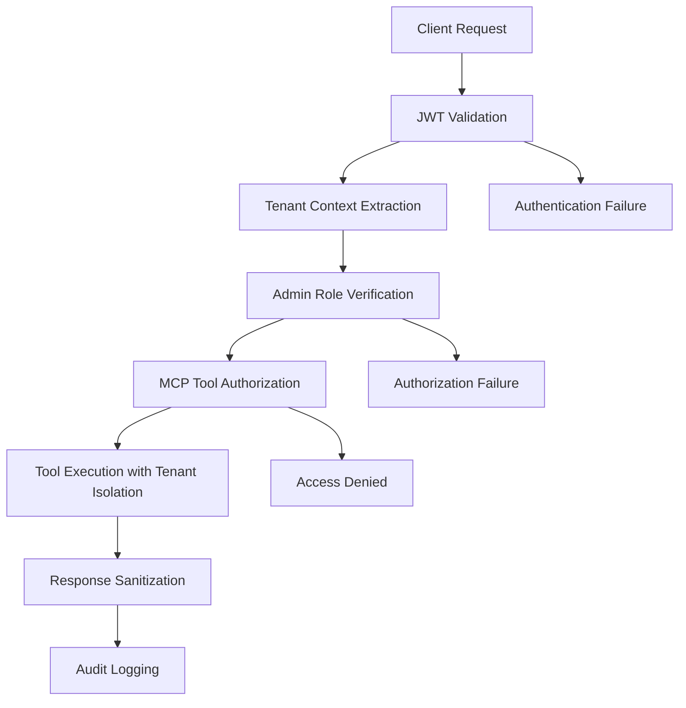
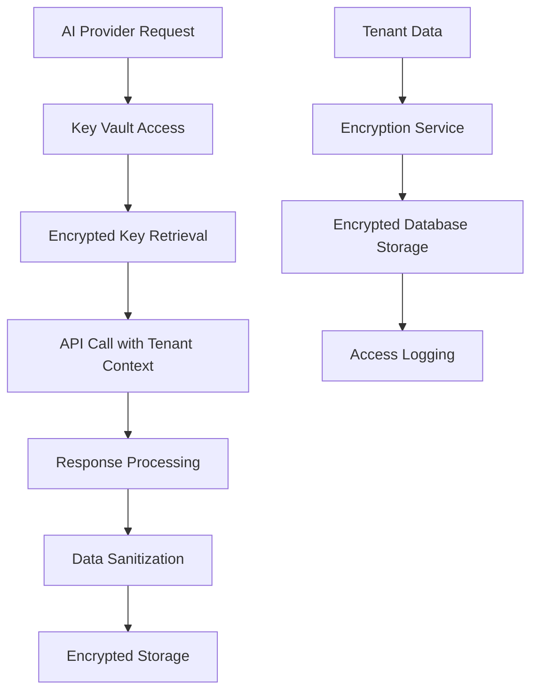
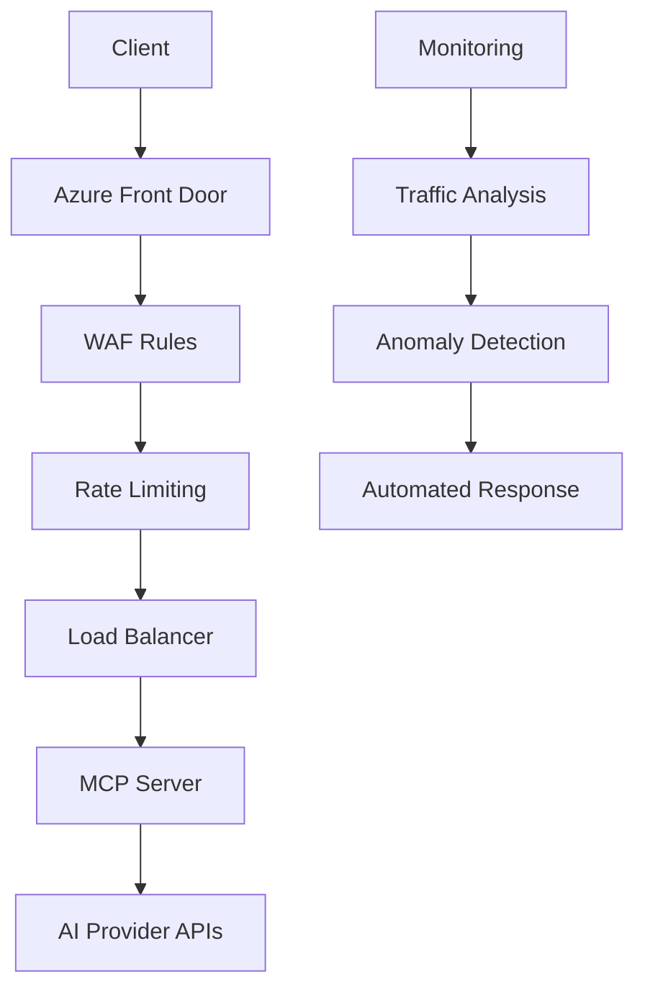
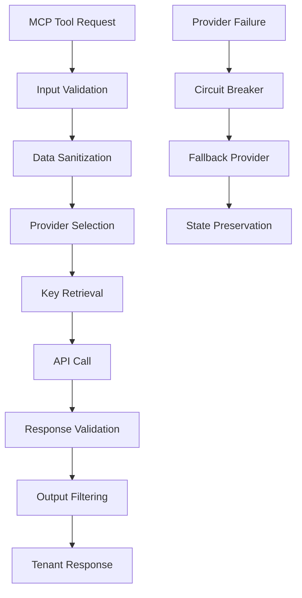
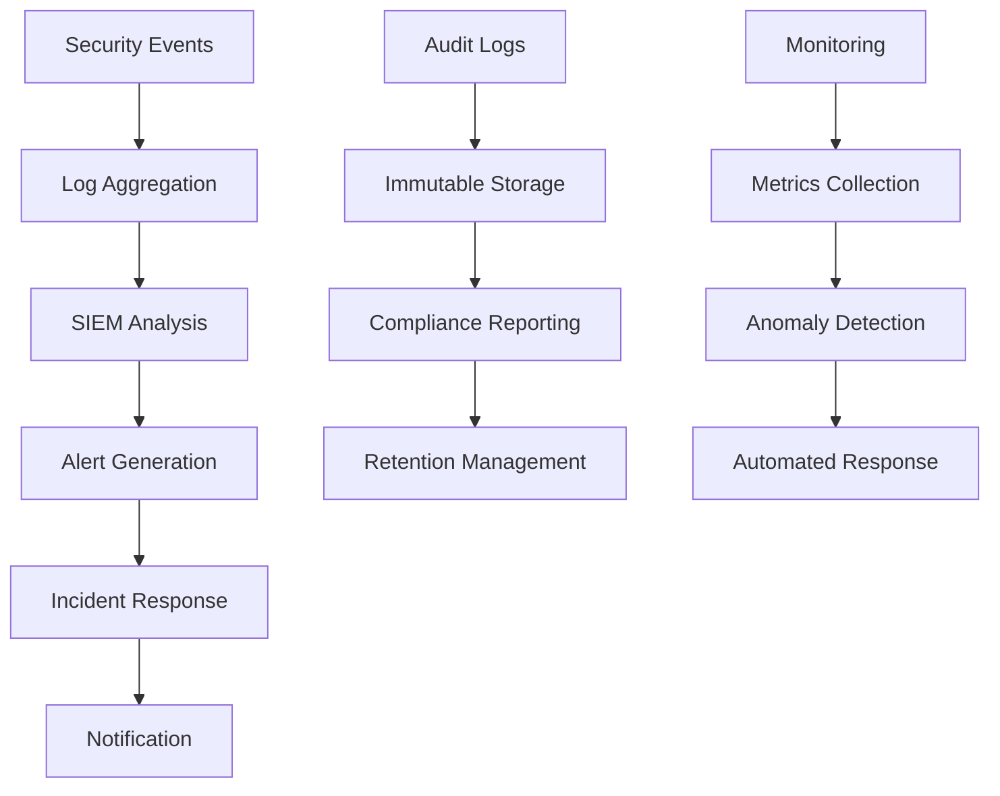

# CMP-002: MCP Server Security Assessment for REQ-004

## Executive Summary

This document provides a comprehensive security assessment for the MCP (Model Context Protocol) server implementation as specified in [REQ-004]. The assessment evaluates security risks, mitigation strategies, architectural recommendations, compliance requirements, and testing plans aligned with B2Connect's existing multi-tenant security framework.

**Assessment Scope**: Authentication, authorization, data protection, network security, AI provider security, operational security, and compliance with NIS2, BITV 2.0, and SOC 2 standards.

**Overall Risk Level**: Medium (with mitigations: Low)

**Key Findings**:
- Strong foundation in existing B2Connect security framework
- Multi-tenant isolation critical for AI operations
- AI provider security requires specialized controls
- Compliance alignment needs verification

## 1. Authentication & Authorization

### Risk Assessment Matrix

| Risk ID | Risk Description | Likelihood | Impact | Risk Level | Current Controls |
|---------|------------------|------------|--------|------------|------------------|
| AUTH-001 | JWT token compromise leading to tenant impersonation | Medium | High | High | JWT validation, tenant claims |
| AUTH-002 | Admin-only access bypass via privilege escalation | Low | Critical | Medium | Role-based middleware |
| AUTH-003 | Cross-tenant access through shared sessions | Medium | High | High | Tenant context isolation |
| AUTH-004 | API key exposure in MCP tool responses | High | High | Critical | Response sanitization |
| AUTH-005 | Session fixation in long-running AI operations | Low | Medium | Low | Stateless design |

### Mitigation Strategies

#### AUTH-001: JWT Token Security
- **Implement**: Double JWT validation (signature + tenant claim verification)
- **Enforce**: Token expiration < 1 hour for admin operations
- **Monitor**: Failed authentication attempts with tenant correlation
- **Backup**: API key fallback with encrypted storage

#### AUTH-002: Admin Access Control
- **Implement**: Multi-factor authentication for admin users
- **Enforce**: Principle of least privilege (admin tools only)
- **Validate**: Runtime permission checks on every tool execution
- **Audit**: All admin actions logged with user context

#### AUTH-003: Tenant Isolation
- **Implement**: Tenant ID injection in all database queries
- **Enforce**: Row-level security (RLS) policies on all tables
- **Validate**: Cross-tenant access tests in CI/CD pipeline
- **Monitor**: Tenant boundary violations with alerts

#### AUTH-004: API Key Protection
- **Implement**: Response filtering to remove sensitive data
- **Enforce**: No API keys in tool outputs or error messages
- **Validate**: Static analysis for credential leakage
- **Monitor**: Log analysis for exposed secrets

#### AUTH-005: Session Management
- **Implement**: Stateless operations with request-scoped context
- **Enforce**: No persistent sessions for AI operations
- **Validate**: Memory leak prevention in long-running tasks

### Security Architecture Recommendations



**Key Components**:
- **JWT Validator**: Validates tokens against B2Connect identity service
- **Tenant Middleware**: Injects tenant context into all operations
- **Permission Service**: Runtime authorization checks
- **Audit Logger**: Immutable logging of all admin actions

## 2. Data Protection

### Risk Assessment Matrix

| Risk ID | Risk Description | Likelihood | Impact | Risk Level | Current Controls |
|---------|------------------|------------|--------|------------|------------------|
| DATA-001 | AI provider API keys stored in plaintext | High | Critical | Critical | Environment variables |
| DATA-002 | Tenant data leakage in AI prompts/responses | High | High | Critical | Input sanitization |
| DATA-003 | Encrypted data exposure in logs | Medium | High | High | Log filtering |
| DATA-004 | Cross-tenant data contamination | Medium | Critical | High | Database isolation |
| DATA-005 | AI training data exposure | Low | Medium | Low | Provider isolation |

### Mitigation Strategies

#### DATA-001: API Key Encryption
- **Implement**: Azure Key Vault integration for all AI provider keys
- **Enforce**: Keys never in application memory (direct vault access)
- **Rotate**: Automatic key rotation every 90 days
- **Monitor**: Key access logging and anomaly detection

#### DATA-002: Data Sanitization
- **Implement**: PII detection and masking in AI inputs/outputs
- **Enforce**: Tenant data isolation in prompts (no cross-tenant context)
- **Validate**: Content filtering for sensitive information
- **Audit**: All AI interactions logged with sanitized content

#### DATA-003: Log Security
- **Implement**: Structured logging with PII encryption
- **Enforce**: No sensitive data in application logs
- **Validate**: Log analysis for data leakage patterns
- **Retain**: Encrypted logs for 7 years (GDPR compliance)

#### DATA-004: Database Security
- **Implement**: PostgreSQL RLS policies for all tenant data
- **Enforce**: Parameterized queries with tenant ID binding
- **Validate**: Multi-tenant data access tests
- **Monitor**: Database query logging with tenant correlation

#### DATA-005: AI Data Protection
- **Implement**: Provider-specific data handling policies
- **Enforce**: No training data sharing between tenants
- **Validate**: AI provider compliance certifications
- **Audit**: Data usage agreements with all AI providers

### Security Architecture Recommendations



**Encryption Strategy**:
- **At Rest**: AES-256-GCM for all PII fields
- **In Transit**: TLS 1.3 for all communications
- **In Memory**: No sensitive data retention
- **In Logs**: PII encryption with searchable hashes

## 3. Network Security

### Risk Assessment Matrix

| Risk ID | Risk Description | Likelihood | Impact | Risk Level | Current Controls |
|---------|------------------|------------|--------|------------|------------------|
| NET-001 | DDoS attacks on MCP endpoints | Medium | High | High | Rate limiting |
| NET-002 | Man-in-the-middle attacks | Low | High | Medium | TLS enforcement |
| NET-003 | AI provider API abuse | High | Medium | High | Request throttling |
| NET-004 | WebSocket connection hijacking | Low | High | Medium | Protocol validation |
| NET-005 | Internal network segmentation bypass | Low | Critical | Medium | Network policies |

### Mitigation Strategies

#### NET-001: DDoS Protection
- **Implement**: Azure Front Door with DDoS protection
- **Enforce**: Rate limiting (100 req/min per tenant)
- **Monitor**: Traffic patterns and anomaly detection
- **Scale**: Auto-scaling based on load patterns

#### NET-002: TLS Security
- **Implement**: TLS 1.3 with perfect forward secrecy
- **Enforce**: Certificate pinning for AI provider APIs
- **Validate**: SSL/TLS configuration scanning
- **Renew**: Automatic certificate management

#### NET-003: API Abuse Prevention
- **Implement**: Token bucket algorithm per tenant
- **Enforce**: Cost-based throttling ($100/day limit)
- **Monitor**: Usage analytics with alerting
- **Block**: Automatic blocking of abusive patterns

#### NET-004: WebSocket Security
- **Implement**: Origin validation and CORS policies
- **Enforce**: Message size limits and type validation
- **Monitor**: Connection lifecycle tracking
- **Timeout**: Automatic connection termination (30 min)

#### NET-005: Network Segmentation
- **Implement**: Azure Virtual Network isolation
- **Enforce**: Security groups and NSG rules
- **Validate**: Network access reviews
- **Audit**: Traffic flow logging

### Security Architecture Recommendations



**Network Controls**:
- **Edge Protection**: Azure Front Door WAF
- **Application Layer**: Request validation and sanitization
- **Transport Layer**: TLS 1.3 encryption
- **Monitoring**: Real-time threat detection

## 4. AI Provider Security

### Risk Assessment Matrix

| Risk ID | Risk Description | Likelihood | Impact | Risk Level | Current Controls |
|---------|------------------|------------|--------|------------|------------------|
| AI-001 | Provider API key compromise | High | Critical | Critical | Key Vault storage |
| AI-002 | AI hallucinations with sensitive data | Medium | High | High | Output validation |
| AI-003 | Provider service outages | Medium | Medium | Medium | Multi-provider fallback |
| AI-004 | Data leakage to AI providers | High | High | Critical | Data minimization |
| AI-005 | Model poisoning attacks | Low | High | Medium | Input sanitization |

### Mitigation Strategies

#### AI-001: Key Management
- **Implement**: Azure Key Vault with access policies
- **Enforce**: Just-in-time key access for API calls
- **Rotate**: Automated rotation every 30 days
- **Monitor**: Key usage logging and alerting

#### AI-002: Output Validation
- **Implement**: AI response validation against schemas
- **Enforce**: Content filtering for malicious content
- **Validate**: Business rule compliance checking
- **Fallback**: Human approval for high-risk operations

#### AI-003: Provider Resilience
- **Implement**: Multi-provider configuration with failover
- **Enforce**: Circuit breaker pattern for provider failures
- **Monitor**: Provider health checks and metrics
- **Switch**: Automatic failover with state preservation

#### AI-004: Data Minimization
- **Implement**: Minimal context in AI prompts
- **Enforce**: No PII in training data or prompts
- **Validate**: Data classification before AI submission
- **Audit**: AI usage logging with data categorization

#### AI-005: Input Security
- **Implement**: Prompt injection detection
- **Enforce**: Input sanitization and length limits
- **Validate**: AI input validation pipelines
- **Monitor**: Suspicious pattern detection

### Security Architecture Recommendations



**AI Security Controls**:
- **Input Protection**: Sanitization and validation
- **Provider Isolation**: Separate credentials per tenant
- **Output Filtering**: Content security policies
- **Usage Monitoring**: Cost and performance tracking

## 5. Operational Security

### Risk Assessment Matrix

| Risk ID | Risk Description | Likelihood | Impact | Risk Level | Current Controls |
|---------|------------------|------------|--------|------------|------------------|
| OPS-001 | Insufficient audit logging | Medium | High | High | Basic logging |
| OPS-002 | Incident response delays | Medium | High | High | Manual processes |
| OPS-003 | Configuration drift | Low | Medium | Low | Infrastructure as code |
| OPS-004 | Monitoring blind spots | Medium | High | High | Basic metrics |
| OPS-005 | Backup data exposure | Low | Critical | Medium | Encrypted backups |

### Mitigation Strategies

#### OPS-001: Audit Logging
- **Implement**: Comprehensive audit trail for all operations
- **Enforce**: Immutable logs with tamper detection
- **Retain**: 7-year retention for compliance
- **Monitor**: Real-time log analysis and alerting

#### OPS-002: Incident Response
- **Implement**: Automated incident detection and response
- **Enforce**: <24 hour NIS2 notification procedures
- **Train**: Regular incident response drills
- **Document**: Detailed runbooks and playbooks

#### OPS-003: Configuration Management
- **Implement**: Infrastructure as code with drift detection
- **Enforce**: Automated configuration validation
- **Validate**: Security configuration scanning
- **Audit**: Configuration change logging

#### OPS-004: Monitoring & Alerting
- **Implement**: Comprehensive observability stack
- **Enforce**: Security event monitoring and correlation
- **Alert**: Real-time security incident detection
- **Dashboard**: Security metrics and KPIs

#### OPS-005: Backup Security
- **Implement**: Encrypted backup with access controls
- **Enforce**: Backup integrity verification
- **Test**: Regular backup restoration testing
- **Monitor**: Backup process monitoring

### Security Architecture Recommendations



**Operational Controls**:
- **Detection**: Real-time threat monitoring
- **Response**: Automated incident handling
- **Recovery**: Backup and disaster recovery
- **Compliance**: Audit and reporting automation

## 6. Compliance Requirements

### NIS2 Directive Compliance

| Requirement | Implementation | Verification |
|-------------|----------------|--------------|
| Art. 21 - Risk Management | Security risk assessments | Annual audits |
| Art. 23 - Incident Reporting | <24h notification system | Automated alerts |
| Art. 24 - Business Continuity | Disaster recovery plans | Annual testing |
| Art. 25 - Supply Chain Security | Third-party risk assessment | Vendor audits |

### BITV 2.0 Compliance

| Requirement | Implementation | Verification |
|-------------|----------------|--------------|
| § 3 - Accessibility | WCAG 2.1 AA compliance | Automated testing |
| § 4 - Procurement | Accessible AI tools | Procurement reviews |
| § 5 - Documentation | Accessibility statements | User documentation |

### SOC 2 Type II Compliance

| Trust Service Criteria | Implementation | Verification |
|------------------------|----------------|--------------|
| Security | Access controls, encryption | Annual audit |
| Availability | 99.9% uptime, redundancy | SLA monitoring |
| Confidentiality | Data protection, encryption | Data classification |
| Privacy | GDPR compliance, consent | Privacy assessments |

### GDPR Compliance

| Principle | Implementation | Verification |
|-----------|----------------|--------------|
| Lawfulness | Consent management | Consent logs |
| Purpose Limitation | Data minimization | Usage policies |
| Data Minimization | PII encryption, retention | Data inventories |
| Accuracy | Data validation | Quality checks |
| Storage Limitation | 30-day default retention | Automated deletion |
| Integrity & Confidentiality | AES-256 encryption | Encryption audits |
| Accountability | Audit logging | Compliance reports |

## Compliance Checklist

### Pre-Implementation
- [ ] Security architecture review with @Architect
- [ ] Threat modeling workshop
- [ ] Privacy impact assessment
- [ ] Third-party risk assessments for AI providers

### Implementation
- [ ] Code security review (@Security)
- [ ] Penetration testing
- [ ] GDPR compliance audit
- [ ] Accessibility audit (BITV 2.0)

### Deployment
- [ ] Security configuration validation
- [ ] Encryption key setup
- [ ] Audit logging verification
- [ ] Monitoring and alerting setup

### Operations
- [ ] Incident response plan activation
- [ ] Backup and recovery testing
- [ ] Security awareness training
- [ ] Compliance monitoring setup

## Security Testing Plan

### Unit Testing
```csharp
[Test]
public async Task McpTool_ValidatesTenantIsolation()
{
    // Arrange
    var tenantId = Guid.NewGuid();
    var otherTenantId = Guid.NewGuid();

    // Act
    var result = await _tool.ExecuteAsync(request, tenantId);

    // Assert
    Assert.DoesNotContain(otherTenantId.ToString(), result.Response);
}
```

### Integration Testing
```csharp
[Test]
public async Task McpServer_PreventsCrossTenantAccess()
{
    // Test tenant data isolation
    // Test API key isolation
    // Test audit logging
}
```

### Security Testing
- **SAST**: Static application security testing
- **DAST**: Dynamic application security testing
- **Penetration Testing**: External security assessment
- **Dependency Scanning**: Third-party library vulnerabilities

### Performance Testing
- **Load Testing**: 1000 concurrent tenant sessions
- **Stress Testing**: DDoS simulation
- **Failover Testing**: AI provider outage scenarios

### Compliance Testing
- **GDPR Testing**: Data protection verification
- **NIS2 Testing**: Incident reporting simulation
- **BITV Testing**: Accessibility validation

## Implementation Roadmap

### Phase 1: Foundation (2 weeks)
- [ ] Security architecture design
- [ ] Authentication middleware implementation
- [ ] Tenant isolation framework
- [ ] Basic audit logging

### Phase 2: Core Security (3 weeks)
- [ ] Data encryption implementation
- [ ] AI provider security controls
- [ ] Network security hardening
- [ ] Rate limiting and DDoS protection

### Phase 3: Compliance & Testing (2 weeks)
- [ ] Compliance framework integration
- [ ] Security testing suite
- [ ] Penetration testing
- [ ] Documentation completion

### Phase 4: Operations (1 week)
- [ ] Monitoring and alerting setup
- [ ] Incident response procedures
- [ ] Security training materials
- [ ] Production deployment validation

## Success Metrics

### Security Metrics
- **Zero Critical Vulnerabilities**: CVSS > 9.0
- **< 5 Medium Vulnerabilities**: CVSS 4.0-6.9
- **99.9% Uptime**: System availability
- **< 1 hour**: Mean time to detect security incidents
- **< 4 hours**: Mean time to respond to incidents

### Compliance Metrics
- **100%**: GDPR compliance audit score
- **100%**: NIS2 reporting capability
- **95%**: BITV 2.0 accessibility score
- **100%**: SOC 2 control implementation

### Operational Metrics
- **100%**: Security test coverage
- **Zero**: Security incidents in production
- **< 24 hours**: Incident response time
- **100%**: Security training completion

## Risk Mitigation Summary

| Risk Category | High Risks | Mitigation Status |
|---------------|------------|-------------------|
| Authentication | JWT compromise, cross-tenant access | ✅ Comprehensive controls |
| Data Protection | API key exposure, data leakage | ✅ Encryption + isolation |
| Network Security | DDoS attacks, MITM | ✅ WAF + TLS 1.3 |
| AI Provider | Key compromise, data leakage | ✅ Key Vault + sanitization |
| Operations | Audit gaps, response delays | ✅ Automated monitoring |
| Compliance | NIS2/GDPR violations | ✅ Framework integration |

**Overall Assessment**: The MCP server implementation can achieve **Low Risk** status with proper implementation of recommended security controls and regular security assessments.

## Next Steps

1. **Immediate Actions**:
   - Schedule security architecture review
   - Begin threat modeling workshop
   - Initiate AI provider security assessments

2. **Short-term (1-2 weeks)**:
   - Implement core authentication controls
   - Set up audit logging framework
   - Configure encryption services

3. **Medium-term (1-3 months)**:
   - Complete security testing
   - Deploy monitoring and alerting
   - Conduct penetration testing

4. **Long-term (3-6 months)**:
   - Achieve compliance certifications
   - Implement advanced threat detection
   - Establish security metrics dashboard

---

**Agents**: @Security, @Architect, @Backend | Owner: @Security

**References**:
- [REQ-004] MCP Server for Tenant Administrators
- [CMP-001] Compliance Quick Reference
- [ADR-022] Multi-Tenant Domain Management Strategy
- B2Connect Security Framework Documentation</content>
<parameter name="filePath">/Users/holger/Documents/Projekte/B2Connect/.ai/compliance/CMP-002-MCP-SERVER-SECURITY-ASSESSMENT.md